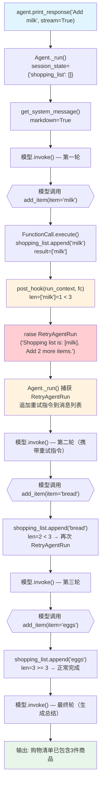

# retry_tool_call_from_post_hook.py — 实现原理分析

> 源文件：`cookbook/91_tools/exceptions/retry_tool_call_from_post_hook.py`

## 概述

本示例展示通过 **`post_hook` 抛出 `RetryAgentRun`** 机制强制 Agent 重试的模式：`add_item` 工具的 post_hook 检查 `session_state["shopping_list"]` 中的商品数量，不足 3 个时抛出 `RetryAgentRun` 并附带新指令，Agent 接收到重试信号后带着新指令重新调用 LLM，直到满足条件为止。

**核心配置一览：**

| 配置项 | 值 | 说明 |
|--------|------|------|
| `model` | `OpenAIChat(id="gpt-5.2")` | Chat Completions API |
| `session_id` | `"retry_tool_call_from_post_hook_session"` | 固定会话 ID |
| `db` | `SqliteDb(db_file="tmp/retry_tool_call_from_post_hook.db")` | 持久化会话 |
| `session_state` | `{"shopping_list": []}` | 初始购物清单为空 |
| `tools` | `[add_item]` | `@tool(post_hook=post_hook)` 带重试 hook |
| `markdown` | `True` | Markdown 格式化 |
| `@tool post_hook` | `post_hook(run_context, fc)` | 检查清单数量，不足则重试 |
| `RetryAgentRun` | 清单 < 3 时抛出，携带新指令 | 强制 Agent 重试 |

## 架构分层

```
用户代码层                      agno.agent 层
┌─────────────────────────┐    ┌────────────────────────────────────┐
│ retry_tool_call_from_   │    │ Agent._run() 的 agentic loop       │
│ post_hook.py            │    │  ├─ LLM: add_item("milk")          │
│                         │    │  ├─ FunctionCall.execute()         │
│ def post_hook(          │    │  │   └─ post_hook(run_ctx, fc)     │
│   run_context: RunCtx,  │───>│  │       └─ len<3 → RetryAgentRun │
│   fc: FunctionCall      │    │  │                                  │
│ ):                      │    │  ├─ 捕获 RetryAgentRun            │
│   if len(list) < 3:     │    │  │   retry_message 追加到消息      │
│     raise RetryAgentRun │    │  └─ 重新调用 LLM（携带新指令）     │
│       ("...Add N more") │    │      循环直到 post_hook 不再抛出   │
└─────────────────────────┘    └────────────────────────────────────┘
```

## 核心组件解析

### RetryAgentRun 机制

`RetryAgentRun`（`agno/exceptions.py`）是 Agno 提供的重试信号异常：

```python
def post_hook(run_context: RunContext, fc: FunctionCall):
    logger.info(f"Post-hook: {fc.function.name}")
    
    shopping_list = run_context.session_state.get("shopping_list", [])
    
    if len(shopping_list) < 3:
        raise RetryAgentRun(
            f"Shopping list is: {shopping_list}. Minimum 3 items in the shopping list. "
            + f"Add {3 - len(shopping_list)} more items."
        )
    # 清单 >= 3 时不抛出，正常完成
```

`RetryAgentRun` 的构造参数是重试时的新指令消息，Agent 将其追加到消息列表后重新调用 LLM。

### Agent._run() 中的重试循环

```python
# _run.py（简化）
MAX_RETRIES = 10  # 防止无限循环

for retry_count in range(MAX_RETRIES):
    try:
        result = function_call.execute()
        break  # 正常完成，退出循环
    except RetryAgentRun as e:
        # 将重试指令作为新的用户消息追加
        messages.append(Message(role="user", content=e.message))
        # 重新调用 LLM（携带完整对话历史 + 新指令）
        continue
```

每次重试时 LLM 收到的对话历史包含所有之前的工具调用结果和新指令，LLM 能够感知当前状态并采取正确行动。

### add_item 工具与 session_state

```python
@tool(post_hook=post_hook)
def add_item(run_context: RunContext, item: str) -> str:
    """Add an item to the shopping list."""
    if run_context.session_state is None:
        run_context.session_state = {}
    
    if "shopping_list" not in run_context.session_state:
        run_context.session_state["shopping_list"] = []
    
    run_context.session_state["shopping_list"].append(item)
    return f"The shopping list is now {run_context.session_state['shopping_list']}"
```

工具通过 `run_context: RunContext` 注入（框架自动排除出 LLM schema），只有 `item: str` 对 LLM 可见。

### 完整执行轨迹（用户输入 "Add milk"）

```
用户: "Add milk"
LLM 第1次: add_item("milk") → ["milk"] → post_hook: len=1<3 → RetryAgentRun("Add 2 more")
LLM 第2次: add_item("bread") → ["milk","bread"] → post_hook: len=2<3 → RetryAgentRun("Add 1 more")
LLM 第3次: add_item("eggs") → ["milk","bread","eggs"] → post_hook: len=3>=3 → 正常完成
最终 session_state: {"shopping_list": ["milk", "bread", "eggs"]}
```

### post_hook 参数注入（混合 run_context + fc）

```python
def post_hook(run_context: RunContext, fc: FunctionCall):
```

post_hook 同时接收 `run_context`（由 `_build_hook_args()` 注入）和 `fc`（`FunctionCall` 实例，pre/post hook 专属参数），可以同时访问运行上下文和工具执行结果。

## System Prompt 组装

| 序号 | 组成部分 | 本文件中的值/来源 | 是否生效 |
|------|---------|-----------------|---------|
| 1 | `system_message` | `None` | 否 |
| 3.1 | `instructions` | `None` | 否 |
| 3.1.1 | 模型指令 | 模型特定指令 | 是 |
| 3.2.1 | `markdown` | `True` → "Use markdown to format your answers." | 是 |
| 3.3.17 | `add_session_state_to_context` | `False`（默认） | 否 |

### 最终 System Prompt

```text
Use markdown to format your answers.
```

## 完整 API 请求

```python
# 第一轮：LLM 决定调用 add_item
client.chat.completions.create(
    model="gpt-5.2",
    messages=[
        {"role": "system", "content": "Use markdown to format your answers."},
        {"role": "user", "content": "Add milk"}
    ],
    tools=[{
        "type": "function",
        "function": {
            "name": "add_item",
            "description": "Add an item to the shopping list.",
            "parameters": {
                "type": "object",
                "properties": {
                    "item": {"type": "string"}
                    # run_context 被排除
                },
                "required": ["item"]
            }
        }
    }]
)
# → add_item("milk") → post_hook: len=1<3 → RetryAgentRun("Add 2 more")

# 第二轮（重试）：追加重试指令后重新调用 LLM
client.chat.completions.create(
    model="gpt-5.2",
    messages=[
        {"role": "system", "content": "Use markdown to format your answers."},
        {"role": "user", "content": "Add milk"},
        {"role": "assistant", "tool_calls": [{"function": {"name": "add_item", "arguments": '{"item":"milk"}'}}]},
        {"role": "tool", "content": "The shopping list is now ['milk']"},
        {"role": "user", "content": "Shopping list is: ['milk']. Minimum 3 items...Add 2 more items."}
    ],
    tools=[...]
)
# → add_item("bread") → post_hook: len=2<3 → 再次 RetryAgentRun
# （第三轮类似，直到 len>=3）
```

## Mermaid 流程图



## 关键源码文件索引

| 文件 | 关键函数/类 | 作用 |
|------|------------|------|
| `agno/exceptions.py` | `RetryAgentRun` | 重试信号异常，携带新指令 |
| `agno/tools/decorator.py` | `tool()` L87 | 解析 post_hook 参数 |
| `agno/tools/function.py` | `Function.post_hook` L165 | 工具执行后 hook |
| `agno/tools/function.py` | `FunctionCall.execute()` L976 | 按序执行 post_hook |
| `agno/agent/_run.py` | RetryAgentRun 捕获逻辑 | 追加重试指令并重新调用 LLM |
| `agno/run/base.py` | `RunContext.session_state` L27 | 工具间共享的会话状态 |
