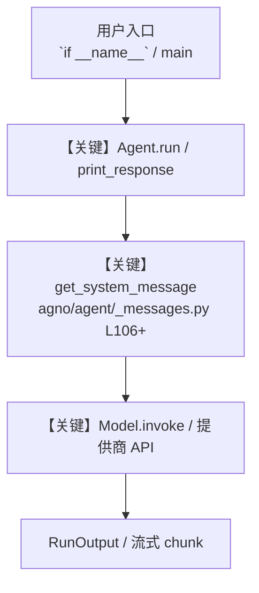

# file_generation_tools.py — 实现原理分析

<!-- cookbook-py-source:start -->
## 完整源码

```python
"""
File Generation Tool Example
This cookbook shows how to use the FileGenerationTool to generate various file types (JSON, CSV, PDF, TXT).
The tool can generate files from agent responses and make them available for download or further processing.
"""

from agno.agent import Agent
from agno.db.sqlite import SqliteDb
from agno.models.openai import OpenAIChat
from agno.tools.file_generation import FileGenerationTools

# ---------------------------------------------------------------------------
# Create Agent
# ---------------------------------------------------------------------------


agent = Agent(
    model=OpenAIChat(id="gpt-4o"),
    db=SqliteDb(db_file="tmp/test.db"),
    tools=[FileGenerationTools(output_directory="tmp")],
    description="You are a helpful assistant that can generate files in various formats.",
    instructions=[
        "When asked to create files, use the appropriate file generation tools.",
        "Always provide meaningful content and appropriate filenames.",
        "Explain what you've created and how it can be used.",
    ],
    markdown=True,
)


def example_json_generation():
    """Example: Generate a JSON file"""
    print("=== JSON File Generation Example ===")
    response = agent.run(
        "Create a JSON file containing information about 3 fictional employees with name, position, department, and salary."
    )
    print(response.content)
    if response.files:
        for file in response.files:
            print(f"Generated file: {file.filename} ({file.size} bytes)")
            if file.url:
                print(f"File location: {file.url}")
    print()


def example_csv_generation():
    """Example: Generate a CSV file"""
    print("=== CSV File Generation Example ===")
    response = agent.run(
        "Create a CSV file with sales data for the last 6 months. Include columns for month, product, units_sold, and revenue."
    )
    print(response.content)
    if response.files:
        for file in response.files:
            print(f"Generated file: {file.filename} ({file.size} bytes)")
            if file.url:
                print(f"File location: {file.url}")
    print()


def example_pdf_generation():
    """Example: Generate a PDF file"""
    print("=== PDF File Generation Example ===")
    response = agent.run(
        "Create a PDF report about renewable energy trends in 2024. Include sections on solar, wind, and hydroelectric power."
    )
    print(response.content)
    if response.files:
        for file in response.files:
            print(f"Generated file: {file.filename} ({file.size} bytes)")
            if file.url:
                print(f"File location: {file.url}")
    print()


def example_text_generation():
    """Example: Generate a text file"""
    print("=== Text File Generation Example ===")
    response = agent.run(
        "Create a text file with a list of best practices for remote work productivity."
    )
    print(response.content)
    if response.files:
        for file in response.files:
            print(f"Generated file: {file.filename} ({file.size} bytes)")
            if file.url:
                print(f"File location: {file.url}")
    print()


# ---------------------------------------------------------------------------
# Run Agent
# ---------------------------------------------------------------------------

if __name__ == "__main__":
    print("File Generation Tool Cookbook Example")
    print("=" * 50)

    example_pdf_generation()
```

<!-- cookbook-py-source:end -->

> 源文件：`cookbook/91_tools/file_generation_tools.py`

## 概述

File Generation Tool Example

本示例归类：**单 Agent**；模型相关类型：`OpenAIChat`。

**核心配置一览：**

| 配置项 | 值 | 说明 |
|--------|------|------|
| `model` | OpenAIChat(id='gpt-4o'…) | `Agent(...)` |
| `db` | SqliteDb(db_file='tmp/test.db'…) | `Agent(...)` |
| `description` | 'You are a helpful assistant that can generate files in various formats.' | `Agent(...)` |
| `markdown` | True | `Agent(...)` |
| （Model 类） | `OpenAIChat` | `agno.models` |

## 架构分层

```
用户 / cookbook 示例              Agno 框架
┌──────────────────────┐         ┌────────────────────────────────┐
│ file_generation_tools.py │  ──▶  │ Agent → get_run_messages → Model │
└──────────────────────┘         └────────────────────────────────┘
                                          │
                                          ▼
                                  ┌───────────────┐
                                  │ 对应 Model 子类 │
                                  └───────────────┘
```

## 核心组件解析

### 运行机制与因果链

1. **入口**：从模块 `__main__` 或暴露的 `agent` / `team` 调用进入；同步用 `print_response` / `run`，异步用 `aprint_response` / `arun`（若源码中有）。
2. **消息**：默认路径下 system 内容由 `get_system_message()`（`libs/agno/agno/agent/_messages.py` 约 **L106** 起）按分段逻辑拼装；若显式传入 `system_message` 则早退使用该字符串。
3. **模型**：具体 HTTP/SDK 形态以 `libs/agno/agno/models/` 下对应类的 `invoke` / `ainvoke` 为准（勿默认写成单一 `chat.completions`）。
4. **副作用**：若配置 `db`、`knowledge`、`memory`，运行会读写存储；仅以本文件为准对照。

### 与框架的衔接

- **System**：`get_system_message()` 锚点 `agno/agent/_messages.py` **L106+**。
- **运行**：`Agent.print_response` 等入口 `agno/agent/agent.py`（以当前仓库检索为准）。

## System Prompt 组装

| 序号 | 组成部分 | 本文件 | 是否生效 |
|------|---------|--------|---------|
| 1 | `instructions` / `description` 等 | 见核心配置表与源码 | 有赋值则生效 |
| 2 | 默认分段（markdown、时间等） | 取决于 `Agent` 默认与显式参数 | 视参数 |

### 拼装顺序与源码锚点

1. `system_message` 直给 → 使用该内容（见 `_messages.py` 文档字符串分支说明）。
2. 否则默认拼装：`description`、`role`、`instructions`、markdown 附加段等按 `# 3.x` 注释顺序合并。

### 还原后的完整 System 文本

```text
--- description ---
You are a helpful assistant that can generate files in various formats.
```

### 段落释义（模型视角）

- 指令与安全边界由 `instructions` / `system_message` 约束；若带 `tools` / `knowledge`，文档中需体现「何时检索/调用」由框架注入的提示段支持。

## 完整 API 请求

```python
# 请以本文件实际 Model 为准打开 libs/agno/agno/models/<厂商>/ 下对应类的 invoke：
# 可能是 chat.completions.create、responses.create、Gemini generate_content 等。
```

> 与上一节 system 文本在同一 run 中组合；`developer`/`system` 角色由适配器转换。



**【关键】节点说明：**

- **print_response / run**：用户可见的同步入口。
- **get_system_message**：系统提示拼装核心。
- **Model.invoke**：对模型提供商的实际请求。

## 关键源码文件索引

| 文件 | 作用 |
|------|------|
| `agno/agent/_messages.py` | `get_system_message()` L106+ |
| `agno/agent/agent.py` | `Agent` 运行与 CLI 输出 |
| `agno/models/` | 各厂商 `Model.invoke` |
