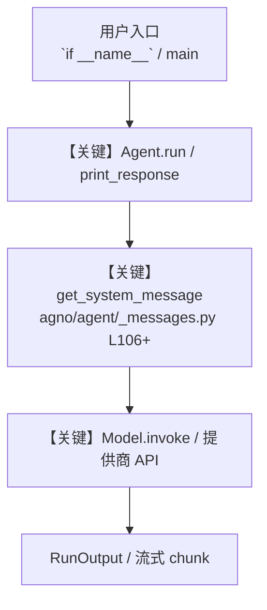

# file_tools.py — 实现原理分析

<!-- cookbook-py-source:start -->
## 完整源码

```python
"""
File Tools - File System Operations and Management

This example demonstrates how to use FileTools for file operations
including reading, writing, searching files, and searching file contents.
Shows enable_ flag patterns for selective function access.
"""

from pathlib import Path

from agno.agent import Agent
from agno.tools.file import FileTools

# ---------------------------------------------------------------------------
# Create Agent
# ---------------------------------------------------------------------------


# Example 1: All functions enabled (default behavior)
agent_full = Agent(
    tools=[
        FileTools(Path("tmp/file"))
    ],  # All functions enabled by default, except file deletion
    description="You are a comprehensive file management assistant with all file operation capabilities.",
    instructions=[
        "Help users with all file operations including read, write, search, and management",
        "Create, modify, and organize files and directories",
        "Provide clear feedback on file operations",
        "Ensure file paths and operations are valid",
    ],
    markdown=True,
)

# Example 2: Enable only file reading and searching
agent_readonly = Agent(
    tools=[
        FileTools(
            Path("tmp/file"),
            enable_read_file=True,
            enable_search_files=True,
            enable_list_files=True,
        )
    ],
    description="You are a file reader focused on accessing and searching existing files.",
    instructions=[
        "Read and search through existing files",
        "List file contents and directory structures",
        "Cannot create, modify, or delete files",
        "Focus on information retrieval and file exploration",
    ],
    markdown=True,
)

# Example 3: Enable all functions using 'all=True' pattern
agent_comprehensive = Agent(
    tools=[FileTools(Path("tmp/file"), all=True)],
    description="You are a full-featured file system manager with all capabilities enabled.",
    instructions=[
        "Perform comprehensive file system operations",
        "Manage complete file lifecycles including creation, modification, and deletion",
        "Support advanced file organization and processing workflows",
        "Provide end-to-end file management solutions",
    ],
    markdown=True,
)

# Example 4: Write-only operations (for content creation)
agent_writer = Agent(
    tools=[
        FileTools(
            Path("tmp/file"),
            enable_save_file=True,
            enable_read_file=False,  # Disable file reading
            enable_read_file_chunk=False,  # Disable reading in chunks as well
            enable_search_files=False,  # Disable file searching
        )
    ],
    description="You are a content creator focused on writing and organizing new files.",
    instructions=[
        "Create new files and directories",
        "Generate and save content to files",
        "Cannot read existing files or search directories",
        "Focus on content creation and file organization",
    ],
    markdown=True,
)

# Example 5: Content search agent using enable_search_content
# search_content lets the agent grep through file contents (case-insensitive)
# for a query string, returning matching files with snippets.
agent_content_search = Agent(
    tools=[
        FileTools(
            Path("tmp/file"),
            enable_read_file=True,
            enable_search_content=True,
            enable_list_files=True,
            enable_save_file=False,
        )
    ],
    description="You are a content search specialist that finds information within files.",
    instructions=[
        "Search through file contents to find relevant information",
        "Use search_content to locate files containing specific terms",
        "Summarize the matches and provide context from the snippets",
    ],
    markdown=True,
)

# Example usage

# ---------------------------------------------------------------------------
# Run Agent
# ---------------------------------------------------------------------------
if __name__ == "__main__":
    print("=== Full File Management Example ===")
    agent_full.print_response(
        "What is the most advanced LLM currently? Save the answer to a file.",
        markdown=True,
    )

    print("\n=== Read-Only File Operations Example ===")
    agent_readonly.print_response(
        "Search for all files in the directory and list their names and sizes",
        markdown=True,
    )

    print("\n=== File Writing Example ===")
    agent_writer.print_response(
        "Create a summary of Python best practices and save it to 'python_guide.txt'",
        markdown=True,
    )

    print("\n=== File Search Example ===")
    agent_full.print_response(
        "Search for all files which have an extension '.txt' and save the answer to a new file named 'all_txt_files.txt'",
        markdown=True,
    )

    print("\n=== Content Search Example ===")
    agent_content_search.print_response(
        "Search inside all files for the word 'Python' and summarize what you find",
        markdown=True,
    )
```

<!-- cookbook-py-source:end -->

> 源文件：`cookbook/91_tools/file_tools.py`

## 概述

File Tools - File System Operations and Management

本示例归类：**单 Agent**；模型相关类型：`（见源码 import）`。

**核心配置一览：**

| 配置项 | 值 | 说明 |
|--------|------|------|
| `description` | 'You are a comprehensive file management assistant with all file operation capabilities.' | `Agent(...)` |
| `markdown` | True | `Agent(...)` |

## 架构分层

```
用户 / cookbook 示例              Agno 框架
┌──────────────────────┐         ┌────────────────────────────────┐
│ file_tools.py        │  ──▶  │ Agent → get_run_messages → Model │
└──────────────────────┘         └────────────────────────────────┘
                                          │
                                          ▼
                                  ┌───────────────┐
                                  │ 对应 Model 子类 │
                                  └───────────────┘
```

## 核心组件解析

### 运行机制与因果链

1. **入口**：从模块 `__main__` 或暴露的 `agent` / `team` 调用进入；同步用 `print_response` / `run`，异步用 `aprint_response` / `arun`（若源码中有）。
2. **消息**：默认路径下 system 内容由 `get_system_message()`（`libs/agno/agno/agent/_messages.py` 约 **L106** 起）按分段逻辑拼装；若显式传入 `system_message` 则早退使用该字符串。
3. **模型**：具体 HTTP/SDK 形态以 `libs/agno/agno/models/` 下对应类的 `invoke` / `ainvoke` 为准（勿默认写成单一 `chat.completions`）。
4. **副作用**：若配置 `db`、`knowledge`、`memory`，运行会读写存储；仅以本文件为准对照。

### 与框架的衔接

- **System**：`get_system_message()` 锚点 `agno/agent/_messages.py` **L106+**。
- **运行**：`Agent.print_response` 等入口 `agno/agent/agent.py`（以当前仓库检索为准）。

## System Prompt 组装

| 序号 | 组成部分 | 本文件 | 是否生效 |
|------|---------|--------|---------|
| 1 | `instructions` / `description` 等 | 见核心配置表与源码 | 有赋值则生效 |
| 2 | 默认分段（markdown、时间等） | 取决于 `Agent` 默认与显式参数 | 视参数 |

### 拼装顺序与源码锚点

1. `system_message` 直给 → 使用该内容（见 `_messages.py` 文档字符串分支说明）。
2. 否则默认拼装：`description`、`role`、`instructions`、markdown 附加段等按 `# 3.x` 注释顺序合并。

### 还原后的完整 System 文本

```text
--- description ---
You are a comprehensive file management assistant with all file operation capabilities.
```

### 段落释义（模型视角）

- 指令与安全边界由 `instructions` / `system_message` 约束；若带 `tools` / `knowledge`，文档中需体现「何时检索/调用」由框架注入的提示段支持。

## 完整 API 请求

```python
# 请以本文件实际 Model 为准打开 libs/agno/agno/models/<厂商>/ 下对应类的 invoke：
# 可能是 chat.completions.create、responses.create、Gemini generate_content 等。
```

> 与上一节 system 文本在同一 run 中组合；`developer`/`system` 角色由适配器转换。



**【关键】节点说明：**

- **print_response / run**：用户可见的同步入口。
- **get_system_message**：系统提示拼装核心。
- **Model.invoke**：对模型提供商的实际请求。

## 关键源码文件索引

| 文件 | 作用 |
|------|------|
| `agno/agent/_messages.py` | `get_system_message()` L106+ |
| `agno/agent/agent.py` | `Agent` 运行与 CLI 输出 |
| `agno/models/` | 各厂商 `Model.invoke` |
