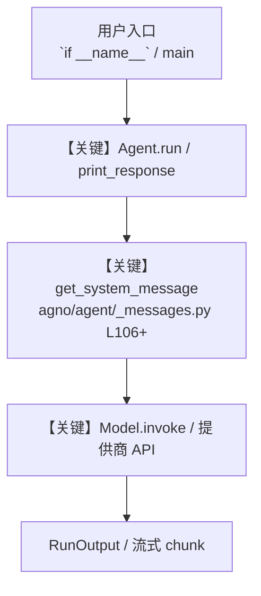

# financial_datasets_tools.py — 实现原理分析

<!-- cookbook-py-source:start -->
## 完整源码

```python
"""
Financial Datasets API Toolkit Example
This example demonstrates various Financial Datasets API functionalities including
financial statements, stock prices, news, insider trades, and more.

Prerequisites:
- Set the environment variable `FINANCIAL_DATASETS_API_KEY` with your Financial Datasets API key.
  You can obtain the API key by creating an account at https://financialdatasets.ai
"""

from agno.agent import Agent
from agno.tools.financial_datasets import FinancialDatasetsTools

# ---------------------------------------------------------------------------
# Create Agent
# ---------------------------------------------------------------------------


agent = Agent(
    name="Financial Data Agent",
    tools=[
        FinancialDatasetsTools(),  # For accessing financial data
    ],
    description="You are a financial data specialist that helps analyze financial information for stocks and cryptocurrencies.",
    instructions=[
        "When given a financial query:",
        "1. Use appropriate Financial Datasets methods based on the query type",
        "2. Format financial data clearly and highlight key metrics",
        "3. For financial statements, compare important metrics with previous periods when relevant",
        "4. Calculate growth rates and trends when appropriate",
        "5. Handle errors gracefully and provide meaningful feedback",
    ],
    markdown=True,
)

# Example 1: Financial Statements

# ---------------------------------------------------------------------------
# Run Agent
# ---------------------------------------------------------------------------
if __name__ == "__main__":
    print("\n=== Income Statement Example ===")
    agent.print_response(
        "Get the most recent income statement for AAPL and highlight key metrics",
        stream=True,
    )

    # Example 2: Balance Sheet Analysis
    print("\n=== Balance Sheet Analysis Example ===")
    agent.print_response(
        "Analyze the balance sheets for MSFT over the last 3 years. Focus on debt-to-equity ratio and cash position.",
        stream=True,
    )

    # # Example 3: Cash Flow Analysis
    # print("\n=== Cash Flow Analysis Example ===")
    # agent.print_response(
    #     "Get the quarterly cash flow statements for TSLA for the past year and analyze their free cash flow trends",
    #     stream=True,
    # )

    # # Example 4: Company Information
    # print("\n=== Company Information Example ===")
    # agent.print_response(
    #     "Provide key information about NVDA including its business description, sector, and industry",
    #     stream=True,
    # )

    # # Example 5: Stock Price Analysis
    # print("\n=== Stock Price Analysis Example ===")
    # agent.print_response(
    #     "Analyze the daily stock prices for AMZN over the past 30 days. Calculate the average, high, low, and volatility.",
    #     stream=True,
    # )

    # # Example 6: Earnings Comparison
    # print("\n=== Earnings Comparison Example ===")
    # agent.print_response(
    #     "Compare the last 4 earnings reports for GOOG. Show the trend in EPS and revenue.",
    #     stream=True,
    # )

    # # Example 7: Insider Trades Analysis
    # print("\n=== Insider Trades Analysis Example ===")
    # agent.print_response(
    #     "Analyze recent insider trading activity for META. Are insiders buying or selling?",
    #     stream=True,
    # )

    # # Example 8: Institutional Ownership
    # print("\n=== Institutional Ownership Example ===")
    # agent.print_response(
    #     "Who are the largest institutional owners of INTC? Have they increased or decreased their positions recently?",
    #     stream=True,
    # )

    # # Example 9: Financial News
    # print("\n=== Financial News Example ===")
    # agent.print_response(
    #     "What are the latest news items about NFLX? Summarize the key stories.",
    #     stream=True,
    # )

    # # Example 10: Multi-stock Comparison
    # print("\n=== Multi-stock Comparison Example ===")
    # agent.print_response(
    #     """Compare the following tech companies: AAPL, MSFT, GOOG, AMZN, META
    #     1. Revenue growth rate
    #     2. Profit margins
    #     3. P/E ratios
    #     4. Debt levels
    #     Present as a comparison table.""",
    #     stream=True,
    # )

    # # Example 11: Cryptocurrency Analysis
    # print("\n=== Cryptocurrency Analysis Example ===")
    # agent.print_response(
    #     "Analyze Bitcoin (BTC) price movements over the past week. Show daily price changes and calculate volatility.",
    #     stream=True,
    # )

    # # Example 12: SEC Filings Analysis
    # print("\n=== SEC Filings Analysis Example ===")
    # agent.print_response(
    #     "Get the most recent 10-K and 10-Q filings for AAPL and extract key risk factors mentioned.",
    #     stream=True,
    # )

    # # Example 13: Financial Metrics and Ratios
    # print("\n=== Financial Metrics Example ===")
    # agent.print_response(
    #     "Calculate and explain the following financial metrics for TSLA: P/E ratio, P/S ratio, EV/EBITDA, and ROE.",
    #     stream=True,
    # )

    # # Example 14: Segmented Financials
    # print("\n=== Segmented Financials Example ===")
    # agent.print_response(
    #     "Analyze AAPL's segmented financials. How much revenue comes from each product category and geographic region?",
    #     stream=True,
    # )

    # # Example 15: Stock Ticker Search
    # print("\n=== Stock Ticker Search Example ===")
    # agent.print_response(
    #     "Find all stock tickers related to 'artificial intelligence' and give me a brief overview of each company.",
    #     stream=True,
    # )

    # # Example 16: Financial Statement Comparison
    # print("\n=== Financial Statement Comparison Example ===")
    # agent.print_response(
    #     """Compare the financial statements of AAPL and MSFT for the most recent fiscal year:
    #     1. Revenue and revenue growth
    #     2. Net income and profit margins
    #     3. Cash position and debt levels
    #     4. R&D spending
    #     Present the comparison in a well-formatted table.""",
    #     stream=True,
    # )

    # # Example 17: Portfolio Analysis
    # print("\n=== Portfolio Analysis Example ===")
    # agent.print_response(
    #     """Analyze a portfolio with the following stocks and weights:
    #     - AAPL (25%)
    #     - MSFT (25%)
    #     - GOOG (20%)
    #     - AMZN (15%)
    #     - TSLA (15%)
    #     Calculate the portfolio's overall financial metrics and recent performance.""",
    #     stream=True,
    # )

    # # Example 18: Dividend Analysis
    # print("\n=== Dividend Analysis Example ===")
    # agent.print_response(
    #     "Analyze the dividend history and dividend yield for JNJ over the past 5 years.",
    #     stream=True,
    # )

    # # Example 19: Technical Indicator Analysis
    # print("\n=== Technical Indicator Analysis Example ===")
    # agent.print_response(
    #     "Using daily stock prices for the past 30 days, calculate and interpret the 7-day and 21-day moving averages for AAPL.",
    #     stream=True,
    # )

    # # Example 20: Financial Report Summary
    # print("\n=== Financial Report Summary Example ===")
    # agent.print_response(
    #     """Create a comprehensive financial summary for NVDA including:
    #     1. Company overview
    #     2. Latest income statement highlights
    #     3. Balance sheet strength
    #     4. Cash flow analysis
    #     5. Key financial ratios
    #     6. Recent news affecting the stock""",
    #     stream=True,
    # )
```

<!-- cookbook-py-source:end -->

> 源文件：`cookbook/91_tools/financial_datasets_tools.py`

## 概述

Financial Datasets API Toolkit Example

本示例归类：**单 Agent**；模型相关类型：`（见源码 import）`。

**核心配置一览：**

| 配置项 | 值 | 说明 |
|--------|------|------|
| `name` | 'Financial Data Agent' | `Agent(...)` |
| `description` | 'You are a financial data specialist that helps analyze financial information for stocks and cryptocurrencies.' | `Agent(...)` |
| `markdown` | True | `Agent(...)` |

## 架构分层

```
用户 / cookbook 示例              Agno 框架
┌──────────────────────┐         ┌────────────────────────────────┐
│ financial_datasets_tools.py │  ──▶  │ Agent → get_run_messages → Model │
└──────────────────────┘         └────────────────────────────────┘
                                          │
                                          ▼
                                  ┌───────────────┐
                                  │ 对应 Model 子类 │
                                  └───────────────┘
```

## 核心组件解析

### 运行机制与因果链

1. **入口**：从模块 `__main__` 或暴露的 `agent` / `team` 调用进入；同步用 `print_response` / `run`，异步用 `aprint_response` / `arun`（若源码中有）。
2. **消息**：默认路径下 system 内容由 `get_system_message()`（`libs/agno/agno/agent/_messages.py` 约 **L106** 起）按分段逻辑拼装；若显式传入 `system_message` 则早退使用该字符串。
3. **模型**：具体 HTTP/SDK 形态以 `libs/agno/agno/models/` 下对应类的 `invoke` / `ainvoke` 为准（勿默认写成单一 `chat.completions`）。
4. **副作用**：若配置 `db`、`knowledge`、`memory`，运行会读写存储；仅以本文件为准对照。

### 与框架的衔接

- **System**：`get_system_message()` 锚点 `agno/agent/_messages.py` **L106+**。
- **运行**：`Agent.print_response` 等入口 `agno/agent/agent.py`（以当前仓库检索为准）。

## System Prompt 组装

| 序号 | 组成部分 | 本文件 | 是否生效 |
|------|---------|--------|---------|
| 1 | `instructions` / `description` 等 | 见核心配置表与源码 | 有赋值则生效 |
| 2 | 默认分段（markdown、时间等） | 取决于 `Agent` 默认与显式参数 | 视参数 |

### 拼装顺序与源码锚点

1. `system_message` 直给 → 使用该内容（见 `_messages.py` 文档字符串分支说明）。
2. 否则默认拼装：`description`、`role`、`instructions`、markdown 附加段等按 `# 3.x` 注释顺序合并。

### 还原后的完整 System 文本

```text
--- description ---
You are a financial data specialist that helps analyze financial information for stocks and cryptocurrencies.
```

### 段落释义（模型视角）

- 指令与安全边界由 `instructions` / `system_message` 约束；若带 `tools` / `knowledge`，文档中需体现「何时检索/调用」由框架注入的提示段支持。

## 完整 API 请求

```python
# 请以本文件实际 Model 为准打开 libs/agno/agno/models/<厂商>/ 下对应类的 invoke：
# 可能是 chat.completions.create、responses.create、Gemini generate_content 等。
```

> 与上一节 system 文本在同一 run 中组合；`developer`/`system` 角色由适配器转换。



**【关键】节点说明：**

- **print_response / run**：用户可见的同步入口。
- **get_system_message**：系统提示拼装核心。
- **Model.invoke**：对模型提供商的实际请求。

## 关键源码文件索引

| 文件 | 作用 |
|------|------|
| `agno/agent/_messages.py` | `get_system_message()` L106+ |
| `agno/agent/agent.py` | `Agent` 运行与 CLI 输出 |
| `agno/models/` | 各厂商 `Model.invoke` |
