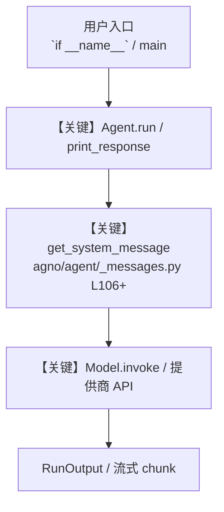

# calendar_gmail_meeting_prep.py — 实现原理分析

<!-- cookbook-py-source:start -->
## 完整源码

```python
"""
Meeting Prep Agent (Calendar + Gmail)
=====================================
Prepares you for upcoming meetings by combining calendar and email context.

Workflow:
1. Fetches your next meeting (or a specific one) from Google Calendar
2. Identifies attendees and their RSVP status
3. Searches Gmail for recent threads involving those attendees
4. Produces a structured prep brief: who's coming, recent topics, open threads

Key concepts:
- Two toolkits on one agent: GoogleCalendarTools + GmailTools
- Multi-step reasoning: calendar lookup -> attendee extraction -> email search
- output_schema: structured meeting prep brief
- add_datetime_to_context: agent knows "now" for finding the next meeting

Setup:
1. Enable both Calendar API and Gmail API at https://console.cloud.google.com
2. Export GOOGLE_CLIENT_ID, GOOGLE_CLIENT_SECRET, GOOGLE_PROJECT_ID env vars
3. pip install openai google-api-python-client google-auth-httplib2 google-auth-oauthlib
4. First run opens browser for OAuth consent (grants both Calendar + Gmail access)
   The same token.json works for both APIs if scopes include both.
"""

from typing import List, Literal, Optional

from agno.agent import Agent
from agno.models.openai import OpenAIChat
from agno.tools.google.calendar import GoogleCalendarTools
from agno.tools.google.gmail import GmailTools
from pydantic import BaseModel, Field


class AttendeeInfo(BaseModel):
    name: str = Field(..., description="Attendee name or email")
    rsvp: Literal["accepted", "declined", "tentative", "needsAction", "unknown"] = (
        Field("unknown", description="RSVP status from calendar")
    )
    recent_email_subjects: List[str] = Field(
        default_factory=list,
        description="Subjects of recent emails from/to this person (last 7 days)",
    )


class OpenThread(BaseModel):
    subject: str = Field(..., description="Email thread subject")
    participants: List[str] = Field(..., description="People in the thread")
    last_message_date: str = Field(..., description="Date of last message")
    summary: str = Field(..., description="One-sentence summary of the thread")
    needs_response: bool = Field(
        False, description="Whether the last message is waiting for user's reply"
    )


class MeetingPrepBrief(BaseModel):
    meeting_title: str = Field(..., description="Meeting title from calendar")
    meeting_time: str = Field(..., description="Start time in human-readable format")
    duration_minutes: int = Field(..., description="Duration in minutes")
    location: Optional[str] = Field(None, description="Location or video call link")
    attendees: List[AttendeeInfo] = Field(
        default_factory=list, description="Attendee details with email context"
    )
    open_threads: List[OpenThread] = Field(
        default_factory=list,
        description="Active email threads with meeting attendees",
    )
    talking_points: List[str] = Field(
        default_factory=list,
        description="Suggested talking points based on recent email topics",
    )
    prep_summary: str = Field(
        ..., description="2-3 sentence overview of what to expect in this meeting"
    )


agent = Agent(
    name="Meeting Prep Agent",
    model=OpenAIChat(id="gpt-4o"),
    tools=[
        GoogleCalendarTools(
            create_event=False,
            update_event=False,
            delete_event=False,
        ),
        GmailTools(
            include_tools=[
                "search_emails",
                "get_emails_by_context",
                "get_thread",
            ]
        ),
    ],
    instructions=[
        "When asked to prep for a meeting:",
        "1. Use list_events to find the meeting, then get_event_attendees for RSVP details.",
        "2. For each attendee, use search_emails to find recent emails (last 7 days).",
        "3. If relevant threads exist, use get_thread to read the full conversation.",
        "4. Identify open threads where the last message needs the user's reply.",
        "5. Generate talking points from email topics related to the meeting subject.",
        "6. Write a prep_summary covering: who is attending, key open topics, any pending replies.",
        "Keep email searches focused -- search by attendee email, not by name.",
    ],
    output_schema=MeetingPrepBrief,
    add_datetime_to_context=True,
    markdown=True,
)


if __name__ == "__main__":
    agent.print_response(
        "Prep me for my next meeting -- who's attending and what have we been discussing over email?",
        stream=True,
    )

    # Prep for a specific meeting
    # agent.print_response(
    #     "Prep me for the 'Q1 Planning' meeting this week",
    #     stream=True,
    # )

    # Prep for all meetings today
    # agent.print_response(
    #     "Give me a prep brief for each of my meetings today",
    #     stream=True,
    # )
```

<!-- cookbook-py-source:end -->

> 源文件：`cookbook/91_tools/google/calendar_gmail_meeting_prep.py`

## 概述

Meeting Prep Agent (Calendar + Gmail)

本示例归类：**单 Agent**；模型相关类型：`OpenAIChat`。

**核心配置一览：**

| 配置项 | 值 | 说明 |
|--------|------|------|
| `name` | 'Meeting Prep Agent' | `Agent(...)` |
| `model` | OpenAIChat(id='gpt-4o'…) | `Agent(...)` |
| `output_schema` | 变量 `MeetingPrepBrief` | `Agent(...)` |
| `add_datetime_to_context` | True | `Agent(...)` |
| `markdown` | True | `Agent(...)` |
| （Model 类） | `OpenAIChat` | `agno.models` |

## 架构分层

```
用户 / cookbook 示例              Agno 框架
┌──────────────────────┐         ┌────────────────────────────────┐
│ calendar_gmail_meeting_prep.py │  ──▶  │ Agent → get_run_messages → Model │
└──────────────────────┘         └────────────────────────────────┘
                                          │
                                          ▼
                                  ┌───────────────┐
                                  │ 对应 Model 子类 │
                                  └───────────────┘
```

## 核心组件解析

### 运行机制与因果链

1. **入口**：从模块 `__main__` 或暴露的 `agent` / `team` 调用进入；同步用 `print_response` / `run`，异步用 `aprint_response` / `arun`（若源码中有）。
2. **消息**：默认路径下 system 内容由 `get_system_message()`（`libs/agno/agno/agent/_messages.py` 约 **L106** 起）按分段逻辑拼装；若显式传入 `system_message` 则早退使用该字符串。
3. **模型**：具体 HTTP/SDK 形态以 `libs/agno/agno/models/` 下对应类的 `invoke` / `ainvoke` 为准（勿默认写成单一 `chat.completions`）。
4. **副作用**：若配置 `db`、`knowledge`、`memory`，运行会读写存储；仅以本文件为准对照。

### 与框架的衔接

- **System**：`get_system_message()` 锚点 `agno/agent/_messages.py` **L106+**。
- **运行**：`Agent.print_response` 等入口 `agno/agent/agent.py`（以当前仓库检索为准）。

## System Prompt 组装

| 序号 | 组成部分 | 本文件 | 是否生效 |
|------|---------|--------|---------|
| 1 | `instructions` / `description` 等 | 见核心配置表与源码 | 有赋值则生效 |
| 2 | 默认分段（markdown、时间等） | 取决于 `Agent` 默认与显式参数 | 视参数 |

### 拼装顺序与源码锚点

1. `system_message` 直给 → 使用该内容（见 `_messages.py` 文档字符串分支说明）。
2. 否则默认拼装：`description`、`role`、`instructions`、markdown 附加段等按 `# 3.x` 注释顺序合并。

### 还原后的完整 System 文本

```text
（主 `Agent(...)` 未传入可静态解析的 `description`/`instructions`/`system_message` 字符串；此时 system 由 `get_system_message()` 默认段与 `markdown` 等开关决定，请在 `agno/agent/_messages.py` 对照分段注释，或在运行中打印 `get_system_message` 返回值。）
```

### 段落释义（模型视角）

- 指令与安全边界由 `instructions` / `system_message` 约束；若带 `tools` / `knowledge`，文档中需体现「何时检索/调用」由框架注入的提示段支持。

## 完整 API 请求

```python
# 请以本文件实际 Model 为准打开 libs/agno/agno/models/<厂商>/ 下对应类的 invoke：
# 可能是 chat.completions.create、responses.create、Gemini generate_content 等。
```

> 与上一节 system 文本在同一 run 中组合；`developer`/`system` 角色由适配器转换。



**【关键】节点说明：**

- **print_response / run**：用户可见的同步入口。
- **get_system_message**：系统提示拼装核心。
- **Model.invoke**：对模型提供商的实际请求。

## 关键源码文件索引

| 文件 | 作用 |
|------|------|
| `agno/agent/_messages.py` | `get_system_message()` L106+ |
| `agno/agent/agent.py` | `Agent` 运行与 CLI 输出 |
| `agno/models/` | 各厂商 `Model.invoke` |
