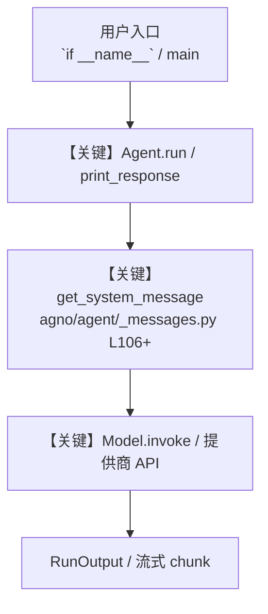

# calendar_meeting_scheduler.py — 实现原理分析

<!-- cookbook-py-source:start -->
## 完整源码

```python
"""
Calendar Meeting Scheduler
===========================
Finds a time that works for all attendees and creates the meeting.

Multi-step workflow: check_availability across attendees, find overlapping
free slots, present options, then create_event with the chosen time.

Key concepts:
- check_availability: FreeBusy API for multi-person scheduling
- find_available_slots: user's own free windows
- create_event: with attendees, Google Meet link, and reminders
- Multi-step agent reasoning: query -> analyze -> propose -> create

Setup:
1. Create OAuth credentials at https://console.cloud.google.com (enable Calendar API)
2. Export GOOGLE_CLIENT_ID, GOOGLE_CLIENT_SECRET, GOOGLE_PROJECT_ID env vars
3. pip install openai google-api-python-client google-auth-httplib2 google-auth-oauthlib
4. First run opens browser for OAuth consent, saves token.json for reuse
"""

from typing import List, Optional

from agno.agent import Agent
from agno.models.openai import OpenAIChat
from agno.tools.google.calendar import GoogleCalendarTools
from pydantic import BaseModel, Field


class TimeSlot(BaseModel):
    start: str = Field(..., description="Slot start in ISO format")
    end: str = Field(..., description="Slot end in ISO format")
    duration_minutes: int = Field(..., description="Duration in minutes")


class SchedulingResult(BaseModel):
    attendees: List[str] = Field(..., description="Email addresses of all attendees")
    available_slots: List[TimeSlot] = Field(
        default_factory=list, description="Time slots where all attendees are free"
    )
    chosen_slot: Optional[TimeSlot] = Field(
        None, description="The slot that was selected for the meeting"
    )
    event_created: bool = Field(False, description="Whether the event was created")
    event_id: Optional[str] = Field(None, description="Created event ID if applicable")
    notes: str = Field(..., description="Summary of scheduling outcome")


agent = Agent(
    name="Meeting Scheduler",
    model=OpenAIChat(id="gpt-4o"),
    tools=[
        GoogleCalendarTools(
            quick_add_event=True,
        )
    ],
    description="You are a meeting scheduling assistant that finds times that work for everyone.",
    instructions=[
        "When asked to schedule a meeting with attendees:",
        "1. Use check_availability to find when all attendees are free.",
        "2. Cross-reference with find_available_slots for the user's own free windows.",
        "3. Present the best 3 available slots (prefer morning, avoid lunch 12-1pm).",
        "4. Create the event with the first available slot unless the user specifies otherwise.",
        "Always add a Google Meet link for remote meetings (set add_google_meet=True).",
        "Set a 10-minute popup reminder by default.",
    ],
    output_schema=SchedulingResult,
    add_datetime_to_context=True,
    markdown=True,
)


if __name__ == "__main__":
    agent.print_response(
        "Schedule a 30-minute meeting with alice@company.com and bob@company.com "
        "sometime this week. Add a Google Meet link.",
        stream=True,
    )

    # Schedule with specific constraints
    # agent.print_response(
    #     "Find a 1-hour slot for a team review with alice@company.com, bob@company.com, "
    #     "and carol@company.com. Must be in the afternoon (after 2pm) this week.",
    #     stream=True,
    # )

    # Quick scheduling without availability check
    # agent.print_response(
    #     "Quick add: Design review with the team Friday at 3pm for 45 minutes",
    #     stream=True,
    # )
```

<!-- cookbook-py-source:end -->

> 源文件：`cookbook/91_tools/google/calendar_meeting_scheduler.py`

## 概述

Calendar Meeting Scheduler

本示例归类：**单 Agent**；模型相关类型：`OpenAIChat`。

**核心配置一览：**

| 配置项 | 值 | 说明 |
|--------|------|------|
| `name` | 'Meeting Scheduler' | `Agent(...)` |
| `model` | OpenAIChat(id='gpt-4o'…) | `Agent(...)` |
| `description` | 'You are a meeting scheduling assistant that finds times that work for everyone.' | `Agent(...)` |
| `output_schema` | 变量 `SchedulingResult` | `Agent(...)` |
| `add_datetime_to_context` | True | `Agent(...)` |
| `markdown` | True | `Agent(...)` |
| （Model 类） | `OpenAIChat` | `agno.models` |

## 架构分层

```
用户 / cookbook 示例              Agno 框架
┌──────────────────────┐         ┌────────────────────────────────┐
│ calendar_meeting_scheduler.py │  ──▶  │ Agent → get_run_messages → Model │
└──────────────────────┘         └────────────────────────────────┘
                                          │
                                          ▼
                                  ┌───────────────┐
                                  │ 对应 Model 子类 │
                                  └───────────────┘
```

## 核心组件解析

### 运行机制与因果链

1. **入口**：从模块 `__main__` 或暴露的 `agent` / `team` 调用进入；同步用 `print_response` / `run`，异步用 `aprint_response` / `arun`（若源码中有）。
2. **消息**：默认路径下 system 内容由 `get_system_message()`（`libs/agno/agno/agent/_messages.py` 约 **L106** 起）按分段逻辑拼装；若显式传入 `system_message` 则早退使用该字符串。
3. **模型**：具体 HTTP/SDK 形态以 `libs/agno/agno/models/` 下对应类的 `invoke` / `ainvoke` 为准（勿默认写成单一 `chat.completions`）。
4. **副作用**：若配置 `db`、`knowledge`、`memory`，运行会读写存储；仅以本文件为准对照。

### 与框架的衔接

- **System**：`get_system_message()` 锚点 `agno/agent/_messages.py` **L106+**。
- **运行**：`Agent.print_response` 等入口 `agno/agent/agent.py`（以当前仓库检索为准）。

## System Prompt 组装

| 序号 | 组成部分 | 本文件 | 是否生效 |
|------|---------|--------|---------|
| 1 | `instructions` / `description` 等 | 见核心配置表与源码 | 有赋值则生效 |
| 2 | 默认分段（markdown、时间等） | 取决于 `Agent` 默认与显式参数 | 视参数 |

### 拼装顺序与源码锚点

1. `system_message` 直给 → 使用该内容（见 `_messages.py` 文档字符串分支说明）。
2. 否则默认拼装：`description`、`role`、`instructions`、markdown 附加段等按 `# 3.x` 注释顺序合并。

### 还原后的完整 System 文本

```text
--- description ---
You are a meeting scheduling assistant that finds times that work for everyone.
```

### 段落释义（模型视角）

- 指令与安全边界由 `instructions` / `system_message` 约束；若带 `tools` / `knowledge`，文档中需体现「何时检索/调用」由框架注入的提示段支持。

## 完整 API 请求

```python
# 请以本文件实际 Model 为准打开 libs/agno/agno/models/<厂商>/ 下对应类的 invoke：
# 可能是 chat.completions.create、responses.create、Gemini generate_content 等。
```

> 与上一节 system 文本在同一 run 中组合；`developer`/`system` 角色由适配器转换。



**【关键】节点说明：**

- **print_response / run**：用户可见的同步入口。
- **get_system_message**：系统提示拼装核心。
- **Model.invoke**：对模型提供商的实际请求。

## 关键源码文件索引

| 文件 | 作用 |
|------|------|
| `agno/agent/_messages.py` | `get_system_message()` L106+ |
| `agno/agent/agent.py` | `Agent` 运行与 CLI 输出 |
| `agno/models/` | 各厂商 `Model.invoke` |
