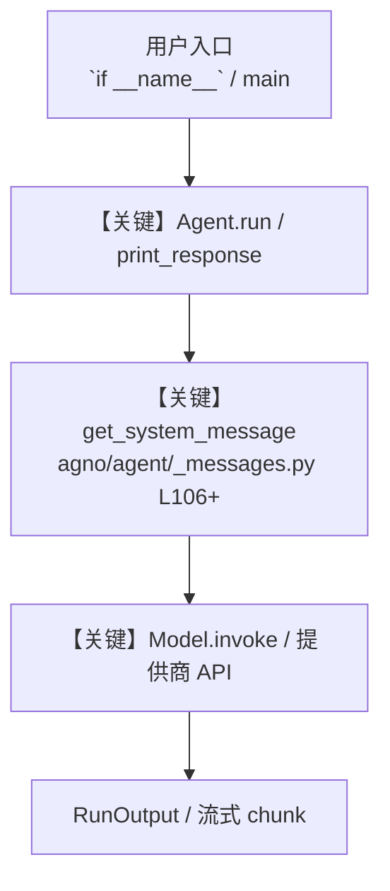

# gmail_inbox_triage.py — 实现原理分析

<!-- cookbook-py-source:start -->
## 完整源码

```python
"""
Gmail Inbox Triage
==================
A personal inbox triage agent that learns your preferences across sessions.

Combines Gmail tools with the Learning Machine to build persistent memory:
- Learns your communication tone and style
- Remembers frequent contacts and relationships
- Adapts drafts to match your writing patterns
- Uses date awareness for time-relative queries ("last week", "this month")

Key concepts:
- LearningMachine with UserMemoryConfig: Persistent preference storage
- add_datetime_to_context: Date-aware email queries without unix timestamps
- get_thread + get_message: Full context before drafting
- Multi-session learning: Agent improves with each interaction

Setup:
1. Create OAuth credentials at https://console.cloud.google.com (enable Gmail API)
2. Export GOOGLE_CLIENT_ID, GOOGLE_CLIENT_SECRET, GOOGLE_PROJECT_ID env vars
3. pip install google-api-python-client google-auth-httplib2 google-auth-oauthlib
4. Start PostgreSQL: cookbook/scripts/run_pgvector.sh
5. First run opens browser for OAuth consent, saves token.json for reuse
"""

from agno.agent import Agent
from agno.db.postgres import PostgresDb
from agno.learn import LearningMachine, LearningMode, UserMemoryConfig
from agno.models.openai import OpenAIChat
from agno.tools.google.gmail import GmailTools

db = PostgresDb(db_url="postgresql+psycopg://ai:ai@localhost:5532/ai")

agent = Agent(
    name="Inbox Triage Agent",
    model=OpenAIChat(id="gpt-4o"),
    tools=[GmailTools(download_attachment=True, archive_email=True)],
    db=db,
    learning=LearningMachine(
        user_memory=UserMemoryConfig(
            mode=LearningMode.ALWAYS,
        ),
    ),
    instructions=[
        "You are a personal email assistant that learns the user's preferences over time.",
        "Before drafting any reply, read the full thread with get_thread to understand context.",
        "Match the user's tone: if they write casually, draft casually. If formal, match it.",
        "When the user corrects a draft or gives style feedback, remember it for next time.",
        "For date-based queries, use get_emails_by_date with YYYY/MM/DD format.",
        "When asked about attachments, use get_message to find attachment IDs, then download_attachment.",
    ],
    add_datetime_to_context=True,
    markdown=True,
)


if __name__ == "__main__":
    user_id = "user@example.com"

    # # Session 1: Triage inbox and learn preferences
    print("\n--- Session 1: Triage inbox, agent learns your style ---\n")

    agent.print_response(
        "Summarize my 5 most recent unread emails. Keep it short and direct.",
        user_id=user_id,
        session_id="session_1",
        stream=True,
    )

    # # Show what the agent learned
    # lm = agent.learning_machine
    # if lm and lm.user_memory_store:
    #     print("\n--- Learned memories ---")
    #     lm.user_memory_store.print(user_id=user_id)

    # # Session 2: Agent recalls preferences in a new session
    # print("\n--- Session 2: Agent remembers your preferences ---\n")

    # agent.print_response(
    #     "Draft a reply to the most recent email thread I received.",
    #     user_id=user_id,
    #     session_id="session_2",
    #     stream=True,
    # )
```

<!-- cookbook-py-source:end -->

> 源文件：`cookbook/91_tools/google/gmail_inbox_triage.py`

## 概述

Gmail Inbox Triage

本示例归类：**单 Agent**；模型相关类型：`OpenAIChat`。

**核心配置一览：**

| 配置项 | 值 | 说明 |
|--------|------|------|
| `name` | 'Inbox Triage Agent' | `Agent(...)` |
| `model` | OpenAIChat(id='gpt-4o'…) | `Agent(...)` |
| `db` | 变量 `db` | `Agent(...)` |
| `learning` | LearningMachine(…) | `Agent(...)` |
| `add_datetime_to_context` | True | `Agent(...)` |
| `markdown` | True | `Agent(...)` |
| （Model 类） | `OpenAIChat` | `agno.models` |

## 架构分层

```
用户 / cookbook 示例              Agno 框架
┌──────────────────────┐         ┌────────────────────────────────┐
│ gmail_inbox_triage.py │  ──▶  │ Agent → get_run_messages → Model │
└──────────────────────┘         └────────────────────────────────┘
                                          │
                                          ▼
                                  ┌───────────────┐
                                  │ 对应 Model 子类 │
                                  └───────────────┘
```

## 核心组件解析

### 运行机制与因果链

1. **入口**：从模块 `__main__` 或暴露的 `agent` / `team` 调用进入；同步用 `print_response` / `run`，异步用 `aprint_response` / `arun`（若源码中有）。
2. **消息**：默认路径下 system 内容由 `get_system_message()`（`libs/agno/agno/agent/_messages.py` 约 **L106** 起）按分段逻辑拼装；若显式传入 `system_message` 则早退使用该字符串。
3. **模型**：具体 HTTP/SDK 形态以 `libs/agno/agno/models/` 下对应类的 `invoke` / `ainvoke` 为准（勿默认写成单一 `chat.completions`）。
4. **副作用**：若配置 `db`、`knowledge`、`memory`，运行会读写存储；仅以本文件为准对照。

### 与框架的衔接

- **System**：`get_system_message()` 锚点 `agno/agent/_messages.py` **L106+**。
- **运行**：`Agent.print_response` 等入口 `agno/agent/agent.py`（以当前仓库检索为准）。

## System Prompt 组装

| 序号 | 组成部分 | 本文件 | 是否生效 |
|------|---------|--------|---------|
| 1 | `instructions` / `description` 等 | 见核心配置表与源码 | 有赋值则生效 |
| 2 | 默认分段（markdown、时间等） | 取决于 `Agent` 默认与显式参数 | 视参数 |

### 拼装顺序与源码锚点

1. `system_message` 直给 → 使用该内容（见 `_messages.py` 文档字符串分支说明）。
2. 否则默认拼装：`description`、`role`、`instructions`、markdown 附加段等按 `# 3.x` 注释顺序合并。

### 还原后的完整 System 文本

```text
（主 `Agent(...)` 未传入可静态解析的 `description`/`instructions`/`system_message` 字符串；此时 system 由 `get_system_message()` 默认段与 `markdown` 等开关决定，请在 `agno/agent/_messages.py` 对照分段注释，或在运行中打印 `get_system_message` 返回值。）
```

### 段落释义（模型视角）

- 指令与安全边界由 `instructions` / `system_message` 约束；若带 `tools` / `knowledge`，文档中需体现「何时检索/调用」由框架注入的提示段支持。

## 完整 API 请求

```python
# 请以本文件实际 Model 为准打开 libs/agno/agno/models/<厂商>/ 下对应类的 invoke：
# 可能是 chat.completions.create、responses.create、Gemini generate_content 等。
```

> 与上一节 system 文本在同一 run 中组合；`developer`/`system` 角色由适配器转换。



**【关键】节点说明：**

- **print_response / run**：用户可见的同步入口。
- **get_system_message**：系统提示拼装核心。
- **Model.invoke**：对模型提供商的实际请求。

## 关键源码文件索引

| 文件 | 作用 |
|------|------|
| `agno/agent/_messages.py` | `get_system_message()` L106+ |
| `agno/agent/agent.py` | `Agent` 运行与 CLI 输出 |
| `agno/models/` | 各厂商 `Model.invoke` |
