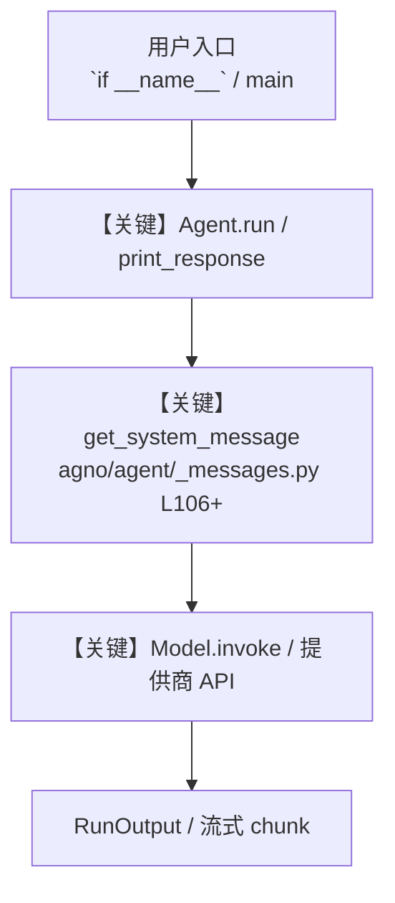

# gmail_tools.py — 实现原理分析

<!-- cookbook-py-source:start -->
## 完整源码

```python
"""
Gmail Agent that can read, draft and send emails using the Gmail.
"""

from agno.agent import Agent
from agno.models.openai import OpenAIChat
from agno.tools.google.gmail import GmailTools
from pydantic import BaseModel, Field

# ---------------------------------------------------------------------------
# Create Agent
# ---------------------------------------------------------------------------


class FindEmailOutput(BaseModel):
    message_id: str = Field(..., description="The message id of the email")
    thread_id: str = Field(..., description="The thread id of the email")
    references: str = Field(..., description="The references of the email")
    in_reply_to: str = Field(..., description="The in-reply-to of the email")
    subject: str = Field(..., description="The subject of the email")
    body: str = Field(..., description="The body of the email")


# Example 1: Include specific Gmail functions for reading only
read_only_agent = Agent(
    name="Gmail Reader Agent",
    model=OpenAIChat(id="gpt-4o"),
    tools=[
        GmailTools(
            include_tools=[
                "search_emails",
                "get_emails_by_thread",
                "mark_email_as_read",
                "mark_email_as_unread",
                "list_custom_labels",
            ]
        )
    ],
    description="You are a Gmail reading specialist that can search, read and label emails.",
    instructions=[
        "You can search and read Gmail messages but cannot send or draft emails.",
        "You can mark emails as read or unread for processing workflows.",
        "You can list all available labels in the user's Gmail account.",
        "Summarize email contents and extract key details and dates.",
        "Show the email contents in a structured markdown format.",
    ],
    markdown=True,
    output_schema=FindEmailOutput,
)

# Example 2: Exclude dangerous functions (sending emails)
safe_gmail_agent = Agent(
    name="Safe Gmail Agent",
    model=OpenAIChat(id="gpt-4o"),
    tools=[GmailTools(exclude_tools=["send_email", "send_email_reply"])],
    description="You are a Gmail agent with safe operations only.",
    instructions=[
        "You can read and draft emails but cannot send them.",
        "Show the email contents in a structured markdown format.",
    ],
    markdown=True,
    output_schema=FindEmailOutput,
)

# Example 3: Label Management Specialist Agent
label_manager_agent = Agent(
    name="Gmail Label Manager",
    model=OpenAIChat(id="gpt-4o"),
    tools=[
        GmailTools(
            include_tools=[
                "list_custom_labels",
                "apply_label",
                "remove_label",
                "delete_custom_label",
                "search_emails",
                "get_emails_by_context",
            ]
        )
    ],
    description="You are a Gmail label management specialist that helps organize emails with labels.",
    instructions=[
        "You specialize in Gmail label management operations.",
        "You can list existing custom labels, apply labels to emails, remove labels, and delete labels.",
        "Always be careful when deleting labels - confirm with the user first.",
        "When applying or removing labels, search for relevant emails first.",
        "Provide clear feedback on label operations performed.",
    ],
    markdown=True,
)

# Example 4: Full Gmail functionality (default)
agent = Agent(
    name="Full Gmail Agent",
    model=OpenAIChat(id="gpt-4o"),
    tools=[GmailTools()],
    description="You are an expert Gmail Agent that can read, draft, send and label emails using Gmail.",
    instructions=[
        "Based on user query, you can read, draft, send and label emails using Gmail.",
        "While showing email contents, you can summarize the email contents, extract key details and dates.",
        "Show the email contents in a structured markdown format.",
        "Attachments can be added to the email",
        "When you need to modify an email, make sure to find its message_id and thread_id in order to do modification operations.",
    ],
    markdown=True,
    output_schema=FindEmailOutput,
)

# Example 5: Draft a reply to a conversation thread
thread_reply_agent = Agent(
    name="Thread Reply Agent",
    model=OpenAIChat(id="gpt-4o"),
    tools=[GmailTools()],
    description="You are a Gmail agent that finds conversations and drafts threaded replies.",
    instructions=[
        "Search for the requested thread, load full context, then draft a reply.",
        "Always create a draft -- never send directly.",
        "Summarize the thread context so the user knows what the reply addresses.",
    ],
    markdown=True,
)


# BASIC GMAIL OPERATIONS EXAMPLES

# Example 1: Find the last email from a specific sender
email = "<replace_with_email_address>"

# ---------------------------------------------------------------------------
# Run Agent
# ---------------------------------------------------------------------------
if __name__ == "__main__":
    response = agent.print_response(
        f"Find the last email from {email} along with the message id, references and in-reply-to",
        markdown=True,
        stream=True,
        output_schema=FindEmailOutput,
    )

    # Example 2: Mark an email as read/unread (useful for processing workflows)
    # Note: You would typically get the message_id from a search operation first

    # Mark as read (removes UNREAD label)
    agent.print_response(
        f"""Mark the last email received from {email} as unread.""",
        markdown=True,
        stream=True,
    )

    # Example 3: Send a new email with attachments
    # agent.print_response(
    #     f"""Send an email to {email} with subject 'Subject'
    #     and body 'Body' and Attach the file 'tmp/attachment.pdf'""",
    #     markdown=True,
    #     stream=True,
    # )

    # LABEL MANAGEMENT EXAMPLES

    # Example 4.1: List all custom labels
    label_manager_agent.print_response(
        "List all my custom labels in Gmail.",
        markdown=True,
        stream=True,
    )

    # Example 4.2: Apply labels to organize emails
    label_manager_agent.print_response(
        "Apply the 'Newsletters' label to emails from 'newsletter@company.com'. Process the last 5 emails.",
        markdown=True,
        stream=True,
    )

    # Example 4.3: Remove labels from emails
    label_manager_agent.print_response(
        "Remove the 'Urgent' label from emails containing 'resolved' in the subject. Process up to 5 emails.",
        markdown=True,
        stream=True,
    )

    # Example 5: Draft a reply to a conversation thread
    # thread_reply_agent.print_response(
    #     "Find the latest thread about 'project update' and draft a reply asking about next steps",
    #     stream=True,
    # )
```

<!-- cookbook-py-source:end -->

> 源文件：`cookbook/91_tools/google/gmail_tools.py`

## 概述

Gmail Agent that can read, draft and send emails using the Gmail.

本示例归类：**单 Agent**；模型相关类型：`OpenAIChat`。

**核心配置一览：**

| 配置项 | 值 | 说明 |
|--------|------|------|
| `name` | 'Gmail Reader Agent' | `Agent(...)` |
| `model` | OpenAIChat(id='gpt-4o'…) | `Agent(...)` |
| `description` | 'You are a Gmail reading specialist that can search, read and label emails.' | `Agent(...)` |
| `markdown` | True | `Agent(...)` |
| `output_schema` | 变量 `FindEmailOutput` | `Agent(...)` |
| （Model 类） | `OpenAIChat` | `agno.models` |

## 架构分层

```
用户 / cookbook 示例              Agno 框架
┌──────────────────────┐         ┌────────────────────────────────┐
│ gmail_tools.py       │  ──▶  │ Agent → get_run_messages → Model │
└──────────────────────┘         └────────────────────────────────┘
                                          │
                                          ▼
                                  ┌───────────────┐
                                  │ 对应 Model 子类 │
                                  └───────────────┘
```

## 核心组件解析

### 运行机制与因果链

1. **入口**：从模块 `__main__` 或暴露的 `agent` / `team` 调用进入；同步用 `print_response` / `run`，异步用 `aprint_response` / `arun`（若源码中有）。
2. **消息**：默认路径下 system 内容由 `get_system_message()`（`libs/agno/agno/agent/_messages.py` 约 **L106** 起）按分段逻辑拼装；若显式传入 `system_message` 则早退使用该字符串。
3. **模型**：具体 HTTP/SDK 形态以 `libs/agno/agno/models/` 下对应类的 `invoke` / `ainvoke` 为准（勿默认写成单一 `chat.completions`）。
4. **副作用**：若配置 `db`、`knowledge`、`memory`，运行会读写存储；仅以本文件为准对照。

### 与框架的衔接

- **System**：`get_system_message()` 锚点 `agno/agent/_messages.py` **L106+**。
- **运行**：`Agent.print_response` 等入口 `agno/agent/agent.py`（以当前仓库检索为准）。

## System Prompt 组装

| 序号 | 组成部分 | 本文件 | 是否生效 |
|------|---------|--------|---------|
| 1 | `instructions` / `description` 等 | 见核心配置表与源码 | 有赋值则生效 |
| 2 | 默认分段（markdown、时间等） | 取决于 `Agent` 默认与显式参数 | 视参数 |

### 拼装顺序与源码锚点

1. `system_message` 直给 → 使用该内容（见 `_messages.py` 文档字符串分支说明）。
2. 否则默认拼装：`description`、`role`、`instructions`、markdown 附加段等按 `# 3.x` 注释顺序合并。

### 还原后的完整 System 文本

```text
--- description ---
You are a Gmail reading specialist that can search, read and label emails.
```

### 段落释义（模型视角）

- 指令与安全边界由 `instructions` / `system_message` 约束；若带 `tools` / `knowledge`，文档中需体现「何时检索/调用」由框架注入的提示段支持。

## 完整 API 请求

```python
# 请以本文件实际 Model 为准打开 libs/agno/agno/models/<厂商>/ 下对应类的 invoke：
# 可能是 chat.completions.create、responses.create、Gemini generate_content 等。
```

> 与上一节 system 文本在同一 run 中组合；`developer`/`system` 角色由适配器转换。



**【关键】节点说明：**

- **print_response / run**：用户可见的同步入口。
- **get_system_message**：系统提示拼装核心。
- **Model.invoke**：对模型提供商的实际请求。

## 关键源码文件索引

| 文件 | 作用 |
|------|------|
| `agno/agent/_messages.py` | `get_system_message()` L106+ |
| `agno/agent/agent.py` | `Agent` 运行与 CLI 输出 |
| `agno/models/` | 各厂商 `Model.invoke` |
