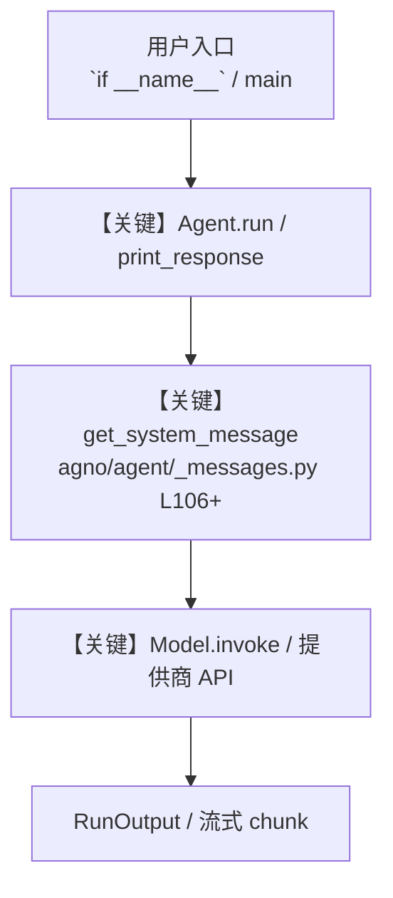

# google_maps_tools.py — 实现原理分析

<!-- cookbook-py-source:start -->
## 完整源码

```python
"""
Google Maps Tools - Location and Business Information Agent

This example demonstrates various Google Maps API functionalities including business search,
directions, geocoding, address validation, and more. Shows how to use include_tools and
exclude_tools parameters for selective function access.

Prerequisites:
- Set the environment variable `GOOGLE_MAPS_API_KEY` with your Google Maps API key.
  You can obtain the API key from the Google Cloud Console:
  https://console.cloud.google.com/projectselector2/google/maps-apis/credentials

- You also need to activate the Address Validation API for your project:
  https://console.developers.google.com/apis/api/addressvalidation.googleapis.com

"""

from agno.agent import Agent
from agno.tools.crawl4ai import Crawl4aiTools
from agno.tools.google.maps import GoogleMapTools

# ---------------------------------------------------------------------------
# Create Agent
# ---------------------------------------------------------------------------


# Example 1: All functions available (default behavior)
agent_full = Agent(
    name="Full Maps API Agent",
    tools=[
        GoogleMapTools(),  # All functions enabled by default
        Crawl4aiTools(max_length=5000),
    ],
    description="You are a location and business information specialist with full Google Maps access.",
    instructions=[
        "Use any Google Maps function as needed for location-based queries",
        "Combine Maps data with website data when available",
        "Format responses clearly and provide relevant details",
        "Handle errors gracefully and provide meaningful feedback",
    ],
    markdown=True,
)

# Example 2: Include only specific functions
agent_search = Agent(
    name="Search-focused Maps Agent",
    tools=[
        GoogleMapTools(
            include_tools=[
                "search_places",
            ]
        ),
    ],
    description="You are a location search specialist focused only on finding places.",
    instructions=[
        "Focus on place searches and getting place details",
        "Use search_places for general queries",
        "Use find_place_from_text for specific place names",
        "Use get_nearby_places for proximity searches",
    ],
    markdown=True,
)

# Example 3: Exclude potentially expensive operations
agent_safe = Agent(
    name="Safe Maps API Agent",
    tools=[
        GoogleMapTools(
            exclude_tools=[
                "get_distance_matrix",  # Can be expensive with many origins/destinations
                "get_directions",  # Excludes detailed route calculations
            ]
        ),
        Crawl4aiTools(max_length=3000),
    ],
    description="You are a location specialist with restricted access to expensive operations.",
    instructions=[
        "Provide location information without detailed routing",
        "Use geocoding and place searches freely",
        "For directions, provide general guidance only",
    ],
    markdown=True,
)

# Using the full-featured agent for examples
agent = agent_full

# Example 1: Business Search

# ---------------------------------------------------------------------------
# Run Agent
# ---------------------------------------------------------------------------
if __name__ == "__main__":
    print("\n=== Business Search Example ===")
    agent.print_response(
        "Find me highly rated Chinese restaurants in Phoenix, AZ with their contact details",
        stream=True,
    )

    # Example 2: Directions
    print("\n=== Directions Example ===")
    agent.print_response(
        """Get driving directions from 'Phoenix Sky Harbor Airport' to 'Desert Botanical Garden',
        avoiding highways if possible""",
        stream=True,
    )

    # Example 3: Address Validation and Geocoding
    print("\n=== Address Validation and Geocoding Example ===")
    agent.print_response(
        """Please validate and geocode this address:
        '1600 Amphitheatre Parkway, Mountain View, CA'""",
        stream=True,
    )

    # Example 4: Distance Matrix
    print("\n=== Distance Matrix Example ===")
    agent.print_response(
        """Calculate the travel time and distance between these locations in Phoenix:
        Origins: ['Phoenix Sky Harbor Airport', 'Downtown Phoenix']
        Destinations: ['Desert Botanical Garden', 'Phoenix Zoo']""",
        stream=True,
    )

    # Example 5: Nearby Places and Details
    print("\n=== Nearby Places Example ===")
    agent.print_response(
        """Find coffee shops near Arizona State University Tempe campus.
        Include ratings and opening hours if available.""",
        stream=True,
    )

    # Example 6: Reverse Geocoding and Timezone
    print("\n=== Reverse Geocoding and Timezone Example ===")
    agent.print_response(
        """Get the address and timezone information for these coordinates:
        Latitude: 33.4484, Longitude: -112.0740 (Phoenix)""",
        stream=True,
    )

    # Example 7: Multi-step Route Planning
    print("\n=== Multi-step Route Planning Example ===")
    agent.print_response(
        """Plan a route with multiple stops in Phoenix:
        Start: Phoenix Sky Harbor Airport
        Stops:
        1. Arizona Science Center
        2. Heard Museum
        3. Desert Botanical Garden
        End: Return to Airport
        Please include estimated travel times between each stop.""",
        stream=True,
    )

    # Example 8: Location Analysis
    print("\n=== Location Analysis Example ===")
    agent.print_response(
        """Analyze this location in Phoenix:
        Address: '2301 N Central Ave, Phoenix, AZ 85004'
        Please provide:
        1. Exact coordinates
        2. Nearby landmarks
        3. Elevation data
        4. Local timezone""",
        stream=True,
    )

    # Example 9: Business Hours and Accessibility
    print("\n=== Business Hours and Accessibility Example ===")
    agent.print_response(
        """Find museums in Phoenix that are:
        1. Open on Mondays
        2. Have wheelchair accessibility
        3. Within 5 miles of downtown
        Include their opening hours and contact information.""",
        stream=True,
    )

    # Example 10: Transit Options
    print("\n=== Transit Options Example ===")
    agent.print_response(
        """Compare different travel modes from 'Phoenix Convention Center' to 'Phoenix Art Museum':
        1. Driving
        2. Walking
        3. Transit (if available)
        Include estimated time and distance for each option.""",
        stream=True,
    )
```

<!-- cookbook-py-source:end -->

> 源文件：`cookbook/91_tools/google_maps_tools.py`

## 概述

Google Maps Tools - Location and Business Information Agent

本示例归类：**单 Agent**；模型相关类型：`（见源码 import）`。

**核心配置一览：**

| 配置项 | 值 | 说明 |
|--------|------|------|
| `name` | 'Full Maps API Agent' | `Agent(...)` |
| `description` | 'You are a location and business information specialist with full Google Maps access.' | `Agent(...)` |
| `markdown` | True | `Agent(...)` |

## 架构分层

```
用户 / cookbook 示例              Agno 框架
┌──────────────────────┐         ┌────────────────────────────────┐
│ google_maps_tools.py │  ──▶  │ Agent → get_run_messages → Model │
└──────────────────────┘         └────────────────────────────────┘
                                          │
                                          ▼
                                  ┌───────────────┐
                                  │ 对应 Model 子类 │
                                  └───────────────┘
```

## 核心组件解析

### 运行机制与因果链

1. **入口**：从模块 `__main__` 或暴露的 `agent` / `team` 调用进入；同步用 `print_response` / `run`，异步用 `aprint_response` / `arun`（若源码中有）。
2. **消息**：默认路径下 system 内容由 `get_system_message()`（`libs/agno/agno/agent/_messages.py` 约 **L106** 起）按分段逻辑拼装；若显式传入 `system_message` 则早退使用该字符串。
3. **模型**：具体 HTTP/SDK 形态以 `libs/agno/agno/models/` 下对应类的 `invoke` / `ainvoke` 为准（勿默认写成单一 `chat.completions`）。
4. **副作用**：若配置 `db`、`knowledge`、`memory`，运行会读写存储；仅以本文件为准对照。

### 与框架的衔接

- **System**：`get_system_message()` 锚点 `agno/agent/_messages.py` **L106+**。
- **运行**：`Agent.print_response` 等入口 `agno/agent/agent.py`（以当前仓库检索为准）。

## System Prompt 组装

| 序号 | 组成部分 | 本文件 | 是否生效 |
|------|---------|--------|---------|
| 1 | `instructions` / `description` 等 | 见核心配置表与源码 | 有赋值则生效 |
| 2 | 默认分段（markdown、时间等） | 取决于 `Agent` 默认与显式参数 | 视参数 |

### 拼装顺序与源码锚点

1. `system_message` 直给 → 使用该内容（见 `_messages.py` 文档字符串分支说明）。
2. 否则默认拼装：`description`、`role`、`instructions`、markdown 附加段等按 `# 3.x` 注释顺序合并。

### 还原后的完整 System 文本

```text
--- description ---
You are a location and business information specialist with full Google Maps access.
```

### 段落释义（模型视角）

- 指令与安全边界由 `instructions` / `system_message` 约束；若带 `tools` / `knowledge`，文档中需体现「何时检索/调用」由框架注入的提示段支持。

## 完整 API 请求

```python
# 请以本文件实际 Model 为准打开 libs/agno/agno/models/<厂商>/ 下对应类的 invoke：
# 可能是 chat.completions.create、responses.create、Gemini generate_content 等。
```

> 与上一节 system 文本在同一 run 中组合；`developer`/`system` 角色由适配器转换。



**【关键】节点说明：**

- **print_response / run**：用户可见的同步入口。
- **get_system_message**：系统提示拼装核心。
- **Model.invoke**：对模型提供商的实际请求。

## 关键源码文件索引

| 文件 | 作用 |
|------|------|
| `agno/agent/_messages.py` | `get_system_message()` L106+ |
| `agno/agent/agent.py` | `Agent` 运行与 CLI 输出 |
| `agno/models/` | 各厂商 `Model.invoke` |
