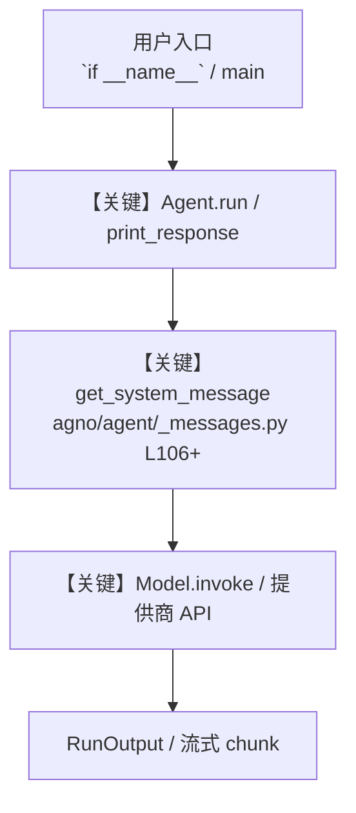

# googlecalendar_tools.py — 实现原理分析

<!-- cookbook-py-source:start -->
## 完整源码

```python
"""
Steps to get the Google OAuth Credentials (Reference : https://developers.google.com/calendar/api/quickstart/python)

1. Enable Google Calender API
    - Go To https://console.cloud.google.com/apis/enableflow?apiid=calendar-json.googleapis.com
    - Select Project and Enable The API

2. Go To API & Service -> OAuth Consent Screen

3.Select User Type .
    - If you are Google Workspace User select Internal
    - Else Select External

4.Fill in the app details (App name, logo, support email, etc.).

5. Select Scope
    - Click on Add or Remove Scope
    - Search for Google Calender API (Make Sure you've enabled Google calender API otherwise scopes wont be visible)
    - Select Scopes Accordingly
        - From the dropdown check on /auth/calendar scope
    - Save and Continue


6. Adding Test User
    - Click Add Users and enter the email addresses of the users you want to allow during testing.
    - NOTE : Only these users can access the app's OAuth functionality when the app is in "Testing" mode.
    If anyone else tries to authenticate, they'll see an error like: "Error 403: access_denied."
    - To make the app available to all users, you'll need to move the app's status to "In Production.".
    Before doing so, ensure the app is fully verified by Google if it uses sensitive or restricted scopes.
    - Click on Go back to Dashboard


7. Generate OAuth 2.0 Client ID
    - Go To Credentials
    - Click on Create Credentials -> OAuth Client ID
    - Select Application Type as Desktop app
    - Download JSON

8. Using Google Calender Tool
    - Pass the Path of downloaded credentials as credentials_path to Google Calender tool
"""

from agno.agent import Agent
from agno.tools.google.calendar import GoogleCalendarTools

# ---------------------------------------------------------------------------
# Create Agent
# ---------------------------------------------------------------------------


agent = Agent(
    tools=[
        GoogleCalendarTools(
            # credentials_path="credentials.json",  # Path to your downloaded OAuth credentials
            # token_path="token.json",  # Path to your downloaded OAuth credentials
            oauth_port=8080,  # port used for oauth authentication
            allow_update=True,
        )
    ],
    instructions=[
        """
    You are a scheduling assistant.
    You should help users to perform these actions in their Google calendar:
        - get their scheduled events from a certain date and time
        - create events based on provided details
        - update existing events
        - delete events
        - find available time slots for scheduling
    """
    ],
    add_datetime_to_context=True,
)

# Example 1: List calendar events

# ---------------------------------------------------------------------------
# Run Agent
# ---------------------------------------------------------------------------
if __name__ == "__main__":
    agent.print_response("Give me the list of tomorrow's events", markdown=True)

    # Example 2: Create an event
    # agent.print_response(
    #     "create an event tomorrow from 9am to 10am, make the title as 'Team Meeting' and description as 'Weekly team sync'",
    #     markdown=True,
    # )

    # Example 3: Find available time slots
    # agent.print_response(
    #     "Find available 1-hour time slots for tomorrow between 9 AM and 5 PM",
    #     markdown=True,
    # )

    # Example 4: List available calendars
    # agent.print_response(
    #     "List all my calendars",
    #     markdown=True,
    # )

    # Example 5: Update an event
    # agent.print_response(
    #     "update the 'Team Meeting' event to run from 5pm to 7pm and change description to 'Extended team sync'",
    #     markdown=True,
    # )

    # Example 6: Delete an event
    # agent.print_response("delete the 'Team Meeting' event", markdown=True)

    # # Example 7: Find available time slots for a specific calendar
    # agent.print_response(
    #     "Find available 1-hour time slots for this week between 9 AM and 5 PM in the Appointments calendar",
    #     markdown=True,
    # )

    # Example 9: Find available slots using locale-based working hours
    # agent.print_response(
    #     "Find available 60-minute slots for the next 3 days", markdown=True
    # )
```

<!-- cookbook-py-source:end -->

> 源文件：`cookbook/91_tools/googlecalendar_tools.py`

## 概述

Steps to get the Google OAuth Credentials (Reference : https://developers.google.com/calendar/api/quickstart/python)

本示例归类：**单 Agent**；模型相关类型：`（见源码 import）`。

**核心配置一览：**

| 配置项 | 值 | 说明 |
|--------|------|------|
| `add_datetime_to_context` | True | `Agent(...)` |

## 架构分层

```
用户 / cookbook 示例              Agno 框架
┌──────────────────────┐         ┌────────────────────────────────┐
│ googlecalendar_tools.py │  ──▶  │ Agent → get_run_messages → Model │
└──────────────────────┘         └────────────────────────────────┘
                                          │
                                          ▼
                                  ┌───────────────┐
                                  │ 对应 Model 子类 │
                                  └───────────────┘
```

## 核心组件解析

### 运行机制与因果链

1. **入口**：从模块 `__main__` 或暴露的 `agent` / `team` 调用进入；同步用 `print_response` / `run`，异步用 `aprint_response` / `arun`（若源码中有）。
2. **消息**：默认路径下 system 内容由 `get_system_message()`（`libs/agno/agno/agent/_messages.py` 约 **L106** 起）按分段逻辑拼装；若显式传入 `system_message` 则早退使用该字符串。
3. **模型**：具体 HTTP/SDK 形态以 `libs/agno/agno/models/` 下对应类的 `invoke` / `ainvoke` 为准（勿默认写成单一 `chat.completions`）。
4. **副作用**：若配置 `db`、`knowledge`、`memory`，运行会读写存储；仅以本文件为准对照。

### 与框架的衔接

- **System**：`get_system_message()` 锚点 `agno/agent/_messages.py` **L106+**。
- **运行**：`Agent.print_response` 等入口 `agno/agent/agent.py`（以当前仓库检索为准）。

## System Prompt 组装

| 序号 | 组成部分 | 本文件 | 是否生效 |
|------|---------|--------|---------|
| 1 | `instructions` / `description` 等 | 见核心配置表与源码 | 有赋值则生效 |
| 2 | 默认分段（markdown、时间等） | 取决于 `Agent` 默认与显式参数 | 视参数 |

### 拼装顺序与源码锚点

1. `system_message` 直给 → 使用该内容（见 `_messages.py` 文档字符串分支说明）。
2. 否则默认拼装：`description`、`role`、`instructions`、markdown 附加段等按 `# 3.x` 注释顺序合并。

### 还原后的完整 System 文本

```text
（主 `Agent(...)` 未传入可静态解析的 `description`/`instructions`/`system_message` 字符串；此时 system 由 `get_system_message()` 默认段与 `markdown` 等开关决定，请在 `agno/agent/_messages.py` 对照分段注释，或在运行中打印 `get_system_message` 返回值。）
```

### 段落释义（模型视角）

- 指令与安全边界由 `instructions` / `system_message` 约束；若带 `tools` / `knowledge`，文档中需体现「何时检索/调用」由框架注入的提示段支持。

## 完整 API 请求

```python
# 请以本文件实际 Model 为准打开 libs/agno/agno/models/<厂商>/ 下对应类的 invoke：
# 可能是 chat.completions.create、responses.create、Gemini generate_content 等。
```

> 与上一节 system 文本在同一 run 中组合；`developer`/`system` 角色由适配器转换。



**【关键】节点说明：**

- **print_response / run**：用户可见的同步入口。
- **get_system_message**：系统提示拼装核心。
- **Model.invoke**：对模型提供商的实际请求。

## 关键源码文件索引

| 文件 | 作用 |
|------|------|
| `agno/agent/_messages.py` | `get_system_message()` L106+ |
| `agno/agent/agent.py` | `Agent` 运行与 CLI 输出 |
| `agno/models/` | 各厂商 `Model.invoke` |
