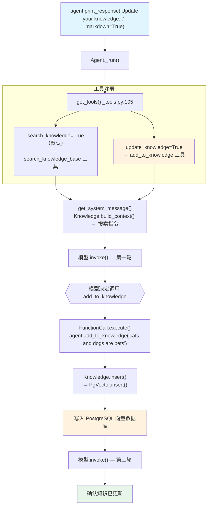

# knowledge_tool.py — 实现原理分析

> 源文件：`cookbook/91_tools/knowledge_tool.py`

## 概述

本示例展示 Agno 的 **`update_knowledge` 工具**机制：通过 `update_knowledge=True` 为 Agent 注册内置的知识库更新工具，允许 Agent 自主将对话中学到的信息写入向量数据库。同时演示了在 `Team` 中配置相同的 `update_knowledge` 能力，Agent 和 Team 共享同一 Knowledge 实例。

**核心配置一览：**

| 配置项 | 值 | 说明 |
|--------|------|------|
| `model` | `None` | 未显式设置 |
| `knowledge` | `Knowledge(vector_db=PgVector(...))` | PostgreSQL 向量数据库 |
| `update_knowledge` | `True` | 注册知识库写入工具 |
| `search_knowledge` | `True`（默认） | 同时注册知识库搜索工具 |
| `db_url` | `"postgresql+psycopg://ai:ai@localhost:5532/ai"` | PostgreSQL 连接 |
| Team `knowledge` | 同一 `kb` 实例 | Team 与 Agent 共享知识库 |

## 架构分层

```
用户代码层                      agno.agent 层
┌─────────────────────────┐    ┌────────────────────────────────────┐
│ knowledge_tool.py       │    │ Agent._run()                       │
│                         │    │  ├─ get_tools()  _tools.py:105     │
│ kb = Knowledge(         │    │  │   → search_knowledge=True       │
│   vector_db=PgVector(..)│    │  │     → search_knowledge_base()   │
│ )                       │───>│  │   → update_knowledge=True       │
│                         │    │  │     → agent.add_to_knowledge()  │
│ Agent(                  │    │  │                                  │
│   knowledge=kb,         │    │  └─ FunctionCall.execute()         │
│   update_knowledge=True │    │      → kb.insert(...)              │
│ )                       │    └────────────────────────────────────┘
│                         │
│ Team(                   │
│   members=[agent],      │                    │ pgvector
│   knowledge=kb,         │                    ▼
│   update_knowledge=True │    ┌────────────────────────────────┐
│ )                       │    │ PostgreSQL + pgvector 向量存储  │
└─────────────────────────┘    └────────────────────────────────┘
```

## 核心组件解析

### update_knowledge 工具注册

`update_knowledge=True` 在 `get_tools()`（`_tools.py:188-189`）中触发：

```python
# _tools.py:188-189
if resolved_knowledge is not None and agent.update_knowledge:
    agent_tools.append(agent.add_to_knowledge)
```

`agent.add_to_knowledge` 是 Agent 内置方法，封装了对 `Knowledge.insert()` 的调用，使 Agent 能够将新知识写入向量数据库。

### search_knowledge 与 update_knowledge 组合

同时开启两个能力，Agent 拥有"读"和"写"知识库的完整权限：

| 工具 | 条件 | 功能 |
|------|------|------|
| `search_knowledge_base` | `search_knowledge=True`（默认） | 检索知识库，Agentic RAG |
| `add_to_knowledge` | `update_knowledge=True` | 向知识库写入新知识 |

### Team 共享 Knowledge

```python
team = Team(
    name="Knowledge Team",
    members=[agent],
    knowledge=kb,       # 与 agent 共享同一 kb 实例
    update_knowledge=True,
)
```

Team 和 Agent 都可以读写同一个向量数据库，实现多成员之间的知识共享和协同积累。

### Knowledge + PgVector 配置

```python
kb = Knowledge(
    vector_db=PgVector(
        table_name="documents",
        db_url="postgresql+psycopg://ai:ai@localhost:5532/ai",
    ),
)
```

需要运行 `./cookbook/scripts/run_pgvector.sh` 启动 PostgreSQL 容器，表自动创建。

## System Prompt 组装

| 序号 | 组成部分 | 本文件中的值/来源 | 是否生效 |
|------|---------|-----------------|---------|
| 1 | `system_message` | `None` | 否 |
| 3.1 | `instructions` | `None` | 否 |
| 3.1.1 | 模型指令 | 模型特定指令 | 是 |
| 3.2.1 | `markdown` | `None` | 否 |
| 3.3.13 | `search_knowledge` instructions | `Knowledge.build_context()` 注入搜索指令 | 是 |

### 最终 System Prompt

```text
<knowledge_base>
（Knowledge.build_context() 生成的搜索指令）
</knowledge_base>
```

## 完整 API 请求

```python
client.chat.completions.create(
    model="<default-model>",
    messages=[
        {"role": "system", "content": "<knowledge_base>\n搜索指令...\n</knowledge_base>"},
        {"role": "user", "content": "Update your knowledge with the fact that cats and dogs are pets"}
    ],
    tools=[
        {"type": "function", "function": {"name": "search_knowledge_base", ...}},
        {"type": "function", "function": {"name": "add_to_knowledge", "description": "...", ...}}
    ],
    stream=False
)
# 模型决定调用 add_to_knowledge("cats and dogs are pets")
# → Knowledge.insert() → PgVector.insert() → 写入 PostgreSQL
```

## Mermaid 流程图



## 关键源码文件索引

| 文件 | 关键函数/类 | 作用 |
|------|------------|------|
| `agno/agent/_tools.py` | `get_tools()` L188-189 | 注册 add_to_knowledge 工具 |
| `agno/knowledge/knowledge.py` | `Knowledge.insert()` | 写入向量数据库 |
| `agno/knowledge/knowledge.py` | `Knowledge.build_context()` L2908 | 生成 system prompt 搜索指令 |
| `agno/vectordb/pgvector.py` | `PgVector` | PostgreSQL 向量存储后端 |
| `agno/team/team.py` | `Team` | 支持共享 Knowledge 的团队 |
