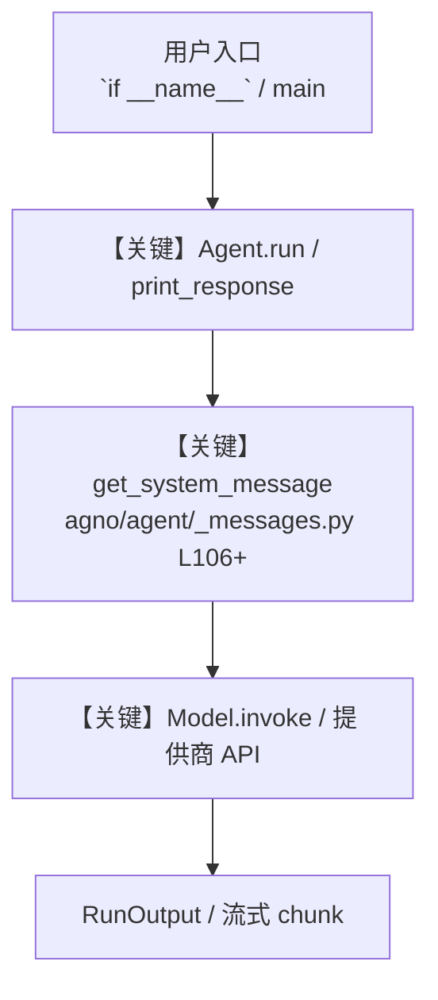

# lumalabs_tools.py — 实现原理分析

<!-- cookbook-py-source:start -->
## 完整源码

```python
"""
Lumalabs Tools
=============================

Demonstrates lumalabs tools.
"""

from agno.agent import Agent
from agno.models.openai import OpenAIChat
from agno.tools.lumalab import LumaLabTools

# ---------------------------------------------------------------------------
# Create Agent
# ---------------------------------------------------------------------------


"""Create an agent specialized for Luma AI video generation"""

luma_agent = Agent(
    name="Luma Video Agent",
    id="luma-video-agent",
    model=OpenAIChat(id="gpt-4o"),
    tools=[LumaLabTools()],  # Using the LumaLab tool we created
    markdown=True,
    instructions=[
        "You are an agent designed to generate videos using the Luma AI API.",
        "You can generate videos in two ways:",
        "1. Text-to-Video Generation:",
        "   - Use the generate_video function for creating videos from text prompts",
        "   - Default parameters: loop=False, aspect_ratio='16:9', keyframes=None",
        "2. Image-to-Video Generation:",
        "   - Use the image_to_video function when starting from one or two images",
        "   - Required parameters: prompt, start_image_url",
        "   - Optional parameters: end_image_url, loop=False, aspect_ratio='16:9'",
        "   - The image URLs must be publicly accessible",
        "Choose the appropriate function based on whether the user provides image URLs or just a text prompt.",
        "The video will be displayed in the UI automatically below your response, so you don't need to show the video URL in your response.",
        "Politely and courteously let the user know that the video has been generated and will be displayed below as soon as its ready.",
        "After generating any video, if generation is async (wait_for_completion=False), inform about the generation ID",
    ],
    system_message=(
        "Use generate_video for text-to-video requests and image_to_video for image-based "
        "generation. Don't modify default parameters unless specifically requested. "
        "Always provide clear feedback about the video generation status."
    ),
)

# ---------------------------------------------------------------------------
# Run Agent
# ---------------------------------------------------------------------------
if __name__ == "__main__":
    luma_agent.run("Generate a video of a car in a sky")
    # luma_agent.run("Transform this image into a video of a tiger walking: https://upload.wikimedia.org/wikipedia/commons/thumb/3/3f/Walking_tiger_female.jpg/1920px-Walking_tiger_female.jpg")
    # luma_agent.run("""
    # Create a transition video between these two images:
    # Start: https://img.freepik.com/premium-photo/car-driving-dark-forest-generative-ai_634053-6661.jpg?w=1380
    # End: https://img.freepik.com/free-photo/front-view-black-luxury-sedan-road_114579-5030.jpg?t=st=1733821884~exp=1733825484~hmac=735ca584a9b985c53875fc1ad343c3fd394e1de4db49e5ab1a9ab37ac5f91a36&w=1380
    # Make it a smooth, natural movement
    # """)
```

<!-- cookbook-py-source:end -->

> 源文件：`cookbook/91_tools/lumalabs_tools.py`

## 概述

Lumalabs Tools

本示例归类：**单 Agent**；模型相关类型：`OpenAIChat`。

**核心配置一览：**

| 配置项 | 值 | 说明 |
|--------|------|------|
| `name` | 'Luma Video Agent' | `Agent(...)` |
| `id` | 'luma-video-agent' | `Agent(...)` |
| `model` | OpenAIChat(id='gpt-4o'…) | `Agent(...)` |
| `markdown` | True | `Agent(...)` |
| `system_message` | "Use generate_video for text-to-video requests and image_to_video for image-based generation. Don't modify default parameters unless specifically requested. Always provide clear feedback about the v..." | `Agent(...)` |
| （Model 类） | `OpenAIChat` | `agno.models` |

## 架构分层

```
用户 / cookbook 示例              Agno 框架
┌──────────────────────┐         ┌────────────────────────────────┐
│ lumalabs_tools.py    │  ──▶  │ Agent → get_run_messages → Model │
└──────────────────────┘         └────────────────────────────────┘
                                          │
                                          ▼
                                  ┌───────────────┐
                                  │ 对应 Model 子类 │
                                  └───────────────┘
```

## 核心组件解析

### 运行机制与因果链

1. **入口**：从模块 `__main__` 或暴露的 `agent` / `team` 调用进入；同步用 `print_response` / `run`，异步用 `aprint_response` / `arun`（若源码中有）。
2. **消息**：默认路径下 system 内容由 `get_system_message()`（`libs/agno/agno/agent/_messages.py` 约 **L106** 起）按分段逻辑拼装；若显式传入 `system_message` 则早退使用该字符串。
3. **模型**：具体 HTTP/SDK 形态以 `libs/agno/agno/models/` 下对应类的 `invoke` / `ainvoke` 为准（勿默认写成单一 `chat.completions`）。
4. **副作用**：若配置 `db`、`knowledge`、`memory`，运行会读写存储；仅以本文件为准对照。

### 与框架的衔接

- **System**：`get_system_message()` 锚点 `agno/agent/_messages.py` **L106+**。
- **运行**：`Agent.print_response` 等入口 `agno/agent/agent.py`（以当前仓库检索为准）。

## System Prompt 组装

| 序号 | 组成部分 | 本文件 | 是否生效 |
|------|---------|--------|---------|
| 1 | `instructions` / `description` 等 | 见核心配置表与源码 | 有赋值则生效 |
| 2 | 默认分段（markdown、时间等） | 取决于 `Agent` 默认与显式参数 | 视参数 |

### 拼装顺序与源码锚点

1. `system_message` 直给 → 使用该内容（见 `_messages.py` 文档字符串分支说明）。
2. 否则默认拼装：`description`、`role`、`instructions`、markdown 附加段等按 `# 3.x` 注释顺序合并。

### 还原后的完整 System 文本

```text
--- system_message ---
Use generate_video for text-to-video requests and image_to_video for image-based generation. Don't modify default parameters unless specifically requested. Always provide clear feedback about the video generation status.
```

### 段落释义（模型视角）

- 指令与安全边界由 `instructions` / `system_message` 约束；若带 `tools` / `knowledge`，文档中需体现「何时检索/调用」由框架注入的提示段支持。

## 完整 API 请求

```python
# 请以本文件实际 Model 为准打开 libs/agno/agno/models/<厂商>/ 下对应类的 invoke：
# 可能是 chat.completions.create、responses.create、Gemini generate_content 等。
```

> 与上一节 system 文本在同一 run 中组合；`developer`/`system` 角色由适配器转换。



**【关键】节点说明：**

- **print_response / run**：用户可见的同步入口。
- **get_system_message**：系统提示拼装核心。
- **Model.invoke**：对模型提供商的实际请求。

## 关键源码文件索引

| 文件 | 作用 |
|------|------|
| `agno/agent/_messages.py` | `get_system_message()` L106+ |
| `agno/agent/agent.py` | `Agent` 运行与 CLI 输出 |
| `agno/models/` | 各厂商 `Model.invoke` |
