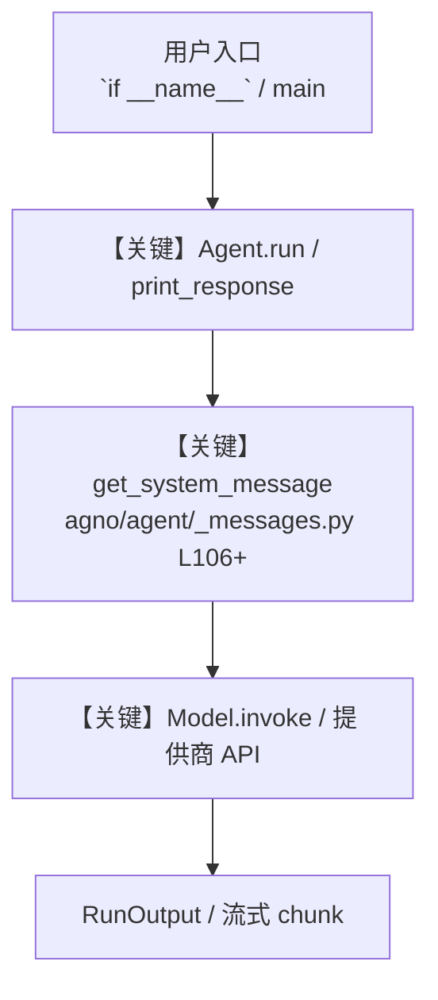

# gibsonai.py — 实现原理分析

<!-- cookbook-py-source:start -->
## 完整源码

````python
"""GibsonAI MCP Server - Create and manage databases with prompts

This example shows how to connect a local GibsonAI MCP to Agno agent.
You can instantly generate, modify database schemas
and chat with your relational database using natural language.
From prompt to a serverless database (MySQL, PostgresQL, etc.), auto-generated REST APIs for your data.

Example prompts to try:
- "Create a new GibsonAI project for my e-commerce app"
- "Show me the current schema for my project"
- "Add a 'products' table with name, price, and description fields"
- "Create a 'users' table with authentication fields"
- "Deploy my schema changes to production"

How to setup and run:

1. Install [UV](https://docs.astral.sh/uv/) package manager.
2. Install the GibsonAI CLI:
    ```bash
    uvx --from gibson-cli@latest gibson auth login
    ```
3. Install the required dependencies:
    ```bash
    uv pip install agno mcp openai
    ```
4. Export your API key:
    ```bash
    export OPENAI_API_KEY="your_openai_api_key"
    ```
5. Run the GibsonAI agent by running this file.
6. Check created database and schema on GibsonAI dashboard: https://app.gibsonai.com

This logs you into the [GibsonAI CLI](https://docs.gibsonai.com/reference/cli-quickstart)
so you can access all the features directly from your agent.

"""

import asyncio
from textwrap import dedent

from agno.agent import Agent
from agno.models.openai import OpenAIChat
from agno.tools.mcp import MCPTools

# ---------------------------------------------------------------------------
# Create Agent
# ---------------------------------------------------------------------------


async def run_gibsonai_agent(message: str):
    """Run the GibsonAI agent with the given message."""
    mcp_tools = MCPTools(
        "uvx --from gibson-cli@latest gibson mcp run",
        timeout_seconds=300,  # Extended timeout for GibsonAI operations
    )

    # Connect to the MCP server
    await mcp_tools.connect()

    agent = Agent(
        name="GibsonAIAgent",
        model=OpenAIChat(id="gpt-4o"),
        tools=[mcp_tools],
        description="Agent for managing database projects and schemas",
        instructions=dedent("""\
            You are a GibsonAI database assistant. Help users manage their database projects and schemas.

            Your capabilities include:
            - Creating new GibsonAI projects
            - Managing database schemas (tables, columns, relationships)
            - Deploying schema changes to hosted databases
            - Querying database schemas and data
            - Providing insights about database structure and best practices
        """),
        markdown=True,
    )

    # Run the agent
    await agent.aprint_response(message, stream=True)

    # Close the MCP connection
    await mcp_tools.close()


# Example usage
# ---------------------------------------------------------------------------
# Run Agent
# ---------------------------------------------------------------------------

if __name__ == "__main__":
    asyncio.run(
        run_gibsonai_agent(
            """
            Create a database for blog posts platform with users and posts tables.
            You can decide the schema of the tables without double checking with me.
            """
        )
    )
````

<!-- cookbook-py-source:end -->

> 源文件：`cookbook/91_tools/mcp/gibsonai.py`

## 概述

GibsonAI MCP Server - Create and manage databases with prompts

本示例归类：**单 Agent**；模型相关类型：`OpenAIChat`。

**核心配置一览：**

| 配置项 | 值 | 说明 |
|--------|------|------|
| `name` | 'GibsonAIAgent' | `Agent(...)` |
| `model` | OpenAIChat(id='gpt-4o'…) | `Agent(...)` |
| `description` | 'Agent for managing database projects and schemas' | `Agent(...)` |
| `instructions` | dedent('            You are a GibsonAI database assistant. Help users manage their database projects and schemas.\n\n            Your capabilities include:\n            - Creating new GibsonAI projects\n            - Managing database schemas (tables, columns, relationships)\n            - Deploying schema changes to hosted databases\n            - Querying database schemas and data\n            - Providing insights about database structure and best practices\n        '…) | `Agent(...)` |
| `markdown` | True | `Agent(...)` |
| （Model 类） | `OpenAIChat` | `agno.models` |

## 架构分层

```
用户 / cookbook 示例              Agno 框架
┌──────────────────────┐         ┌────────────────────────────────┐
│ gibsonai.py          │  ──▶  │ Agent → get_run_messages → Model │
└──────────────────────┘         └────────────────────────────────┘
                                          │
                                          ▼
                                  ┌───────────────┐
                                  │ 对应 Model 子类 │
                                  └───────────────┘
```

## 核心组件解析

### 运行机制与因果链

1. **入口**：从模块 `__main__` 或暴露的 `agent` / `team` 调用进入；同步用 `print_response` / `run`，异步用 `aprint_response` / `arun`（若源码中有）。
2. **消息**：默认路径下 system 内容由 `get_system_message()`（`libs/agno/agno/agent/_messages.py` 约 **L106** 起）按分段逻辑拼装；若显式传入 `system_message` 则早退使用该字符串。
3. **模型**：具体 HTTP/SDK 形态以 `libs/agno/agno/models/` 下对应类的 `invoke` / `ainvoke` 为准（勿默认写成单一 `chat.completions`）。
4. **副作用**：若配置 `db`、`knowledge`、`memory`，运行会读写存储；仅以本文件为准对照。

### 与框架的衔接

- **System**：`get_system_message()` 锚点 `agno/agent/_messages.py` **L106+**。
- **运行**：`Agent.print_response` 等入口 `agno/agent/agent.py`（以当前仓库检索为准）。

## System Prompt 组装

| 序号 | 组成部分 | 本文件 | 是否生效 |
|------|---------|--------|---------|
| 1 | `instructions` / `description` 等 | 见核心配置表与源码 | 有赋值则生效 |
| 2 | 默认分段（markdown、时间等） | 取决于 `Agent` 默认与显式参数 | 视参数 |

### 拼装顺序与源码锚点

1. `system_message` 直给 → 使用该内容（见 `_messages.py` 文档字符串分支说明）。
2. 否则默认拼装：`description`、`role`、`instructions`、markdown 附加段等按 `# 3.x` 注释顺序合并。

### 还原后的完整 System 文本

```text
--- description ---
Agent for managing database projects and schemas
```

### 段落释义（模型视角）

- 指令与安全边界由 `instructions` / `system_message` 约束；若带 `tools` / `knowledge`，文档中需体现「何时检索/调用」由框架注入的提示段支持。

## 完整 API 请求

```python
# 请以本文件实际 Model 为准打开 libs/agno/agno/models/<厂商>/ 下对应类的 invoke：
# 可能是 chat.completions.create、responses.create、Gemini generate_content 等。
```

> 与上一节 system 文本在同一 run 中组合；`developer`/`system` 角色由适配器转换。



**【关键】节点说明：**

- **print_response / run**：用户可见的同步入口。
- **get_system_message**：系统提示拼装核心。
- **Model.invoke**：对模型提供商的实际请求。

## 关键源码文件索引

| 文件 | 作用 |
|------|------|
| `agno/agent/_messages.py` | `get_system_message()` L106+ |
| `agno/agent/agent.py` | `Agent` 运行与 CLI 输出 |
| `agno/models/` | 各厂商 `Model.invoke` |
