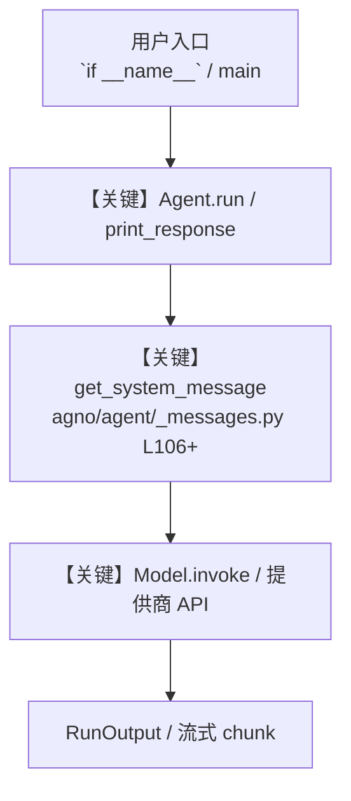

# groq_mcp.py — 实现原理分析

<!-- cookbook-py-source:start -->
## 完整源码

```python
"""Groq + MCP = Lightning Fast Agents

This example demonstrates how to create a high-performance filesystem agent by combining
Groq's fast LLM inference with the Model Context Protocol (MCP). This combination delivers
exceptional speed while maintaining powerful filesystem exploration capabilities.

Example prompts to try:
- "What files are in the current directory?"
- "Show me the content of README.md"
- "What is the license for this project?"
- "Find all Python files in the project"
- "Analyze the performance benefits of using Groq with MCP"

Run: `uv pip install agno mcp openai` to install the dependencies
"""

import asyncio
from pathlib import Path
from textwrap import dedent

from agno.agent import Agent
from agno.models.groq import Groq
from agno.tools.mcp import MCPTools
from mcp import ClientSession, StdioServerParameters
from mcp.client.stdio import stdio_client

# ---------------------------------------------------------------------------
# Create Agent
# ---------------------------------------------------------------------------


async def create_filesystem_agent(session):
    """Create and configure a high-performance filesystem agent with Groq and MCP."""
    # Initialize the MCP toolkit
    mcp_tools = MCPTools(session=session)
    await mcp_tools.initialize()

    # Create an agent with the MCP toolkit and Groq's fast LLM
    return Agent(
        model=Groq(id="llama-3.3-70b-versatile"),
        tools=[mcp_tools],
        instructions=dedent("""\
            You are a high-performance filesystem assistant powered by Groq and MCP.
            Your combination of Groq's fast inference and MCP's efficient context handling
            makes you exceptionally quick at exploring and analyzing files.

            - Navigate the filesystem with lightning speed to answer questions
            - Use the list_allowed_directories tool to find directories that you can access
            - Highlight the performance benefits of the Groq+MCP combination when relevant
            - Provide clear context about files you examine
            - Use headings to organize your responses
            - Be concise and focus on relevant information\
        """),
        markdown=True,
    )


async def run_agent(message: str) -> None:
    """Run the filesystem agent with the given message."""
    # Initialize the MCP server
    server_params = StdioServerParameters(
        command="npx",
        args=[
            "-y",
            "@modelcontextprotocol/server-filesystem",
            str(Path(__file__).parent.parent.parent.parent),
        ],
    )

    # Create a client session to connect to the MCP server
    async with stdio_client(server_params) as (read, write):
        async with ClientSession(read, write) as session:
            agent = await create_filesystem_agent(session)

            # Run the agent
            await agent.aprint_response(message, stream=True)


# Example usage
# ---------------------------------------------------------------------------
# Run Agent
# ---------------------------------------------------------------------------

if __name__ == "__main__":
    # Basic example - exploring project license
    asyncio.run(run_agent("What is the license for this project?"))

    # Performance demonstration example
    asyncio.run(
        run_agent(
            "Show me the README.md and explain how Groq with MCP enables fast file analysis"
        )
    )


# More example prompts to explore:
"""
Performance-focused queries:
1. "Analyze a large Python file and explain how Groq+MCP makes this fast"
2. "Compare the directory structure and explain how MCP efficiently provides this information"
3. "Find all TODO comments in the codebase and demonstrate the speed advantage"
4. "Process multiple configuration files simultaneously and explain the performance benefits"
5. "Explain how the Groq+MCP combination optimizes context handling for large codebases"

File exploration queries:
1. "What are the main Python packages used in this project?"
2. "Show me all configuration files and explain their purpose"
3. "Find all test files and summarize what they're testing"
4. "What's the project's entry point and how does it work?"
5. "Analyze the project's dependency structure"

Code analysis queries:
1. "Explain the architecture of this codebase"
2. "What design patterns are used in this project?"
3. "Find potential security issues in the codebase"
4. "How is error handling implemented across the project?"
5. "Analyze the API endpoints in this project"
"""
```

<!-- cookbook-py-source:end -->

> 源文件：`cookbook/91_tools/mcp/groq_mcp.py`

## 概述

Groq + MCP = Lightning Fast Agents

本示例归类：**单 Agent**；模型相关类型：`Groq`。

**核心配置一览：**

| 配置项 | 值 | 说明 |
|--------|------|------|
| `model` | Groq(id='llama-3.3-70b-versatile'…) | `Agent(...)` |
| `instructions` | dedent("            You are a high-performance filesystem assistant powered by Groq and MCP.\n            Your combination of Groq's fast inference and MCP's efficient context handling\n            makes you exceptionally quick at exploring and analyzing files.\n\n            - Navigate the filesystem with lightning speed to answer questions\n            - Use the list_allowed_directories tool to find directories that you can access\n            - Highlight the performance benefits of the Groq+MCP combination when relevant\n            - Provide clear context about files you examine\n            - Use headings to organize your responses\n            - Be concise and focus on relevant information        "…) | `Agent(...)` |
| `markdown` | True | `Agent(...)` |
| （Model 类） | `Groq` | `agno.models` |

## 架构分层

```
用户 / cookbook 示例              Agno 框架
┌──────────────────────┐         ┌────────────────────────────────┐
│ groq_mcp.py          │  ──▶  │ Agent → get_run_messages → Model │
└──────────────────────┘         └────────────────────────────────┘
                                          │
                                          ▼
                                  ┌───────────────┐
                                  │ 对应 Model 子类 │
                                  └───────────────┘
```

## 核心组件解析

### 运行机制与因果链

1. **入口**：从模块 `__main__` 或暴露的 `agent` / `team` 调用进入；同步用 `print_response` / `run`，异步用 `aprint_response` / `arun`（若源码中有）。
2. **消息**：默认路径下 system 内容由 `get_system_message()`（`libs/agno/agno/agent/_messages.py` 约 **L106** 起）按分段逻辑拼装；若显式传入 `system_message` 则早退使用该字符串。
3. **模型**：具体 HTTP/SDK 形态以 `libs/agno/agno/models/` 下对应类的 `invoke` / `ainvoke` 为准（勿默认写成单一 `chat.completions`）。
4. **副作用**：若配置 `db`、`knowledge`、`memory`，运行会读写存储；仅以本文件为准对照。

### 与框架的衔接

- **System**：`get_system_message()` 锚点 `agno/agent/_messages.py` **L106+**。
- **运行**：`Agent.print_response` 等入口 `agno/agent/agent.py`（以当前仓库检索为准）。

## System Prompt 组装

| 序号 | 组成部分 | 本文件 | 是否生效 |
|------|---------|--------|---------|
| 1 | `instructions` / `description` 等 | 见核心配置表与源码 | 有赋值则生效 |
| 2 | 默认分段（markdown、时间等） | 取决于 `Agent` 默认与显式参数 | 视参数 |

### 拼装顺序与源码锚点

1. `system_message` 直给 → 使用该内容（见 `_messages.py` 文档字符串分支说明）。
2. 否则默认拼装：`description`、`role`、`instructions`、markdown 附加段等按 `# 3.x` 注释顺序合并。

### 还原后的完整 System 文本

```text
（主 `Agent(...)` 未传入可静态解析的 `description`/`instructions`/`system_message` 字符串；此时 system 由 `get_system_message()` 默认段与 `markdown` 等开关决定，请在 `agno/agent/_messages.py` 对照分段注释，或在运行中打印 `get_system_message` 返回值。）
```

### 段落释义（模型视角）

- 指令与安全边界由 `instructions` / `system_message` 约束；若带 `tools` / `knowledge`，文档中需体现「何时检索/调用」由框架注入的提示段支持。

## 完整 API 请求

```python
# 请以本文件实际 Model 为准打开 libs/agno/agno/models/<厂商>/ 下对应类的 invoke：
# 可能是 chat.completions.create、responses.create、Gemini generate_content 等。
```

> 与上一节 system 文本在同一 run 中组合；`developer`/`system` 角色由适配器转换。



**【关键】节点说明：**

- **print_response / run**：用户可见的同步入口。
- **get_system_message**：系统提示拼装核心。
- **Model.invoke**：对模型提供商的实际请求。

## 关键源码文件索引

| 文件 | 作用 |
|------|------|
| `agno/agent/_messages.py` | `get_system_message()` L106+ |
| `agno/agent/agent.py` | `Agent` 运行与 CLI 输出 |
| `agno/models/` | 各厂商 `Model.invoke` |
