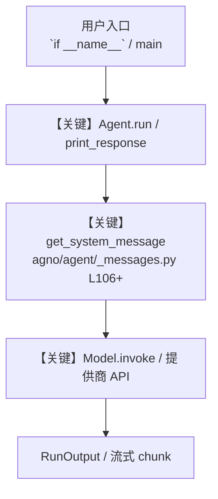

# mcp_toolbox_for_db.py — 实现原理分析

<!-- cookbook-py-source:start -->
## 完整源码

```python
"""Example code showcasing how to connect to the MCP toolbox server using the MCPToolbox Toolkit"""

import asyncio
from textwrap import dedent

from agno.agent import Agent
from agno.tools.mcp_toolbox import MCPToolbox

# ---------------------------------------------------------------------------
# Create Agent
# ---------------------------------------------------------------------------


url = "http://127.0.0.1:5001"


async def run_agent(message: str = None) -> None:
    """Run an interactive CLI for the GitHub agent with the given message."""

    # Approach 1: Load specific toolset at initialization
    async with MCPToolbox(
        url=url, toolsets=["hotel-management", "booking-system"]
    ) as db_tools:
        print(db_tools.functions)  # Print available tools for debugging
        # returns a list of tools from a toolset
        agent = Agent(
            tools=[db_tools],
            instructions=dedent(
                """ \
                You're a helpful hotel assistant. You handle hotel searching, booking and
                cancellations. When the user searches for a hotel, mention it's name, id,
                location and price tier. Always mention hotel ids while performing any
                searches. This is very important for any operations. For any bookings or
                cancellations, please provide the appropriate confirmation. Be sure to
                update checkin or checkout dates if mentioned by the user.
                Don't ask for confirmations from the user.
            """
            ),
            markdown=True,
            show_tool_calls=True,
            add_history_to_messages=True,
            debug_mode=True,
        )

        # Run an interactive command-line interface to interact with the agent.
        await agent.acli_app(message=message, stream=True)


async def run_agent_manual_loading(message: str) -> None:
    """Alternative approach: Manual loading with custom auth parameters."""

    # Approach 2: Manual loading with custom auth parameters
    async with MCPToolbox(url=url) as toolbox:  # No filter parameters
        # Load specific toolsets with custom auth
        hotel_tools = await toolbox.load_toolset(
            "hotel-management",
            auth_token_getters={"hotel_api": lambda: "your-hotel-api-key"},
            bound_params={"region": "us-east-1"},
        )

        booking_tools = await toolbox.load_toolset(
            "booking-system",
            auth_token_getters={"booking_api": lambda: "your-booking-api-key"},
            bound_params={"environment": "production"},
        )

        # Combine tools as needed
        selected_tools = []
        selected_tools.extend(hotel_tools)
        selected_tools.extend(booking_tools[:2])  # Only first 2 booking tools

        agent = Agent(
            tools=selected_tools,
            instructions=dedent(
                """ \
                You're a helpful hotel assistant. You handle hotel searching, booking and
                cancellations. When the user searches for a hotel, mention it's name, id,
                location and price tier. Always mention hotel ids while performing any
                searches. This is very important for any operations. For any bookings or
                cancellations, please provide the appropriate confirmation. Be sure to
                update checkin or checkout dates if mentioned by the user.
                Don't ask for confirmations from the user.
            """
            ),
            markdown=True,
            show_tool_calls=True,
            add_history_to_messages=True,
            debug_mode=True,
        )

        await agent.acli_app(message=message, stream=True)


async def run_agent_no_ctx_manager(message: str = None) -> None:
    """Run an interactive CLI for the GitHub agent with the given message."""

    # Approach 1: Load specific toolset at initialization
    toolbox = MCPToolbox(url=url, toolsets=["hotel-management", "booking-system"])

    await toolbox.connect()

    agent = Agent(
        tools=[toolbox],
        instructions=dedent(
            """ \
            You're a helpful hotel assistant. You handle hotel searching, booking and
            cancellations. When the user searches for a hotel, mention it's name, id,
                location and price tier. Always mention hotel ids while performing any
                searches. This is very important for any operations. For any bookings or
                cancellations, please provide the appropriate confirmation. Be sure to
                update checkin or checkout dates if mentioned by the user.
                Don't ask for confirmations from the user.
            """
        ),
        markdown=True,
        show_tool_calls=True,
        add_history_to_messages=True,
        debug_mode=True,
    )

    await agent.acli_app(message=message, stream=True)


# ---------------------------------------------------------------------------
# Run Agent
# ---------------------------------------------------------------------------

if __name__ == "__main__":
    asyncio.run(run_agent(message=None))

    # Or use the manual loading approach
    # asyncio.run(run_agent_manual_loading(message=None))

    # Or use without context manager
    # asyncio.run(run_agent_no_ctx_manager(message=None))
```

<!-- cookbook-py-source:end -->

> 源文件：`cookbook/91_tools/mcp/mcp_toolbox_for_db.py`

## 概述

Example code showcasing how to connect to the MCP toolbox server using the MCPToolbox Toolkit

本示例归类：**单 Agent**；模型相关类型：`（见源码 import）`。

**核心配置一览：**

| 配置项 | 值 | 说明 |
|--------|------|------|
| `instructions` | dedent("                 You're a helpful hotel assistant. You handle hotel searching, booking and\n                cancellations. When the user searches for a hotel, mention it's name, id,\n                location and price tier. Always mention hotel ids while performing any\n                searches. This is very important for any operations. For any bookings or\n                cancellations, please provide the appropriate confirmation. Be sure to\n                update checkin or checkout dates if mentioned by the user.\n                Don't ask for confirmations from the user.\n            "…) | `Agent(...)` |
| `markdown` | True | `Agent(...)` |
| `show_tool_calls` | True | `Agent(...)` |
| `add_history_to_messages` | True | `Agent(...)` |
| `debug_mode` | True | `Agent(...)` |

## 架构分层

```
用户 / cookbook 示例              Agno 框架
┌──────────────────────┐         ┌────────────────────────────────┐
│ mcp_toolbox_for_db.py │  ──▶  │ Agent → get_run_messages → Model │
└──────────────────────┘         └────────────────────────────────┘
                                          │
                                          ▼
                                  ┌───────────────┐
                                  │ 对应 Model 子类 │
                                  └───────────────┘
```

## 核心组件解析

### 运行机制与因果链

1. **入口**：从模块 `__main__` 或暴露的 `agent` / `team` 调用进入；同步用 `print_response` / `run`，异步用 `aprint_response` / `arun`（若源码中有）。
2. **消息**：默认路径下 system 内容由 `get_system_message()`（`libs/agno/agno/agent/_messages.py` 约 **L106** 起）按分段逻辑拼装；若显式传入 `system_message` 则早退使用该字符串。
3. **模型**：具体 HTTP/SDK 形态以 `libs/agno/agno/models/` 下对应类的 `invoke` / `ainvoke` 为准（勿默认写成单一 `chat.completions`）。
4. **副作用**：若配置 `db`、`knowledge`、`memory`，运行会读写存储；仅以本文件为准对照。

### 与框架的衔接

- **System**：`get_system_message()` 锚点 `agno/agent/_messages.py` **L106+**。
- **运行**：`Agent.print_response` 等入口 `agno/agent/agent.py`（以当前仓库检索为准）。

## System Prompt 组装

| 序号 | 组成部分 | 本文件 | 是否生效 |
|------|---------|--------|---------|
| 1 | `instructions` / `description` 等 | 见核心配置表与源码 | 有赋值则生效 |
| 2 | 默认分段（markdown、时间等） | 取决于 `Agent` 默认与显式参数 | 视参数 |

### 拼装顺序与源码锚点

1. `system_message` 直给 → 使用该内容（见 `_messages.py` 文档字符串分支说明）。
2. 否则默认拼装：`description`、`role`、`instructions`、markdown 附加段等按 `# 3.x` 注释顺序合并。

### 还原后的完整 System 文本

```text
（主 `Agent(...)` 未传入可静态解析的 `description`/`instructions`/`system_message` 字符串；此时 system 由 `get_system_message()` 默认段与 `markdown` 等开关决定，请在 `agno/agent/_messages.py` 对照分段注释，或在运行中打印 `get_system_message` 返回值。）
```

### 段落释义（模型视角）

- 指令与安全边界由 `instructions` / `system_message` 约束；若带 `tools` / `knowledge`，文档中需体现「何时检索/调用」由框架注入的提示段支持。

## 完整 API 请求

```python
# 请以本文件实际 Model 为准打开 libs/agno/agno/models/<厂商>/ 下对应类的 invoke：
# 可能是 chat.completions.create、responses.create、Gemini generate_content 等。
```

> 与上一节 system 文本在同一 run 中组合；`developer`/`system` 角色由适配器转换。



**【关键】节点说明：**

- **print_response / run**：用户可见的同步入口。
- **get_system_message**：系统提示拼装核心。
- **Model.invoke**：对模型提供商的实际请求。

## 关键源码文件索引

| 文件 | 作用 |
|------|------|
| `agno/agent/_messages.py` | `get_system_message()` L106+ |
| `agno/agent/agent.py` | `Agent` 运行与 CLI 输出 |
| `agno/models/` | 各厂商 `Model.invoke` |
