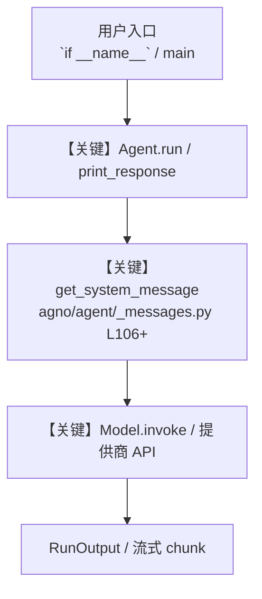

# stripe.py — 实现原理分析

<!-- cookbook-py-source:start -->
## 完整源码

````python
"""Stripe MCP Agent - Manage Your Stripe Operations

This example demonstrates how to create an Agno agent that interacts with the Stripe API via the Model Context Protocol (MCP). This agent can create and manage Stripe objects like customers, products, prices, and payment links using natural language commands.


Setup:
2. Install Python dependencies:
   ```bash
   uv pip install agno mcp
   ```
3. Set Environment Variable: export STRIPE_SECRET_KEY=***.

Stripe MCP Docs: https://github.com/stripe/agent-toolkit
"""

import asyncio
import os
from textwrap import dedent

from agno.agent import Agent
from agno.tools.mcp import MCPTools
from agno.utils.log import log_error, log_exception, log_info

# ---------------------------------------------------------------------------
# Create Agent
# ---------------------------------------------------------------------------


async def run_agent(message: str) -> None:
    """
    Sets up the Stripe MCP server and initialize the Agno agent
    """
    # Verify Stripe API Key is available
    stripe_api_key = os.getenv("STRIPE_SECRET_KEY")
    if not stripe_api_key:
        log_error("STRIPE_SECRET_KEY environment variable not set.")
        return

    enabled_tools = "paymentLinks.create,products.create,prices.create,customers.create,customers.read"

    # handle different Operating Systems
    npx_command = "npx.cmd" if os.name == "nt" else "npx"

    try:
        # Initialize MCP toolkit with Stripe server
        async with MCPTools(
            command=f"{npx_command} -y @stripe/mcp --tools={enabled_tools} --api-key={stripe_api_key}"
        ) as mcp_toolkit:
            agent = Agent(
                name="StripeAgent",
                instructions=dedent("""\
                    You are an AI assistant specialized in managing Stripe operations.
                    You interact with the Stripe API using the available tools.

                    - Understand user requests to create or list Stripe objects (customers, products, prices, payment links).
                    - Clearly state the results of your actions, including IDs of created objects or lists retrieved.
                    - Ask for clarification if a request is ambiguous.
                    - Use markdown formatting, especially for links or code snippets.
                    - Execute the necessary steps sequentially if a request involves multiple actions (e.g., create product, then price, then link).
                """),
                tools=[mcp_toolkit],
                markdown=True,
            )

            # Run the agent with the provided task
            log_info(f"Running agent with assignment: '{message}'")
            await agent.aprint_response(message, stream=True)

    except FileNotFoundError:
        error_msg = f"Error: '{npx_command}' command not found. Please ensure Node.js and npm/npx are installed and in your system's PATH."
        log_error(error_msg)
    except Exception as e:
        log_exception(f"An unexpected error occurred during agent execution: {e}")


# ---------------------------------------------------------------------------
# Run Agent
# ---------------------------------------------------------------------------

if __name__ == "__main__":
    task = "Create a new Stripe product named 'iPhone'. Then create a price of $999.99 USD for it. Finally, create a payment link for that price."
    asyncio.run(run_agent(task))


# Example prompts:
"""
Customer Management:
- "Create a customer. Name: ACME Corp, Email: billing@acme.example.com"
- "List my customers."
- "Find customer by email 'jane.doe@example.com'" # Note: Requires 'customers.retrieve' or search capability

Product and Price Management:
- "Create a new product called 'Basic Plan'."
- "Create a recurring monthly price of $10 USD for product 'Basic Plan'."
- "Create a product 'Ebook Download' and a one-time price of $19.95 USD."
- "List all products." # Note: Requires 'products.list' capability
- "List all prices." # Note: Requires 'prices.list' capability

Payment Links:
- "Create a payment link for the $10 USD monthly 'Basic Plan' price."
- "Generate a payment link for the '$19.95 Ebook Download'."

Combined Tasks:
- "Create a product 'Pro Service', add a price $150 USD (one-time), and give me the payment link."
- "Register a new customer 'support@example.com' named 'Support Team'."
"""
````

<!-- cookbook-py-source:end -->

> 源文件：`cookbook/91_tools/mcp/stripe.py`

## 概述

Stripe MCP Agent - Manage Your Stripe Operations

本示例归类：**单 Agent**；模型相关类型：`（见源码 import）`。

**核心配置一览：**

| 配置项 | 值 | 说明 |
|--------|------|------|
| `name` | 'StripeAgent' | `Agent(...)` |
| `instructions` | dedent('                    You are an AI assistant specialized in managing Stripe operations.\n                    You interact with the Stripe API using the available tools.\n\n                    - Understand user requests to create or list Stripe objects (customers, products, prices, payment links).\n                    - Clearly state the results of your actions, including IDs of created objects or lists retrieved.\n                    - Ask for clarification if a request is ambiguous.\n                    - Use markdown formatting, especially for links or code snippets.\n                    - Execute the necessary steps sequentially if a request involves multiple actions (e.g., create product, then price, then link).\n                '…) | `Agent(...)` |
| `markdown` | True | `Agent(...)` |

## 架构分层

```
用户 / cookbook 示例              Agno 框架
┌──────────────────────┐         ┌────────────────────────────────┐
│ stripe.py            │  ──▶  │ Agent → get_run_messages → Model │
└──────────────────────┘         └────────────────────────────────┘
                                          │
                                          ▼
                                  ┌───────────────┐
                                  │ 对应 Model 子类 │
                                  └───────────────┘
```

## 核心组件解析

### 运行机制与因果链

1. **入口**：从模块 `__main__` 或暴露的 `agent` / `team` 调用进入；同步用 `print_response` / `run`，异步用 `aprint_response` / `arun`（若源码中有）。
2. **消息**：默认路径下 system 内容由 `get_system_message()`（`libs/agno/agno/agent/_messages.py` 约 **L106** 起）按分段逻辑拼装；若显式传入 `system_message` 则早退使用该字符串。
3. **模型**：具体 HTTP/SDK 形态以 `libs/agno/agno/models/` 下对应类的 `invoke` / `ainvoke` 为准（勿默认写成单一 `chat.completions`）。
4. **副作用**：若配置 `db`、`knowledge`、`memory`，运行会读写存储；仅以本文件为准对照。

### 与框架的衔接

- **System**：`get_system_message()` 锚点 `agno/agent/_messages.py` **L106+**。
- **运行**：`Agent.print_response` 等入口 `agno/agent/agent.py`（以当前仓库检索为准）。

## System Prompt 组装

| 序号 | 组成部分 | 本文件 | 是否生效 |
|------|---------|--------|---------|
| 1 | `instructions` / `description` 等 | 见核心配置表与源码 | 有赋值则生效 |
| 2 | 默认分段（markdown、时间等） | 取决于 `Agent` 默认与显式参数 | 视参数 |

### 拼装顺序与源码锚点

1. `system_message` 直给 → 使用该内容（见 `_messages.py` 文档字符串分支说明）。
2. 否则默认拼装：`description`、`role`、`instructions`、markdown 附加段等按 `# 3.x` 注释顺序合并。

### 还原后的完整 System 文本

```text
（主 `Agent(...)` 未传入可静态解析的 `description`/`instructions`/`system_message` 字符串；此时 system 由 `get_system_message()` 默认段与 `markdown` 等开关决定，请在 `agno/agent/_messages.py` 对照分段注释，或在运行中打印 `get_system_message` 返回值。）
```

### 段落释义（模型视角）

- 指令与安全边界由 `instructions` / `system_message` 约束；若带 `tools` / `knowledge`，文档中需体现「何时检索/调用」由框架注入的提示段支持。

## 完整 API 请求

```python
# 请以本文件实际 Model 为准打开 libs/agno/agno/models/<厂商>/ 下对应类的 invoke：
# 可能是 chat.completions.create、responses.create、Gemini generate_content 等。
```

> 与上一节 system 文本在同一 run 中组合；`developer`/`system` 角色由适配器转换。



**【关键】节点说明：**

- **print_response / run**：用户可见的同步入口。
- **get_system_message**：系统提示拼装核心。
- **Model.invoke**：对模型提供商的实际请求。

## 关键源码文件索引

| 文件 | 作用 |
|------|------|
| `agno/agent/_messages.py` | `get_system_message()` L106+ |
| `agno/agent/agent.py` | `Agent` 运行与 CLI 输出 |
| `agno/models/` | 各厂商 `Model.invoke` |
