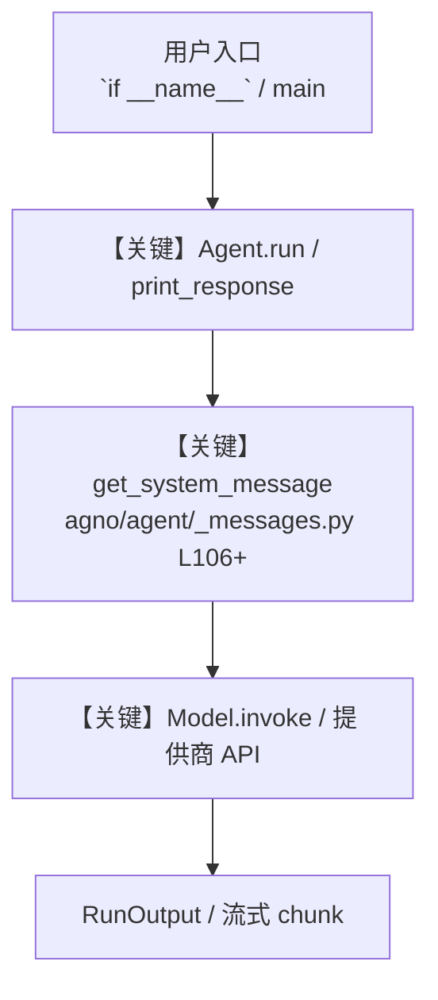

# mem0_tools.py — 实现原理分析

<!-- cookbook-py-source:start -->
## 完整源码

```python
"""
This example demonstrates how to use the Mem0 toolkit with Agno agents.

To get started, please export your Mem0 API key as an environment variable. You can get your Mem0 API key from https://app.mem0.ai/dashboard/api-keys

export MEM0_API_KEY=<your-mem0-api-key>
export MEM0_ORG_ID=<your-mem0-org-id> (Optional)
export MEM0_PROJECT_ID=<your-mem0-project-id> (Optional)
"""

from textwrap import dedent

from agno.agent import Agent
from agno.models.openai import OpenAIChat
from agno.tools.mem0 import Mem0Tools

# ---------------------------------------------------------------------------
# Create Agent
# ---------------------------------------------------------------------------


USER_ID = "jane_doe"
SESSION_ID = "agno_session"

# Example 1: Enable all Mem0 functions
agent_all = Agent(
    model=OpenAIChat(id="gpt-4o"),
    tools=[
        Mem0Tools(
            all=True,  # Enable all Mem0 memory functions
        )
    ],
    user_id=USER_ID,
    session_id=SESSION_ID,
    markdown=True,
    instructions=dedent(
        """
        You have full access to memory operations. You can create, search, update, and delete memories.
        Proactively manage memories to provide the best user experience.
        """
    ),
)

# Example 2: Enable specific Mem0 functions only
agent_specific = Agent(
    model=OpenAIChat(id="gpt-4o"),
    tools=[
        Mem0Tools(
            enable_add_memory=True,
            enable_search_memory=True,
            enable_get_all_memories=False,
            enable_delete_all_memories=False,
        )
    ],
    user_id=USER_ID,
    session_id=SESSION_ID,
    markdown=True,
    instructions=dedent(
        """
        You can add new memories and search existing ones, but cannot delete or view all memories.
        Focus on learning and recalling information about the user.
        """
    ),
)

# Example 3: Default behavior with full memory access
agent = Agent(
    model=OpenAIChat(id="gpt-4o"),
    tools=[
        Mem0Tools(
            enable_add_memory=True,
            enable_search_memory=True,
            enable_get_all_memories=True,
            enable_delete_all_memories=True,
        )
    ],
    user_id=USER_ID,
    session_id=SESSION_ID,
    markdown=True,
    instructions=dedent(
        """
        You have an evolving memory of this user. Proactively capture new personal details,
        preferences, plans, and relevant context the user shares, and naturally bring them up
        in later conversation. Before answering questions about past details, recall from your memory
        to provide precise and personalized responses. Keep your memory concise: store only
        meaningful information that enhances long-term dialogue. If the user asks to start fresh,
        clear all remembered information and proceed anew.
        """
    ),
)

# Example usage with all functions enabled

# ---------------------------------------------------------------------------
# Run Agent
# ---------------------------------------------------------------------------
if __name__ == "__main__":
    print("=== Example 1: Using all Mem0 functions ===")
    agent_all.print_response("I live in NYC and work as a software engineer")
    agent_all.print_response(
        "Summarize all my memories and delete outdated ones if needed"
    )

    # Example usage with specific functions only
    print("\n=== Example 2: Using specific Mem0 functions (add + search only) ===")
    agent_specific.print_response("I love Italian food, especially pasta")
    agent_specific.print_response("What do you remember about my food preferences?")

    # Example usage with default configuration
    print("\n=== Example 3: Default Mem0 agent usage ===")
    agent.print_response("I live in NYC")
    agent.print_response("I lived in San Francisco for 5 years previously")
    agent.print_response("I'm going to a Taylor Swift concert tomorrow")

    agent.print_response("Summarize all the details of the conversation")

    # More examples:
    # agent.print_response("NYC has a famous Brooklyn Bridge")
    # agent.print_response("Delete all my memories")
    # agent.print_response("I moved to LA")
    # agent.print_response("What is the name of the concert I am going to?")
```

<!-- cookbook-py-source:end -->

> 源文件：`cookbook/91_tools/mem0_tools.py`

## 概述

This example demonstrates how to use the Mem0 toolkit with Agno agents.

本示例归类：**单 Agent**；模型相关类型：`OpenAIChat`。

**核心配置一览：**

| 配置项 | 值 | 说明 |
|--------|------|------|
| `model` | OpenAIChat(id='gpt-4o'…) | `Agent(...)` |
| `user_id` | 变量 `USER_ID` | `Agent(...)` |
| `session_id` | 变量 `SESSION_ID` | `Agent(...)` |
| `markdown` | True | `Agent(...)` |
| `instructions` | dedent('\n        You have an evolving memory of this user. Proactively capture new personal details,\n        preferences, plans, and relevant context the user shares, and naturally bring them up\n        in later conversation. Before answering questions about past details, recall from your memory\n        to provide precise and personalized responses. Keep your memory concise: store only\n        meaningful information that enhances long-term dialogue. If the user asks to start fresh,\n        clear all remembered information and proceed anew.\n        '…) | `Agent(...)` |
| （Model 类） | `OpenAIChat` | `agno.models` |

## 架构分层

```
用户 / cookbook 示例              Agno 框架
┌──────────────────────┐         ┌────────────────────────────────┐
│ mem0_tools.py        │  ──▶  │ Agent → get_run_messages → Model │
└──────────────────────┘         └────────────────────────────────┘
                                          │
                                          ▼
                                  ┌───────────────┐
                                  │ 对应 Model 子类 │
                                  └───────────────┘
```

## 核心组件解析

### 运行机制与因果链

1. **入口**：从模块 `__main__` 或暴露的 `agent` / `team` 调用进入；同步用 `print_response` / `run`，异步用 `aprint_response` / `arun`（若源码中有）。
2. **消息**：默认路径下 system 内容由 `get_system_message()`（`libs/agno/agno/agent/_messages.py` 约 **L106** 起）按分段逻辑拼装；若显式传入 `system_message` 则早退使用该字符串。
3. **模型**：具体 HTTP/SDK 形态以 `libs/agno/agno/models/` 下对应类的 `invoke` / `ainvoke` 为准（勿默认写成单一 `chat.completions`）。
4. **副作用**：若配置 `db`、`knowledge`、`memory`，运行会读写存储；仅以本文件为准对照。

### 与框架的衔接

- **System**：`get_system_message()` 锚点 `agno/agent/_messages.py` **L106+**。
- **运行**：`Agent.print_response` 等入口 `agno/agent/agent.py`（以当前仓库检索为准）。

## System Prompt 组装

| 序号 | 组成部分 | 本文件 | 是否生效 |
|------|---------|--------|---------|
| 1 | `instructions` / `description` 等 | 见核心配置表与源码 | 有赋值则生效 |
| 2 | 默认分段（markdown、时间等） | 取决于 `Agent` 默认与显式参数 | 视参数 |

### 拼装顺序与源码锚点

1. `system_message` 直给 → 使用该内容（见 `_messages.py` 文档字符串分支说明）。
2. 否则默认拼装：`description`、`role`、`instructions`、markdown 附加段等按 `# 3.x` 注释顺序合并。

### 还原后的完整 System 文本

```text
（主 `Agent(...)` 未传入可静态解析的 `description`/`instructions`/`system_message` 字符串；此时 system 由 `get_system_message()` 默认段与 `markdown` 等开关决定，请在 `agno/agent/_messages.py` 对照分段注释，或在运行中打印 `get_system_message` 返回值。）
```

### 段落释义（模型视角）

- 指令与安全边界由 `instructions` / `system_message` 约束；若带 `tools` / `knowledge`，文档中需体现「何时检索/调用」由框架注入的提示段支持。

## 完整 API 请求

```python
# 请以本文件实际 Model 为准打开 libs/agno/agno/models/<厂商>/ 下对应类的 invoke：
# 可能是 chat.completions.create、responses.create、Gemini generate_content 等。
```

> 与上一节 system 文本在同一 run 中组合；`developer`/`system` 角色由适配器转换。



**【关键】节点说明：**

- **print_response / run**：用户可见的同步入口。
- **get_system_message**：系统提示拼装核心。
- **Model.invoke**：对模型提供商的实际请求。

## 关键源码文件索引

| 文件 | 作用 |
|------|------|
| `agno/agent/_messages.py` | `get_system_message()` L106+ |
| `agno/agent/agent.py` | `Agent` 运行与 CLI 输出 |
| `agno/models/` | 各厂商 `Model.invoke` |
