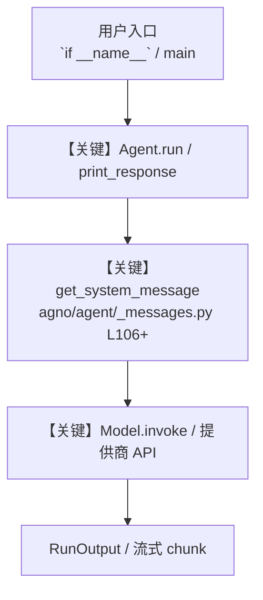

# azure_openai_tools.py — 实现原理分析

<!-- cookbook-py-source:start -->
## 完整源码

```python
"""Example showing how to use Azure OpenAI Tools with Agno.

Requirements:
1. Azure OpenAI service setup with DALL-E deployment and chat model deployment
2. Environment variables:
   - AZURE_OPENAI_API_KEY - Your Azure OpenAI API key
   - AZURE_OPENAI_ENDPOINT - The Azure OpenAI endpoint URL
   - AZURE_OPENAI_DEPLOYMENT - The deployment name for the language model
   - AZURE_OPENAI_IMAGE_DEPLOYMENT - The deployment name for an image generation model
   - OPENAI_API_KEY (for standard OpenAI example)

The script will automatically run only the examples for which you have the necessary
environment variables set.
"""

import sys
from os import getenv

from agno.agent import Agent
from agno.models.azure import AzureOpenAI
from agno.models.openai import OpenAIChat
from agno.tools.models.azure_openai import AzureOpenAITools

# ---------------------------------------------------------------------------
# Create Agent
# ---------------------------------------------------------------------------


# Check for base requirements first - needed for all examples
# Exit early if base requirements aren't met

# ---------------------------------------------------------------------------
# Run Agent
# ---------------------------------------------------------------------------
if __name__ == "__main__":
    if not bool(
        getenv("AZURE_OPENAI_API_KEY")
        and getenv("AZURE_OPENAI_ENDPOINT")
        and getenv("AZURE_OPENAI_IMAGE_DEPLOYMENT")
    ):
        print("Error: Missing base Azure OpenAI requirements.")
        print("Required for all examples:")
        print("- AZURE_OPENAI_API_KEY")
        print("- AZURE_OPENAI_ENDPOINT")
        print("- AZURE_OPENAI_IMAGE_DEPLOYMENT")
        sys.exit(1)

    print("Running Example 1: Standard OpenAI model with Azure OpenAI Tools")
    print(
        "This approach uses OpenAI for the agent's model but Azure for image generation.\n"
    )

    standard_agent = Agent(
        model=OpenAIChat(id="gpt-4o"),  # Using standard OpenAI for the agent
        tools=[AzureOpenAITools()],  # Using Azure OpenAI for image generation
        name="Mixed OpenAI Generator",
        description="An AI assistant that uses standard OpenAI for chat and Azure OpenAI for image generation",
        instructions=[
            "You are an AI artist specializing in creating images based on user descriptions.",
            "Use the generate_image tool to create detailed visualizations of user requests.",
            "Provide creative suggestions to enhance the images if needed.",
        ],
        debug_mode=True,
    )

    # Generate an image with the standard OpenAI model and Azure tools
    standard_agent.print_response(
        "Generate an image of a futuristic city with flying cars and tall skyscrapers",
        markdown=True,
    )

    print("\nRunning Example 2: Full Azure OpenAI setup")
    print(
        "This approach uses Azure OpenAI for both the agent's model and image generation.\n"
    )

    # Create an AzureOpenAI model using Azure credentials
    azure_endpoint = getenv("AZURE_OPENAI_ENDPOINT")
    azure_api_key = getenv("AZURE_OPENAI_API_KEY")
    azure_deployment = getenv("AZURE_OPENAI_DEPLOYMENT")

    # Explicitly pass all parameters to make debugging easier
    azure_model = AzureOpenAI(
        azure_endpoint=azure_endpoint,
        azure_deployment=azure_deployment,
        api_key=azure_api_key,
        id=azure_deployment,  # Using the deployment name as the model ID
    )

    # Create an agent with Azure OpenAI model and tools
    azure_agent = Agent(
        model=azure_model,  # Using Azure OpenAI for the agent
        tools=[AzureOpenAITools()],  # Using Azure OpenAI for image generation
        name="Full Azure OpenAI Generator",
        description="An AI assistant that uses Azure OpenAI for both chat and image generation",
        instructions=[
            "You are an AI artist specializing in creating images based on user descriptions.",
            "Use the generate_image tool to create detailed visualizations of user requests.",
            "Provide creative suggestions to enhance the images if needed.",
        ],
    )

    # Generate an image with the full Azure setup
    azure_agent.print_response(
        "Generate an image of a serene Japanese garden with cherry blossoms",
        markdown=True,
    )
```

<!-- cookbook-py-source:end -->

> 源文件：`cookbook/91_tools/models/azure_openai_tools.py`

## 概述

Example showing how to use Azure OpenAI Tools with Agno.

本示例归类：**单 Agent**；模型相关类型：`AzureOpenAI`。

**核心配置一览：**

| 配置项 | 值 | 说明 |
|--------|------|------|
| `model` | OpenAIChat(id='gpt-4o'…) | `Agent(...)` |
| `name` | 'Mixed OpenAI Generator' | `Agent(...)` |
| `description` | 'An AI assistant that uses standard OpenAI for chat and Azure OpenAI for image generation' | `Agent(...)` |
| `debug_mode` | True | `Agent(...)` |
| （Model 类） | `AzureOpenAI, OpenAIChat` | `agno.models` |

## 架构分层

```
用户 / cookbook 示例              Agno 框架
┌──────────────────────┐         ┌────────────────────────────────┐
│ azure_openai_tools.py │  ──▶  │ Agent → get_run_messages → Model │
└──────────────────────┘         └────────────────────────────────┘
                                          │
                                          ▼
                                  ┌───────────────┐
                                  │ 对应 Model 子类 │
                                  └───────────────┘
```

## 核心组件解析

### 运行机制与因果链

1. **入口**：从模块 `__main__` 或暴露的 `agent` / `team` 调用进入；同步用 `print_response` / `run`，异步用 `aprint_response` / `arun`（若源码中有）。
2. **消息**：默认路径下 system 内容由 `get_system_message()`（`libs/agno/agno/agent/_messages.py` 约 **L106** 起）按分段逻辑拼装；若显式传入 `system_message` 则早退使用该字符串。
3. **模型**：具体 HTTP/SDK 形态以 `libs/agno/agno/models/` 下对应类的 `invoke` / `ainvoke` 为准（勿默认写成单一 `chat.completions`）。
4. **副作用**：若配置 `db`、`knowledge`、`memory`，运行会读写存储；仅以本文件为准对照。

### 与框架的衔接

- **System**：`get_system_message()` 锚点 `agno/agent/_messages.py` **L106+**。
- **运行**：`Agent.print_response` 等入口 `agno/agent/agent.py`（以当前仓库检索为准）。

## System Prompt 组装

| 序号 | 组成部分 | 本文件 | 是否生效 |
|------|---------|--------|---------|
| 1 | `instructions` / `description` 等 | 见核心配置表与源码 | 有赋值则生效 |
| 2 | 默认分段（markdown、时间等） | 取决于 `Agent` 默认与显式参数 | 视参数 |

### 拼装顺序与源码锚点

1. `system_message` 直给 → 使用该内容（见 `_messages.py` 文档字符串分支说明）。
2. 否则默认拼装：`description`、`role`、`instructions`、markdown 附加段等按 `# 3.x` 注释顺序合并。

### 还原后的完整 System 文本

```text
--- description ---
An AI assistant that uses standard OpenAI for chat and Azure OpenAI for image generation
```

### 段落释义（模型视角）

- 指令与安全边界由 `instructions` / `system_message` 约束；若带 `tools` / `knowledge`，文档中需体现「何时检索/调用」由框架注入的提示段支持。

## 完整 API 请求

```python
# 请以本文件实际 Model 为准打开 libs/agno/agno/models/<厂商>/ 下对应类的 invoke：
# 可能是 chat.completions.create、responses.create、Gemini generate_content 等。
```

> 与上一节 system 文本在同一 run 中组合；`developer`/`system` 角色由适配器转换。



**【关键】节点说明：**

- **print_response / run**：用户可见的同步入口。
- **get_system_message**：系统提示拼装核心。
- **Model.invoke**：对模型提供商的实际请求。

## 关键源码文件索引

| 文件 | 作用 |
|------|------|
| `agno/agent/_messages.py` | `get_system_message()` L106+ |
| `agno/agent/agent.py` | `Agent` 运行与 CLI 输出 |
| `agno/models/` | 各厂商 `Model.invoke` |
