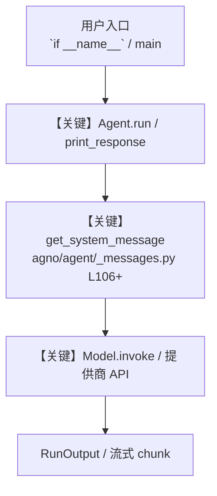

# neo4j_tools.py — 实现原理分析

<!-- cookbook-py-source:start -->
## 完整源码

````python
"""
Example script demonstrating the use of Neo4jTools with an Agno agent.
This script sets up an agent that can interact with a Neo4j database using natural language queries,
such as listing node labels or executing Cypher queries.

## Setting up Neo4j Locally

### Option 1: Using Docker (Recommended)

1. **Install Docker** if you haven't already from https://www.docker.com/

2. **Run Neo4j in Docker:**
   ```bash
   docker run \
       --name neo4j \
       -p 7474:7474 -p 7687:7687 \
       -d \
       -v $HOME/neo4j/data:/data \
       -v $HOME/neo4j/logs:/logs \
       -v $HOME/neo4j/import:/var/lib/neo4j/import \
       -v $HOME/neo4j/plugins:/plugins \
       --env NEO4J_AUTH=neo4j/password \
       neo4j:latest
   ```

3. **Access Neo4j Browser:** Open http://localhost:7474 in your browser
   - Username: `neo4j`
   - Password: `password`

### Option 2: Native Installation

1. **Download Neo4j Desktop** from https://neo4j.com/download/
2. **Install and create a new database**
3. **Start the database** and note the connection details

### Option 3: Using Neo4j Community Edition

1. **Download** from https://neo4j.com/download-center/#community
2. **Extract and run:**
   ```bash
   tar -xf neo4j-community-*-unix.tar.gz
   cd neo4j-community-*
   ./bin/neo4j start
   ```

## Python Setup

1. **Install required packages:**
   ```bash
   uv pip install neo4j python-dotenv
   ```

2. **Set environment variables** (create a `.env` file in your project root):
   ```env
   NEO4J_URI=bolt://localhost:7687
   NEO4J_USERNAME=neo4j
   NEO4J_PASSWORD=password
   ```

## Usage

1. **Ensure Neo4j is running** (check http://localhost:7474)
2. **Run this script** to create an agent that can interact with your Neo4j database
3. **Test with queries** like "What are the node labels in my graph?" or "Show me the database schema"

## Troubleshooting

- **Connection refused:** Make sure Neo4j is running on the correct port (7687)
- **Authentication failed:** Verify your username/password in the Neo4j browser first
- **Import errors:** Install the neo4j driver with `uv pip install neo4j`
"""

import os

from agno.agent import Agent
from agno.models.openai import OpenAIChat
from agno.tools.neo4j import Neo4jTools
from dotenv import load_dotenv

# ---------------------------------------------------------------------------
# Create Agent
# ---------------------------------------------------------------------------


# ---------------------------------------------------------------------------
# Run Agent
# ---------------------------------------------------------------------------
if __name__ == "__main__":
    load_dotenv()

    # Optionally load from environment or hardcode here
    uri = os.getenv("NEO4J_URI", "bolt://localhost:7687")
    user = os.getenv("NEO4J_USERNAME", "neo4j")
    password = os.getenv("NEO4J_PASSWORD", "password")

    # Example 1: All functions enabled (default)
    neo4j_toolkit_all = Neo4jTools(
        uri=uri,
        user=user,
        password=password,
        all=True,
    )

    # Example 2: Specific functions only
    neo4j_toolkit_specific = Neo4jTools(
        uri=uri,
        user=user,
        password=password,
        enable_list_labels=True,
        enable_get_schema=True,
        enable_list_relationships=False,
        enable_run_cypher=False,
    )

    # Example 3: Default behavior
    neo4j_toolkit = Neo4jTools(
        uri=uri,
        user=user,
        password=password,
    )

    description = """You are a Neo4j expert assistant who can help with all operations in a Neo4j database by understanding natural language context and translating it into Cypher queries."""

    instructions = [
        "Analyze the user's context and convert it into Cypher queries that respect the database's current schema.",
        "Before performing any operation, query the current schema (e.g., check for existing nodes or relationships).",
        "If the necessary schema elements are missing, dynamically create or extend the schema using best practices, ensuring data integrity and consistency.",
        "If properties are required or provided for nodes or relationships, ensure that they are added correctly do not overwrite existing ones and do not create duplicates and do not create extra nodes.",
        "Optionally, use or implement a dedicated function to retrieve the current schema (e.g., via a 'get_schema' function).",
        "Ensure that all operations maintain data integrity and follow best practices.",
        "Intelligently create relationships if bi-directional relationships are required, and understand the users intent and create relationships accordingly.",
        "Intelligently handle queries that involve multiple nodes and relationships, understand has to be nodes, properties, and relationships and maintain best practices.",
        "Handle errors gracefully and provide clear feedback to the user.",
    ]

    # Example: Use with AGNO Agent
    agent = Agent(
        model=OpenAIChat(id="o3-mini"),
        tools=[neo4j_toolkit],
        markdown=True,
        description=description,
        instructions=instructions,
    )

    # Agent handles tool usage automatically via LLM reasoning
    agent.print_response(
        "Add some nodes in my graph to represent a person with the name John Doe and a person with the name Jane Doe, and they belong to company 'X' and they are friends."
    )

    agent.print_response("What is the schema of my graph?")
````

<!-- cookbook-py-source:end -->

> 源文件：`cookbook/91_tools/neo4j_tools.py`

## 概述

Example script demonstrating the use of Neo4jTools with an Agno agent.

本示例归类：**单 Agent**；模型相关类型：`OpenAIChat`。

**核心配置一览：**

| 配置项 | 值 | 说明 |
|--------|------|------|
| `model` | OpenAIChat(id='o3-mini'…) | `Agent(...)` |
| `markdown` | True | `Agent(...)` |
| `description` | 'You are a Neo4j expert assistant who can help with all operations in a Neo4j database by understanding natural langua...' | `Agent(...)` |
| `instructions` | 变量 `instructions` | `Agent(...)` |
| （Model 类） | `OpenAIChat` | `agno.models` |

## 架构分层

```
用户 / cookbook 示例              Agno 框架
┌──────────────────────┐         ┌────────────────────────────────┐
│ neo4j_tools.py       │  ──▶  │ Agent → get_run_messages → Model │
└──────────────────────┘         └────────────────────────────────┘
                                          │
                                          ▼
                                  ┌───────────────┐
                                  │ 对应 Model 子类 │
                                  └───────────────┘
```

## 核心组件解析

### 运行机制与因果链

1. **入口**：从模块 `__main__` 或暴露的 `agent` / `team` 调用进入；同步用 `print_response` / `run`，异步用 `aprint_response` / `arun`（若源码中有）。
2. **消息**：默认路径下 system 内容由 `get_system_message()`（`libs/agno/agno/agent/_messages.py` 约 **L106** 起）按分段逻辑拼装；若显式传入 `system_message` 则早退使用该字符串。
3. **模型**：具体 HTTP/SDK 形态以 `libs/agno/agno/models/` 下对应类的 `invoke` / `ainvoke` 为准（勿默认写成单一 `chat.completions`）。
4. **副作用**：若配置 `db`、`knowledge`、`memory`，运行会读写存储；仅以本文件为准对照。

### 与框架的衔接

- **System**：`get_system_message()` 锚点 `agno/agent/_messages.py` **L106+**。
- **运行**：`Agent.print_response` 等入口 `agno/agent/agent.py`（以当前仓库检索为准）。

## System Prompt 组装

| 序号 | 组成部分 | 本文件 | 是否生效 |
|------|---------|--------|---------|
| 1 | `instructions` / `description` 等 | 见核心配置表与源码 | 有赋值则生效 |
| 2 | 默认分段（markdown、时间等） | 取决于 `Agent` 默认与显式参数 | 视参数 |

### 拼装顺序与源码锚点

1. `system_message` 直给 → 使用该内容（见 `_messages.py` 文档字符串分支说明）。
2. 否则默认拼装：`description`、`role`、`instructions`、markdown 附加段等按 `# 3.x` 注释顺序合并。

### 还原后的完整 System 文本

```text
--- description ---
You are a Neo4j expert assistant who can help with all operations in a Neo4j database by understanding natural language context and translating it into Cypher queries.
```

### 段落释义（模型视角）

- 指令与安全边界由 `instructions` / `system_message` 约束；若带 `tools` / `knowledge`，文档中需体现「何时检索/调用」由框架注入的提示段支持。

## 完整 API 请求

```python
# 请以本文件实际 Model 为准打开 libs/agno/agno/models/<厂商>/ 下对应类的 invoke：
# 可能是 chat.completions.create、responses.create、Gemini generate_content 等。
```

> 与上一节 system 文本在同一 run 中组合；`developer`/`system` 角色由适配器转换。



**【关键】节点说明：**

- **print_response / run**：用户可见的同步入口。
- **get_system_message**：系统提示拼装核心。
- **Model.invoke**：对模型提供商的实际请求。

## 关键源码文件索引

| 文件 | 作用 |
|------|------|
| `agno/agent/_messages.py` | `get_system_message()` L106+ |
| `agno/agent/agent.py` | `Agent` 运行与 CLI 输出 |
| `agno/models/` | 各厂商 `Model.invoke` |
