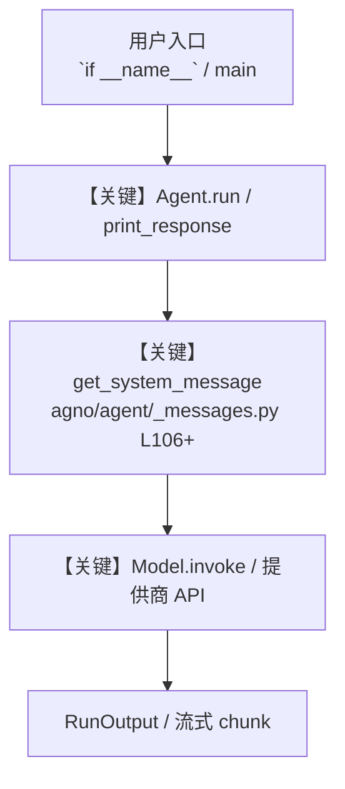

# notion_tools.py — 实现原理分析

<!-- cookbook-py-source:start -->
## 完整源码

```python
"""
Notion Tools
=============================

Demonstrates notion tools.
"""

from agno.agent import Agent
from agno.tools.notion import NotionTools

# ---------------------------------------------------------------------------
# Create Agent
# ---------------------------------------------------------------------------


# Notion Tools Demonstration Script
"""
This script showcases the power of organizing and managing content in Notion using AI.
Automatically categorize, store, and retrieve information from your Notion workspace!

---
Configuration Instructions:
1. Install required dependencies:
   uv pip install agno notion-client

2. Create a Notion Integration:
   - Go to https://www.notion.so/my-integrations
   - Click "+ New integration"
   - Name it (e.g., "Agno Agent")
   - Copy the "Internal Integration Token"

3. Create a Notion Database:
   - Create a new page in Notion
   - Add a database (type /database)
   - Add these properties:
     * Name (Title) - already exists
     * Tag (Select) - add options: travel, tech, general-blogs, fashion, documents

4. Share the database with your integration:
   - Open the database page
   - Click "..." → "Add connections"
   - Select your integration

5. Get the database ID from the URL:
   https://www.notion.so/../DATABASE_ID?v=...

6. Set environment variables in .env:
   NOTION_API_KEY=secret_your_integration_token
   NOTION_DATABASE_ID=your_database_id_here
---

Use Cases:
- Personal knowledge management
- Content organization
- Research notes
- Travel planning
- Reading lists
- And much more!
"""

# Create an agent with Notion Tools
notion_agent = Agent(
    name="Notion Knowledge Manager",
    instructions=[
        "You are a smart assistant that helps organize information in Notion.",
        "When given content, analyze it and categorize it appropriately.",
        "Available categories: travel, tech, general-blogs, fashion, documents",
        "Always search first to avoid duplicate pages with the same tag.",
        "Be concise and helpful in your responses.",
    ],
    tools=[NotionTools()],
    markdown=True,
)


def demonstrate_tools():
    print("  Notion Tools Demonstration\n")
    print("=" * 60)

    # Example 1: Travel Notes
    print("\n Example 1: Organizing Travel Information")
    print("-" * 60)
    prompt = """
    I found this amazing travel guide: 
    'Ha Giang Loop in Vietnam - 4 day motorcycle adventure through stunning mountains.
    Best time to visit: October to March. Must-see spots include Ma Pi Leng Pass.'
    
    Save this to Notion under the travel category.
    """
    notion_agent.print_response(prompt)

    # Example 2: Tech Bookmarks
    print("\n Example 2: Saving Tech Articles")
    print("-" * 60)
    prompt = """
    Save this tech article to Notion:
    'The Rise of AI Agents in 2025 - How autonomous agents are revolutionizing software development.
    Key trends include multi-agent systems, agentic workflows, and AI-powered automation.'
    
    Categorize this appropriately and add to Notion.
    """
    notion_agent.print_response(prompt)

    # Example 3: Multiple Items
    print("\n Example 3: Batch Processing Multiple Items")
    print("-" * 60)
    prompt = """
    I need to save these items to Notion:
    1. 'Best fashion trends for spring 2025 - Sustainable fabrics and minimalist designs'
    2. 'My updated resume and cover letter for job applications'
    3. 'Quick thoughts on productivity hacks for remote work'
    
    Process each one and save them to the appropriate categories.
    """
    notion_agent.print_response(prompt)

    # Example 4: Search and Update
    print("\nExample 4: Finding and Updating Existing Content")
    print("-" * 60)
    prompt = """
    Search for any pages tagged 'tech' and let me know what you find.
    Then add this new insight to one of them:
    'Update: AI agents now support structured output with Pydantic models for better type safety.'
    """
    notion_agent.print_response(prompt)

    # Example 5: Smart Categorization
    print("\n Example 5: Automatic Smart Categorization")
    print("-" * 60)
    prompt = """
    I have this content but I'm not sure where it belongs:
    'Exploring the ancient temples of Angkor Wat in Cambodia. The sunrise view from Angkor Wat 
    is breathtaking. Best visited during the dry season from November to March.'
    
    Analyze this content, decide the best category, and save it to Notion.
    """
    notion_agent.print_response(prompt)

    print("\n" + "=" * 60)
    print(
        "\nYour Notion database now contains organized content across different categories."
    )
    print("Check your Notion workspace to see the results!")


# ---------------------------------------------------------------------------
# Run Agent
# ---------------------------------------------------------------------------

if __name__ == "__main__":
    demonstrate_tools()
```

<!-- cookbook-py-source:end -->

> 源文件：`cookbook/91_tools/notion_tools.py`

## 概述

Notion Tools

本示例归类：**单 Agent**；模型相关类型：`（见源码 import）`。

**核心配置一览：**

| 配置项 | 值 | 说明 |
|--------|------|------|
| `name` | 'Notion Knowledge Manager' | `Agent(...)` |
| `markdown` | True | `Agent(...)` |

## 架构分层

```
用户 / cookbook 示例              Agno 框架
┌──────────────────────┐         ┌────────────────────────────────┐
│ notion_tools.py      │  ──▶  │ Agent → get_run_messages → Model │
└──────────────────────┘         └────────────────────────────────┘
                                          │
                                          ▼
                                  ┌───────────────┐
                                  │ 对应 Model 子类 │
                                  └───────────────┘
```

## 核心组件解析

### 运行机制与因果链

1. **入口**：从模块 `__main__` 或暴露的 `agent` / `team` 调用进入；同步用 `print_response` / `run`，异步用 `aprint_response` / `arun`（若源码中有）。
2. **消息**：默认路径下 system 内容由 `get_system_message()`（`libs/agno/agno/agent/_messages.py` 约 **L106** 起）按分段逻辑拼装；若显式传入 `system_message` 则早退使用该字符串。
3. **模型**：具体 HTTP/SDK 形态以 `libs/agno/agno/models/` 下对应类的 `invoke` / `ainvoke` 为准（勿默认写成单一 `chat.completions`）。
4. **副作用**：若配置 `db`、`knowledge`、`memory`，运行会读写存储；仅以本文件为准对照。

### 与框架的衔接

- **System**：`get_system_message()` 锚点 `agno/agent/_messages.py` **L106+**。
- **运行**：`Agent.print_response` 等入口 `agno/agent/agent.py`（以当前仓库检索为准）。

## System Prompt 组装

| 序号 | 组成部分 | 本文件 | 是否生效 |
|------|---------|--------|---------|
| 1 | `instructions` / `description` 等 | 见核心配置表与源码 | 有赋值则生效 |
| 2 | 默认分段（markdown、时间等） | 取决于 `Agent` 默认与显式参数 | 视参数 |

### 拼装顺序与源码锚点

1. `system_message` 直给 → 使用该内容（见 `_messages.py` 文档字符串分支说明）。
2. 否则默认拼装：`description`、`role`、`instructions`、markdown 附加段等按 `# 3.x` 注释顺序合并。

### 还原后的完整 System 文本

```text
（主 `Agent(...)` 未传入可静态解析的 `description`/`instructions`/`system_message` 字符串；此时 system 由 `get_system_message()` 默认段与 `markdown` 等开关决定，请在 `agno/agent/_messages.py` 对照分段注释，或在运行中打印 `get_system_message` 返回值。）
```

### 段落释义（模型视角）

- 指令与安全边界由 `instructions` / `system_message` 约束；若带 `tools` / `knowledge`，文档中需体现「何时检索/调用」由框架注入的提示段支持。

## 完整 API 请求

```python
# 请以本文件实际 Model 为准打开 libs/agno/agno/models/<厂商>/ 下对应类的 invoke：
# 可能是 chat.completions.create、responses.create、Gemini generate_content 等。
```

> 与上一节 system 文本在同一 run 中组合；`developer`/`system` 角色由适配器转换。



**【关键】节点说明：**

- **print_response / run**：用户可见的同步入口。
- **get_system_message**：系统提示拼装核心。
- **Model.invoke**：对模型提供商的实际请求。

## 关键源码文件索引

| 文件 | 作用 |
|------|------|
| `agno/agent/_messages.py` | `get_system_message()` L106+ |
| `agno/agent/agent.py` | `Agent` 运行与 CLI 输出 |
| `agno/models/` | 各厂商 `Model.invoke` |
