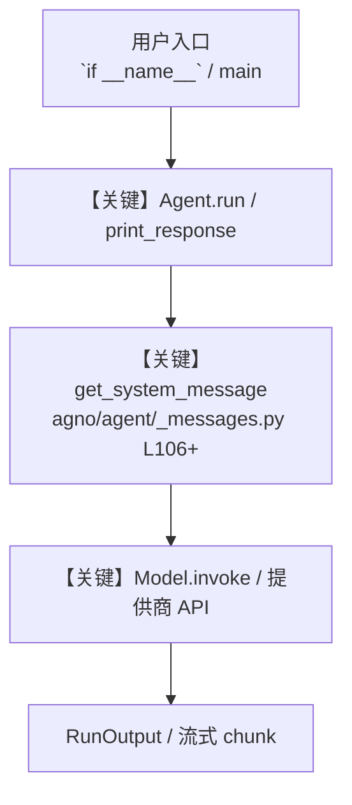

# opencv_tools.py — 实现原理分析

<!-- cookbook-py-source:start -->
## 完整源码

```python
"""
OpenCV Tools - Computer Vision and Image Processing

This example demonstrates how to use OpenCVTools for computer vision tasks.
Shows enable_ flag patterns for selective function access.
OpenCVTools is a small tool (<6 functions) so it uses enable_ flags.

Steps to use OpenCV Tools:

1. Install OpenCV
   - Run: uv pip install opencv-python

2. Camera Permissions (macOS)
   - Go to System Settings > Privacy & Security > Camera
   - Enable camera access for Terminal or your IDE

3. Camera Permissions (Linux)
   - Ensure your user is in the video group: sudo usermod -a -G video $USER
   - Restart your session after adding to the group

4. Camera Permissions (Windows)
   - Go to Settings > Privacy > Camera
   - Enable "Allow apps to access your camera"

Note: Make sure your webcam is connected and not being used by other applications.
"""

import base64

from agno.agent import Agent
from agno.tools.opencv import OpenCVTools
from agno.utils.media import save_base64_data

# ---------------------------------------------------------------------------
# Create Agent
# ---------------------------------------------------------------------------


# Example 1: All functions enabled with live preview (default behavior)
agent_full = Agent(
    name="Full OpenCV Agent",
    tools=[OpenCVTools(show_preview=True)],  # All functions enabled with preview
    description="You are a comprehensive computer vision specialist with all OpenCV capabilities.",
    instructions=[
        "Use all OpenCV tools for complete image processing and camera operations",
        "With live preview enabled, users can see real-time camera feed",
        "For images: show preview window, press 'c' to capture, 'q' to quit",
        "For videos: show live recording with countdown timer",
        "Provide detailed analysis of captured content",
    ],
    markdown=True,
)

# Example 2: Enable specific camera functions
agent_camera = Agent(
    name="Camera Specialist",
    tools=[
        OpenCVTools(
            show_preview=True,
            enable_capture_image=True,
            enable_capture_video=True,
        )
    ],
    description="You are a camera specialist focused on capturing images and videos.",
    instructions=[
        "Specialize in capturing images and videos from webcam",
        "Cannot perform advanced image processing or object detection",
        "Focus on high-quality image and video capture",
        "Provide clear instructions for camera operations",
    ],
    markdown=True,
)

# Example 3: Enable all functions using 'all=True' pattern
agent_comprehensive = Agent(
    name="Comprehensive Vision Agent",
    tools=[OpenCVTools(show_preview=True, all=True)],
    description="You are a full-featured computer vision expert with all capabilities enabled.",
    instructions=[
        "Perform advanced computer vision analysis and processing",
        "Use all available OpenCV functions for complex tasks",
        "Combine camera capture with real-time processing",
        "Provide comprehensive image analysis and insights",
    ],
    markdown=True,
)

# Example 4: Processing-focused agent (no camera capture)
agent_processor = Agent(
    name="Image Processor",
    tools=[
        OpenCVTools(
            show_preview=False,  # Disable live preview
            enable_capture_image=False,  # Disable camera capture
            enable_capture_video=False,  # Disable video capture
        )
    ],
    description="You are an image processing specialist focused on analyzing existing images.",
    instructions=[
        "Process and analyze existing images without camera operations",
        "Cannot capture new images or videos",
        "Focus on image enhancement, filtering, and analysis",
        "Provide detailed insights about image content and properties",
    ],
    markdown=True,
)

# Use the full agent for main examples
agent = agent_full

# Example 1: Interactive mode with live preview

# ---------------------------------------------------------------------------
# Run Agent
# ---------------------------------------------------------------------------
if __name__ == "__main__":
    print("Example 1: Interactive mode with live preview using full agent")

    response = agent.run(
        "Take a quick test of camera, capture the photo and tell me what you see in the photo."
    )

    if response and response.images:
        print("Agent response:", response.content)
        image_base64 = base64.b64encode(response.images[0].content).decode("utf-8")
        save_base64_data(image_base64, "tmp/test.png")

    # Example 2: Capture a video
    response = agent.run("Capture a 5 second webcam video.")

    if response and response.videos:
        save_base64_data(
            base64_data=str(response.videos[0].content),
            output_path="tmp/captured_test_video.mp4",
        )
```

<!-- cookbook-py-source:end -->

> 源文件：`cookbook/91_tools/opencv_tools.py`

## 概述

OpenCV Tools - Computer Vision and Image Processing

本示例归类：**单 Agent**；模型相关类型：`（见源码 import）`。

**核心配置一览：**

| 配置项 | 值 | 说明 |
|--------|------|------|
| `name` | 'Full OpenCV Agent' | `Agent(...)` |
| `description` | 'You are a comprehensive computer vision specialist with all OpenCV capabilities.' | `Agent(...)` |
| `markdown` | True | `Agent(...)` |

## 架构分层

```
用户 / cookbook 示例              Agno 框架
┌──────────────────────┐         ┌────────────────────────────────┐
│ opencv_tools.py      │  ──▶  │ Agent → get_run_messages → Model │
└──────────────────────┘         └────────────────────────────────┘
                                          │
                                          ▼
                                  ┌───────────────┐
                                  │ 对应 Model 子类 │
                                  └───────────────┘
```

## 核心组件解析

### 运行机制与因果链

1. **入口**：从模块 `__main__` 或暴露的 `agent` / `team` 调用进入；同步用 `print_response` / `run`，异步用 `aprint_response` / `arun`（若源码中有）。
2. **消息**：默认路径下 system 内容由 `get_system_message()`（`libs/agno/agno/agent/_messages.py` 约 **L106** 起）按分段逻辑拼装；若显式传入 `system_message` 则早退使用该字符串。
3. **模型**：具体 HTTP/SDK 形态以 `libs/agno/agno/models/` 下对应类的 `invoke` / `ainvoke` 为准（勿默认写成单一 `chat.completions`）。
4. **副作用**：若配置 `db`、`knowledge`、`memory`，运行会读写存储；仅以本文件为准对照。

### 与框架的衔接

- **System**：`get_system_message()` 锚点 `agno/agent/_messages.py` **L106+**。
- **运行**：`Agent.print_response` 等入口 `agno/agent/agent.py`（以当前仓库检索为准）。

## System Prompt 组装

| 序号 | 组成部分 | 本文件 | 是否生效 |
|------|---------|--------|---------|
| 1 | `instructions` / `description` 等 | 见核心配置表与源码 | 有赋值则生效 |
| 2 | 默认分段（markdown、时间等） | 取决于 `Agent` 默认与显式参数 | 视参数 |

### 拼装顺序与源码锚点

1. `system_message` 直给 → 使用该内容（见 `_messages.py` 文档字符串分支说明）。
2. 否则默认拼装：`description`、`role`、`instructions`、markdown 附加段等按 `# 3.x` 注释顺序合并。

### 还原后的完整 System 文本

```text
--- description ---
You are a comprehensive computer vision specialist with all OpenCV capabilities.
```

### 段落释义（模型视角）

- 指令与安全边界由 `instructions` / `system_message` 约束；若带 `tools` / `knowledge`，文档中需体现「何时检索/调用」由框架注入的提示段支持。

## 完整 API 请求

```python
# 请以本文件实际 Model 为准打开 libs/agno/agno/models/<厂商>/ 下对应类的 invoke：
# 可能是 chat.completions.create、responses.create、Gemini generate_content 等。
```

> 与上一节 system 文本在同一 run 中组合；`developer`/`system` 角色由适配器转换。



**【关键】节点说明：**

- **print_response / run**：用户可见的同步入口。
- **get_system_message**：系统提示拼装核心。
- **Model.invoke**：对模型提供商的实际请求。

## 关键源码文件索引

| 文件 | 作用 |
|------|------|
| `agno/agent/_messages.py` | `get_system_message()` L106+ |
| `agno/agent/agent.py` | `Agent` 运行与 CLI 输出 |
| `agno/models/` | 各厂商 `Model.invoke` |
