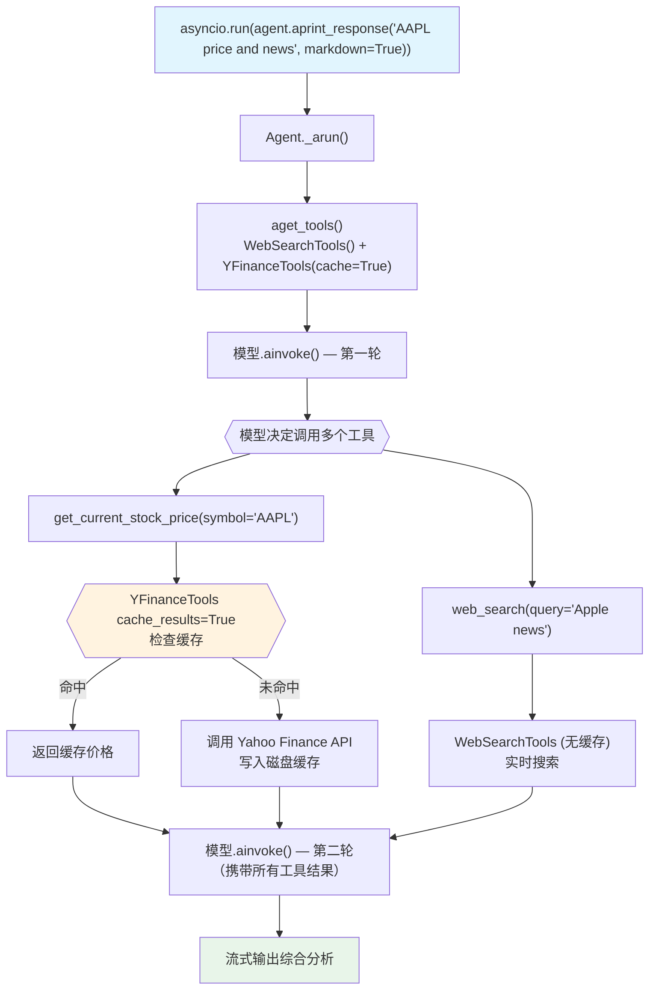

# cache_tool_calls.py — 实现原理分析

> 源文件：`cookbook/91_tools/other/cache_tool_calls.py`

## 概述

本示例展示 **Toolkit 级别 `cache_results` 缓存**机制：`YFinanceTools(cache_results=True)` 对所有 YFinance 工具调用结果进行磁盘缓存，配合 `WebSearchTools()` 实现混合工具 Agent。与 `@tool(cache_results=True)` 的函数级缓存功能相同，但作用于 Toolkit 中所有工具。全程异步执行（`asyncio.run + aprint_response`）。

**核心配置一览：**

| 配置项 | 值 | 说明 |
|--------|------|------|
| `model` | `OpenAIChat(id="gpt-4o-mini")` | Chat Completions API |
| `tools` | `[WebSearchTools(), YFinanceTools(cache_results=True)]` | 混合工具 |
| `YFinanceTools cache_results` | `True` | YFinance 工具启用缓存 |
| 异步模式 | `asyncio.run(agent.aprint_response(...))` | 全链路异步 |
| `markdown` | `True`（`aprint_response` 参数） | 输出 Markdown |

## 架构分层

```
用户代码层                      agno.agent 层
┌─────────────────────────┐    ┌────────────────────────────────────┐
│ other/cache_tool_calls. │    │ Agent._arun()  (异步)              │
│ py                      │    │  ├─ aget_tools()                   │
│                         │    │  │   YFinanceTools.functions        │
│ Agent(                  │    │  │   → Function.cache_results=True  │
│   model=gpt-4o-mini,    │───>│  │                                  │
│   tools=[               │    │  └─ AsyncFunctionCall.aexecute()   │
│     WebSearchTools(),   │    │      ├─ 检查缓存（同步工具）        │
│     YFinanceTools(      │    │      └─ 命中: 返回缓存; 未命中: 调用│
│       cache_results=True│    └────────────────────────────────────┘
│     )],                 │
│ )                       │
└─────────────────────────┘
            │ 磁盘缓存
            ▼
    ┌───────────────────┐
    │ .cache/<hash>.pkl │
    └───────────────────┘
```

## 核心组件解析

### YFinanceTools(cache_results=True)

```python
from agno.tools.yfinance import YFinanceTools

# YFinanceTools 在 Toolkit.__init__() 中将 cache_results 传递给所有 Function
class YFinanceTools(Toolkit):
    def __init__(self, cache_results: bool = False, ...):
        super().__init__(cache_results=cache_results)
        # 所有注册的工具函数都设置 cache_results=True
```

`Toolkit` 基类将 `cache_results` 传播到内部所有 `Function` 实例，等效于为每个工具单独设置 `@tool(cache_results=True)`。

### 缓存 key 设计

缓存 key 基于函数名 + 参数哈希：

```python
# function.py（简化）
cache_key = f"{self.function.name}_{hash(frozenset(sorted(self.arguments.items())))}"
```

相同参数的重复调用（如两次查询 `AAPL` 股价）会命中缓存，避免重复调用 Yahoo Finance API。

### 混合工具场景

```python
agent = Agent(
    model=OpenAIChat(id="gpt-4o-mini"),
    tools=[
        WebSearchTools(),           # 无缓存（每次搜索实时）
        YFinanceTools(cache_results=True),  # 有缓存（股价稳定）
    ],
)
```

LLM 根据任务自动选择工具：金融数据查询 → YFinanceTools（可能命中缓存）；新闻搜索 → WebSearchTools（实时）。

### 与 tool_decorator/cache_tool_calls.py 的对比

| 特性 | `@tool(cache_results=True)` | `YFinanceTools(cache_results=True)` |
|------|-----------------------------|-------------------------------------|
| 作用域 | 单个自定义函数 | Toolkit 中所有工具 |
| 配置位置 | `@tool` 装饰器参数 | Toolkit 构造函数参数 |
| 底层机制 | 完全相同（`Function.cache_results=True`） | 完全相同 |

## System Prompt 组装

| 序号 | 组成部分 | 本文件中的值/来源 | 是否生效 |
|------|---------|-----------------|---------|
| 1 | `system_message` | `None` | 否 |
| 3.1 | `instructions` | `None` | 否 |
| 3.1.1 | 模型指令 | 模型特定指令 | 是 |
| 3.2.1 | `markdown` | 通过 `aprint_response(markdown=True)` 传入 | 是 |

### 最终 System Prompt

```text
Use markdown to format your answers.
```

## 完整 API 请求

```python
client.chat.completions.create(
    model="gpt-4o-mini",
    messages=[
        {"role": "system", "content": "Use markdown to format your answers."},
        {"role": "user", "content": "What is the current stock price of AAPL and latest news on 'Apple'?"}
    ],
    tools=[
        # WebSearchTools 的工具（无缓存）
        {"type": "function", "function": {"name": "web_search", ...}},
        # YFinanceTools 的工具（有缓存）
        {"type": "function", "function": {"name": "get_current_stock_price", ...}},
        {"type": "function", "function": {"name": "get_company_news", ...}},
        # ... 其他 YFinance 工具
    ],
    stream=False
)
# LLM 可能调用：
# 1. get_current_stock_price(symbol="AAPL") → 检查缓存 → 返回价格
# 2. web_search(query="Apple latest news") → 不缓存 → 实时搜索
```

## Mermaid 流程图



## 关键源码文件索引

| 文件 | 关键函数/类 | 作用 |
|------|------------|------|
| `agno/tools/yfinance.py` | `YFinanceTools.__init__()` | 接受 cache_results 并传播 |
| `agno/tools/toolkit.py` | `Toolkit.__init__()` L15 | 处理 cache_results 参数 |
| `agno/tools/function.py` | `Function.cache_results` L191 | 缓存开关 |
| `agno/tools/function.py` | `FunctionCall.execute()` L976 | 缓存读写逻辑 |
| `agno/tools/websearch.py` | `WebSearchTools` | 实时网络搜索工具 |
