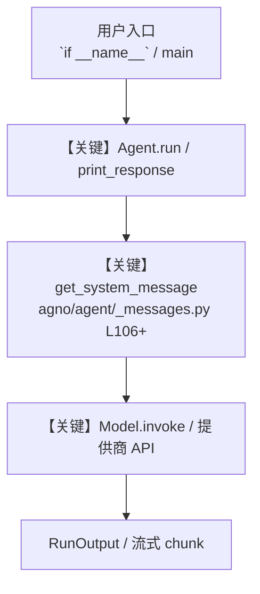

# complex_input_types.py — 实现原理分析

<!-- cookbook-py-source:start -->
## 完整源码

```python
"""
This example shows how to use complex input types with tools.

Recommendations:
- Specify fields with descriptions, these will be used in the JSON schema sent to the model and will increase accuracy.
- Try not to nest the structures too deeply, the model will have a hard time understanding them.
"""

from datetime import datetime
from enum import Enum
from typing import List, Optional

from agno.agent import Agent
from agno.tools.decorator import tool
from pydantic import BaseModel, Field

# ---------------------------------------------------------------------------
# Create Agent
# ---------------------------------------------------------------------------


# Define Pydantic models for our tools
class UserProfile(BaseModel):
    """User profile information."""

    name: str = Field(..., description="Full name of the user")
    email: str = Field(..., description="Valid email address")
    age: int = Field(..., ge=0, le=120, description="Age of the user")
    interests: List[str] = Field(
        default_factory=list, description="List of user interests"
    )
    created_at: datetime = Field(
        default_factory=datetime.now, description="Account creation timestamp"
    )


class TaskPriority(str, Enum):
    """Priority levels for tasks."""

    LOW = "low"
    MEDIUM = "medium"
    HIGH = "high"
    URGENT = "urgent"


class Task(BaseModel):
    """Task information."""

    title: str = Field(..., min_length=1, max_length=100, description="Task title")
    description: Optional[str] = Field(None, description="Detailed task description")
    priority: TaskPriority = Field(
        default=TaskPriority.MEDIUM, description="Task priority level"
    )
    due_date: Optional[datetime] = Field(None, description="Task due date")
    assigned_to: Optional[UserProfile] = Field(
        None, description="User assigned to the task"
    )


# Custom tools using Pydantic models
@tool
def create_user(user_data: UserProfile) -> str:
    """Create a new user profile with validated information."""
    # In a real application, this would save to a database
    return f"Created user profile for {user_data.name} with email {user_data.email}"


@tool
def create_task(task_data: Task) -> str:
    """Create a new task with priority and assignment."""
    # In a real application, this would save to a database
    return f"Created task '{task_data.title}' with priority {task_data.priority}"


# Create the agent
agent = Agent(
    name="task_manager",
    description="An agent that manages users and tasks with proper validation",
    tools=[create_user, create_task],
)

# Example usage
# ---------------------------------------------------------------------------
# Run Agent
# ---------------------------------------------------------------------------

if __name__ == "__main__":
    # Example 1: Create a user
    agent.print_response(
        "Create a new user named John Doe with email john@example.com, age 30, and interests in Python and AI"
    )

    # Example 2: Create a task
    agent.print_response(
        "Create a high priority task titled 'Implement API endpoints' due tomorrow"
    )
```

<!-- cookbook-py-source:end -->

> 源文件：`cookbook/91_tools/other/complex_input_types.py`

## 概述

This example shows how to use complex input types with tools.

本示例归类：**单 Agent**；模型相关类型：`（见源码 import）`。

**核心配置一览：**

| 配置项 | 值 | 说明 |
|--------|------|------|
| `name` | 'task_manager' | `Agent(...)` |
| `description` | 'An agent that manages users and tasks with proper validation' | `Agent(...)` |

## 架构分层

```
用户 / cookbook 示例              Agno 框架
┌──────────────────────┐         ┌────────────────────────────────┐
│ complex_input_types.py │  ──▶  │ Agent → get_run_messages → Model │
└──────────────────────┘         └────────────────────────────────┘
                                          │
                                          ▼
                                  ┌───────────────┐
                                  │ 对应 Model 子类 │
                                  └───────────────┘
```

## 核心组件解析

### 运行机制与因果链

1. **入口**：从模块 `__main__` 或暴露的 `agent` / `team` 调用进入；同步用 `print_response` / `run`，异步用 `aprint_response` / `arun`（若源码中有）。
2. **消息**：默认路径下 system 内容由 `get_system_message()`（`libs/agno/agno/agent/_messages.py` 约 **L106** 起）按分段逻辑拼装；若显式传入 `system_message` 则早退使用该字符串。
3. **模型**：具体 HTTP/SDK 形态以 `libs/agno/agno/models/` 下对应类的 `invoke` / `ainvoke` 为准（勿默认写成单一 `chat.completions`）。
4. **副作用**：若配置 `db`、`knowledge`、`memory`，运行会读写存储；仅以本文件为准对照。

### 与框架的衔接

- **System**：`get_system_message()` 锚点 `agno/agent/_messages.py` **L106+**。
- **运行**：`Agent.print_response` 等入口 `agno/agent/agent.py`（以当前仓库检索为准）。

## System Prompt 组装

| 序号 | 组成部分 | 本文件 | 是否生效 |
|------|---------|--------|---------|
| 1 | `instructions` / `description` 等 | 见核心配置表与源码 | 有赋值则生效 |
| 2 | 默认分段（markdown、时间等） | 取决于 `Agent` 默认与显式参数 | 视参数 |

### 拼装顺序与源码锚点

1. `system_message` 直给 → 使用该内容（见 `_messages.py` 文档字符串分支说明）。
2. 否则默认拼装：`description`、`role`、`instructions`、markdown 附加段等按 `# 3.x` 注释顺序合并。

### 还原后的完整 System 文本

```text
--- description ---
An agent that manages users and tasks with proper validation
```

### 段落释义（模型视角）

- 指令与安全边界由 `instructions` / `system_message` 约束；若带 `tools` / `knowledge`，文档中需体现「何时检索/调用」由框架注入的提示段支持。

## 完整 API 请求

```python
# 请以本文件实际 Model 为准打开 libs/agno/agno/models/<厂商>/ 下对应类的 invoke：
# 可能是 chat.completions.create、responses.create、Gemini generate_content 等。
```

> 与上一节 system 文本在同一 run 中组合；`developer`/`system` 角色由适配器转换。



**【关键】节点说明：**

- **print_response / run**：用户可见的同步入口。
- **get_system_message**：系统提示拼装核心。
- **Model.invoke**：对模型提供商的实际请求。

## 关键源码文件索引

| 文件 | 作用 |
|------|------|
| `agno/agent/_messages.py` | `get_system_message()` L106+ |
| `agno/agent/agent.py` | `Agent` 运行与 CLI 输出 |
| `agno/models/` | 各厂商 `Model.invoke` |
