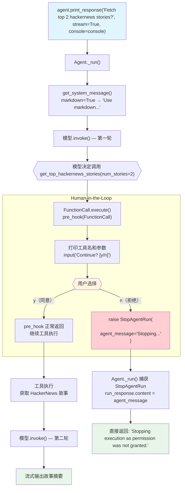

# human_in_the_loop.py — 实现原理分析

> 源文件：`cookbook/91_tools/other/human_in_the_loop.py`

## 概述

本示例展示通过 `@tool(pre_hook=...)` 实现 **Human-in-the-Loop（人机协作）** 机制：在工具执行前弹出用户确认提示，若用户拒绝则抛出 `StopAgentRun` 异常，Agent 立即停止执行并向用户返回预设消息，不再调用工具和后续 LLM。

**核心配置一览：**

| 配置项 | 值 | 说明 |
|--------|------|------|
| `model` | `OpenAIChat(id="gpt-4o-mini")` | Chat Completions API |
| `tools` | `[get_top_hackernews_stories]` | 带 pre_hook 确认的工具 |
| `markdown` | `True` | Markdown 格式化 |
| `@tool pre_hook` | `pre_hook(fc: FunctionCall)` | 用户确认 hook |
| `StopAgentRun` | 用户选择 "n" 时抛出 | 立即终止 Agent 执行 |
| `agent_message` | `"Stopping execution as permission was not granted."` | 中断时的 Agent 响应 |

## 架构分层

```
用户代码层                      agno.agent 层
┌─────────────────────────┐    ┌────────────────────────────────────┐
│ human_in_the_loop.py    │    │ Agent._run()                       │
│                         │    │  ├─ 模型决定调用工具               │
│ def pre_hook(fc):       │    │  └─ FunctionCall.execute()         │
│   print(fc.function.name│    │      ├─ pre_hook(FunctionCall)     │
│   message = input(      │───>│      │   ├─ 用户确认: y/n           │
│     "Continue? [y/n]"   │    │      │   └─ n → raise StopAgentRun │
│   if message == "n":    │    │      │                              │
│     raise StopAgentRun( │    │      └─ 捕获 StopAgentRun          │
│       "...",            │    │         → 返回 agent_message        │
│       agent_message=".."│    │         → 停止循环                 │
│     )                   │    └────────────────────────────────────┘
└─────────────────────────┘
```

## 核心组件解析

### StopAgentRun 异常

`StopAgentRun`（`agno/exceptions.py`）是 Agno 提供的特殊异常，用于从 hook 或工具中中断 Agent 执行：

```python
from agno.exceptions import StopAgentRun

def pre_hook(fc: FunctionCall):
    print(f"\n⚠️  About to run: {fc.function.name}")
    print(f"   Arguments: {fc.arguments}")
    
    message = input("Do you want to continue? [y/n] (default: y): ").strip().lower()
    
    if message == "n":
        raise StopAgentRun(
            "Tool call cancelled by user",
            agent_message="Stopping execution as permission was not granted.",
        )
```

- **第一个参数**：开发者日志消息（显示在 `debug_mode=True` 时）
- **`agent_message`**：最终返回给用户的响应内容（替代 LLM 生成的内容）

### Agent._run() 中的 StopAgentRun 捕获

```python
# _run.py（简化）
try:
    result = function_call.execute()
except StopAgentRun as e:
    run_response.content = e.agent_message   # 使用预设消息
    run_response.event = RunEvent.run_completed
    return run_response   # 立即返回，不再调用 LLM
```

`StopAgentRun` 不同于普通异常：它被 Agent 的执行循环直接捕获，优雅地结束执行流程。

### 与 Rich Console 集成

```python
from rich.console import Console

# 使用 agent.print_response() 同一个 console 实例
console = Console()
agent.print_response(..., stream=True, console=console)
```

传入相同的 `console` 实例可以让 pre_hook 中的 `input()` 在 Rich 的 Live 显示暂停后正确输出提示，避免终端输出混乱。

### 完整流程对比

| 用户选择 | 执行路径 | 最终输出 |
|---------|---------|---------|
| 默认（y） | pre_hook 通过 → 工具执行 → LLM 生成回答 | 正常工具执行结果 |
| "n" | pre_hook 抛出 `StopAgentRun` → 捕获 → 直接返回 | "Stopping execution as permission was not granted." |

## System Prompt 组装

| 序号 | 组成部分 | 本文件中的值/来源 | 是否生效 |
|------|---------|-----------------|---------|
| 1 | `system_message` | `None` | 否 |
| 3.1 | `instructions` | `None` | 否 |
| 3.1.1 | 模型指令 | 模型特定指令 | 是 |
| 3.2.1 | `markdown` | `True` → "Use markdown to format your answers." | 是 |

### 最终 System Prompt

```text
Use markdown to format your answers.
```

## 完整 API 请求

用户同意执行时的完整请求：

```python
# 第一轮：模型决定调用工具
client.chat.completions.create(
    model="gpt-4o-mini",
    messages=[
        {"role": "system", "content": "Use markdown to format your answers."},
        {"role": "user", "content": "Fetch the top 2 hackernews stories?"}
    ],
    tools=[{
        "type": "function",
        "function": {
            "name": "get_top_hackernews_stories",
            "description": "Fetch top stories from Hacker News.",
            "parameters": {
                "type": "object",
                "properties": {
                    "num_stories": {"type": "integer"}
                },
                "required": ["num_stories"]
            }
        }
    }],
    stream=True
)
# → 模型: tool_call: get_top_hackernews_stories(num_stories=2)
# → pre_hook: 打印确认提示
# → 用户输入 "y" → 工具执行 → 第二轮 LLM
#   用户输入 "n" → StopAgentRun → 直接返回预设消息，不发第二轮请求
```

## Mermaid 流程图



## 关键源码文件索引

| 文件 | 关键函数/类 | 作用 |
|------|------------|------|
| `agno/exceptions.py` | `StopAgentRun` | 立即终止 Agent 执行的异常 |
| `agno/tools/decorator.py` | `tool()` L87 | 解析 pre_hook 参数 |
| `agno/tools/function.py` | `Function.pre_hook` L162 | 工具执行前 hook |
| `agno/tools/function.py` | `FunctionCall` 类 | 工具执行上下文 |
| `agno/agent/_run.py` | StopAgentRun 捕获逻辑 | 捕获并优雅终止 |
