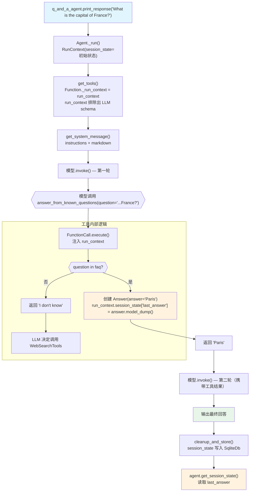

# session_state_tool.py — 实现原理分析

> 源文件：`cookbook/91_tools/other/session_state_tool.py`

## 概述

本示例展示在 **自定义工具函数中通过 `run_context: RunContext` 直接读写 `session_state`** 的机制：工具接收 `RunContext` 注入，在 FAQ 查找命中后将答案写入 `run_context.session_state["last_answer"]`，Agent 多次运行后可在外部通过 `agent.get_session_state()` 读取。配合 `SqliteDb` 持久化会话。

**核心配置一览：**

| 配置项 | 值 | 说明 |
|--------|------|------|
| `name` | `"Q & A Agent"` | Agent 名称 |
| `model` | `None` | 未显式设置 |
| `db` | `SqliteDb(db_file="tmp/q_and_a_agent.db")` | SQLite 持久化 |
| `tools` | `[answer_from_known_questions, WebSearchTools()]` | FAQ 工具 + 网络搜索兜底 |
| `markdown` | `True` | 输出 Markdown 格式 |
| `instructions` | `"You are a Q & A agent..."` | Agent 行为指令 |
| `@tool run_context: RunContext` | 注入当前运行上下文 | 读写 session_state |
| `output_schema` | `Answer(BaseModel)` | Pydantic 模型（定义在工具函数内部） |

## 架构分层

```
用户代码层                      agno.agent 层
┌─────────────────────────┐    ┌────────────────────────────────────┐
│ session_state_tool.py   │    │ Agent._run()                       │
│                         │    │  ├─ RunContext(session_state=...)   │
│ @tool()                 │    │  │                                  │
│ def answer_from_known_  │    │  ├─ get_tools()                    │
│   questions(            │───>│  │   → Function._run_context绑定   │
│     question: str,      │    │  │                                  │
│     run_context:RunCtx  │    │  └─ FunctionCall.execute()         │
│   ) -> str:             │    │      → 注入 run_context            │
│   run_context.          │    │      → 工具写 session_state        │
│     session_state[      │    │                                    │
│     "last_answer"] = .. │    └────────────────────────────────────┘
└─────────────────────────┘
                │
                │ 写入 session_state
                ▼
    ┌───────────────────────────┐
    │ SqliteDb                  │
    │ session_state 持久化      │
    └───────────────────────────┘
```

## 核心组件解析

### RunContext 注入到工具函数

```python
@tool()
def answer_from_known_questions(question: str, run_context: RunContext) -> str:
    """Answer a question from a list of known questions"""
    # run_context 由框架在 parse_tools() 时识别并排除出 LLM schema
    # 在 FunctionCall.execute() 时通过 entrypoint_args 注入
```

`parse_tools()` 识别函数签名中的 `run_context: RunContext` 参数，从 LLM 的 `parameters` schema 中排除（LLM 只看到 `question`）。执行时框架通过 `Function._run_context` 注入当前运行的 `RunContext`。

### session_state 写入

```python
faq = {
    "What is the capital of France?": "Paris",
    ...
}

if question in faq:
    answer = Answer(answer=faq[question], original_question=question)
    run_context.session_state["last_answer"] = answer.model_dump()
    return answer.answer
else:
    return "I don't know the answer to that question."
```

`run_context.session_state` 是引用传递（`dict`），工具函数直接修改它会更新 Agent 的当前状态，运行结束后由 `cleanup_and_store()` 写入 `SqliteDb`。

### 多轮 FAQ + 搜索兜底

```python
tools=[
    answer_from_known_questions,   # 首先查 FAQ
    WebSearchTools(),              # FAQ 未命中时搜索网络
],
instructions="...If you don't know the answer, you can search the web."
```

LLM 优先尝试 `answer_from_known_questions`，返回 "I don't know" 时再调用 `WebSearchTools`（通过 instructions 引导）。

### 运行后读取 session_state

```python
# 第一次运行
q_and_a_agent.print_response("What is the capital of France?", stream=True)

# 读取当次运行写入的 session_state
session_state = q_and_a_agent.get_session_state()
if session_state and "last_answer" in session_state:
    print(f"Session state after first run -> {session_state['last_answer']}")
# 输出: {'answer': 'Paris', 'original_question': 'What is the capital of France?'}
```

`agent.get_session_state()`（`agent.py:939`）从当前会话返回最新的 `session_state`。

## System Prompt 组装

| 序号 | 组成部分 | 本文件中的值/来源 | 是否生效 |
|------|---------|-----------------|---------|
| 1 | `system_message` | `None` | 否 |
| 3.1 | `instructions` | `"You are a Q & A agent..."` | 是 |
| 3.1.1 | 模型指令 | 模型特定指令 | 是 |
| 3.2.1 | `markdown` | `True` → "Use markdown to format your answers." | 是 |
| 3.3.3 | instructions 拼接 | 写入 system message | 是 |

### 最终 System Prompt

```text
You are a Q & A agent that can answer questions from a list of known questions. If you don't know the answer, you can search the web.

Use markdown to format your answers.
```

## 完整 API 请求

```python
client.chat.completions.create(
    model="<default-model>",
    messages=[
        {"role": "system", "content": "You are a Q & A agent...\n\nUse markdown to format your answers."},
        {"role": "user", "content": "What is the capital of France?"}
    ],
    tools=[
        {
            "type": "function",
            "function": {
                "name": "answer_from_known_questions",
                "description": "Answer a question from a list of known questions",
                "parameters": {
                    "type": "object",
                    "properties": {
                        "question": {"type": "string", "description": "The question to answer"}
                        # run_context 被排除
                    },
                    "required": ["question"]
                }
            }
        },
        {
            "type": "function",
            "function": {"name": "web_search", "description": "...", ...}
        }
    ],
    stream=True
)
# 执行：answer_from_known_questions(question="What is the capital of France?")
# 工具内部：run_context.session_state["last_answer"] = {"answer": "Paris", ...}
# LLM 收到工具结果 "Paris" → 生成最终回答
```

## Mermaid 流程图



## 关键源码文件索引

| 文件 | 关键函数/类 | 作用 |
|------|------------|------|
| `agno/run/base.py` | `RunContext` L16 | 运行上下文（含 session_state 引用） |
| `agno/agent/_tools.py` | `parse_tools()` L350 | 排除 run_context 出 LLM schema |
| `agno/tools/function.py` | `Function._run_context` L201 | 绑定当前 RunContext |
| `agno/agent/agent.py` | `get_session_state()` L939 | 获取当前会话状态 |
| `agno/agent/_run.py` | `cleanup_and_store()` L4348 | 运行后持久化 session_state |
| `agno/db/sqlite/` | `SqliteDb` | SQLite 存储后端 |
