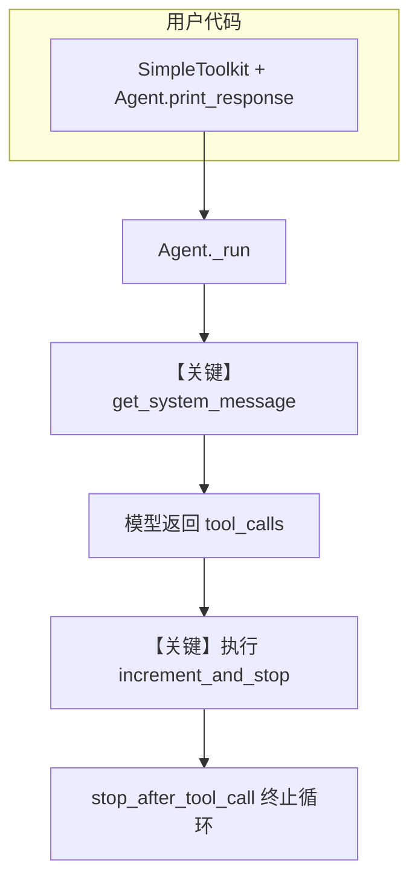

# stop_after_tool_call_in_toolkit.py — 实现原理分析

> 源文件：`cookbook/91_tools/other/stop_after_tool_call_in_toolkit.py`

## 概述

本示例展示 Agno 的 **`Toolkit.stop_after_tool_call_tools`** 机制：在 **不使用** `@tool` 装饰器的情况下，为 Toolkit 内指定工具名注册「工具执行后结束 agent 循环」行为，适合类方法场景。

**核心配置一览：**

| 配置项 | 值 | 说明 |
|--------|------|------|
| `model` | `None`（运行时在 `set_default_model` 中设为 `OpenAIChat(id="gpt-4o")`） | 未在构造函数中传入，走默认 Chat Completions |
| `name` | `None` | 未设置 |
| `tools` | `[SimpleToolkit()]` | 自定义 Toolkit，含 `stop_after_tool_call_tools` |
| `markdown` | `True` | 系统消息中追加 Markdown 格式说明 |
| `instructions` | `None` | 未设置 |
| `description` | `None` | 未设置 |
| `db` | `None` | 未设置 |

## 架构分层

```
用户代码层                agno.agent 层
┌────────────────────────┐    ┌──────────────────────────────────┐
│ stop_after_tool_call_  │    │ Agent.print_response / _run()   │
│ in_toolkit.py          │    │  ├ get_system_message()          │
│ SimpleToolkit(         │───>│  │    _messages.py               │
│   stop_after_tool_call_│    │  ├ get_tools() → Toolkit 注册    │
│   tools=[...])         │    │  │    各 Function.stop_after_   │
│                        │    │  │    tool_call 来自 Toolkit    │
└────────────────────────┘    └──────────────────────────────────┘
                                        │
                                        ▼
                                ┌──────────────┐
                                │ OpenAIChat   │
                                │ gpt-4o       │
                                │ Chat API     │
                                └──────────────┘
```

## 核心组件解析

### Toolkit 与 stop_after_tool_call_tools

`SimpleToolkit` 在 `Toolkit.__init__` 中传入 `stop_after_tool_call_tools=["increment_and_stop"]`，框架在注册函数时会将对应 `Function` 的 `stop_after_tool_call` 置为 `True`（主程序中的 `assert` 用于验证）。

### 运行机制与因果链

1. **数据路径**：用户字符串 → `print_response` → `Agent._run` → 组装消息 → 模型返回 tool_calls → 执行 `increment_and_stop` → 因 `stop_after_tool_call=True` 结束本轮 agent 工具循环（不再强制模型继续 turn）。
2. **状态与副作用**：本示例无 `db`、无持久化 session 写入演示；`SimpleToolkit.counter` 仅在进程内内存中变化。
3. **关键分支**：若调用 `increment_continue` / `get_counter`，`stop_after_tool_call` 为 `False`，agent 可继续多轮工具/对话；仅 `increment_and_stop` 触发「停」语义。
4. **与相邻示例差异**：对比 `tool_decorator/stop_after_tool_call.py`（装饰器），本文件强调 **Toolkit 级列表配置** 与类方法绑定。

## System Prompt 组装

| 序号 | 组成部分 | 本文件中的值/来源 | 是否生效 |
|------|---------|-----------------|---------|
| 1 | `system_message` 直传 | 未设置 | 否 |
| 2 | `build_context` | 默认 `True` | 是 |
| 3 | `instructions` | 未设置 | 否 |
| 4 | `description` / `role` | 未设置 | 否 |
| 5 | `markdown` | `True` | 是 → 追加「Use markdown...」 |
| 6 | `_tool_instructions` | 来自已注册工具 | 是（运行时） |
| 7 | `model.get_system_message_for_model` | `Model` 基类 | 视模型而定 |

### 拼装顺序与源码锚点

默认路径见 `get_system_message()`（`agno/agent/_messages.py`）：`# 3.1` 指令 → `# 3.2.1` markdown → `# 3.3.3` 指令块 → `# 3.3.5` 工具说明 → `# 3.3.14` 模型补充。本示例未提供 `instructions`/`description`，故 `# 3.3.1`–`# 3.3.2` 为空。

### 还原后的完整 System 文本

```text
<additional_information>
- Use markdown to format your answers.
</additional_information>

（后续为运行时注入：各工具的名称/参数/说明及模型适配器通过 get_system_message_for_model 追加的片段；本脚本未以字面量写死，需运行一次并在 get_system_message 返回前打印 message.content 查看全文。）
```

本 run 参照用户输入：`"Call the increment_and_stop tool once. Do not call any other tools."`

### 段落释义（模型视角）

- **Markdown 段**：要求回答使用 Markdown，与 `markdown=True` 一致。
- **工具段（运行时）**：告知可调用的工具及参数；`increment_and_stop` 执行后框架根据 `stop_after_tool_call` 停止继续工具轮。

### 与 User / Developer 消息的边界

用户消息仅包含上述英文请求；无额外 developer 消息（OpenAI Chat Completions 使用 `system` + `user`/`assistant`/`tool`）。

## 完整 API 请求

```python
# OpenAIChat → client.chat.completions.create（概念上等价）
# 一次典型 non-stream run（省略 tools JSON 细节）：

client.chat.completions.create(
    model="gpt-4o",
    messages=[
        # role=system, content=上一节还原结构 + 工具说明（运行时完整内容）
        {"role": "user", "content": "Call the increment_and_stop tool once. Do not call any other tools."},
    ],
    tools=[...],  # 来自 Agent.get_tools() / Function 序列化
)
```

> 与「还原后的 System 文本」对应：`messages[0]` 的 `content` 为拼装后的 system；用户句为 `messages[-1]`（若仅一轮）。

## Mermaid 流程图



- **【关键】get_system_message**：注入 markdown 与工具模式。
- **【关键】执行 increment_and_stop**：演示 Toolkit 级 stop 语义。

## 关键源码文件索引

| 文件 | 关键函数/类 | 作用 |
|------|------------|------|
| `agno/agent/_messages.py` | `get_system_message()` L106 起 | 默认 system 拼装 |
| `agno/agent/_init.py` | `set_default_model()` L66-78 | 默认 `OpenAIChat` |
| `agno/tools/toolkit.py` | `Toolkit` | `stop_after_tool_call_tools` 处理（见 Toolkit 实现） |
| `agno/models/base.py` | `get_system_message_for_model()` L2984 起 | 模型侧 system 片段 |
