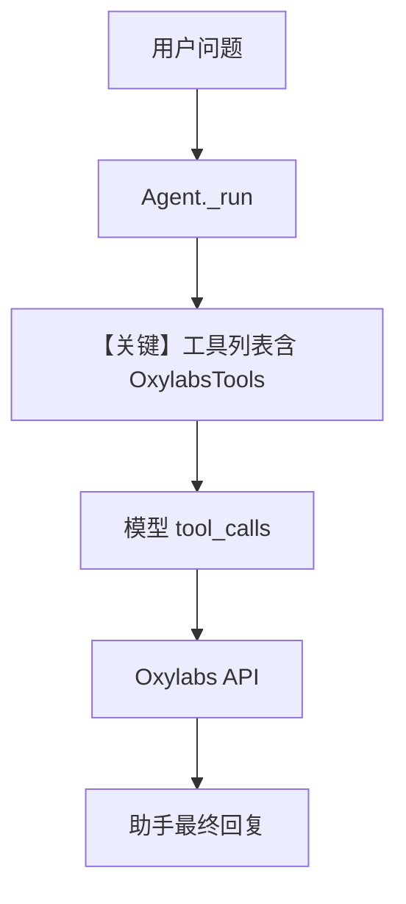

# oxylabs_tools.py — 实现原理分析

<!-- cookbook-py-source:start -->
## 完整源码

```python
"""
Oxylabs Tools
=============================

Demonstrates oxylabs tools.
"""

from agno.agent import Agent
from agno.tools.oxylabs import OxylabsTools

# ---------------------------------------------------------------------------
# Create Agent
# ---------------------------------------------------------------------------


agent = Agent(
    tools=[OxylabsTools()],
    markdown=True,
)

# Example 1: Google Search

# ---------------------------------------------------------------------------
# Run Agent
# ---------------------------------------------------------------------------
if __name__ == "__main__":
    agent.print_response(
        "Let's search for 'latest iPhone reviews' and provide a summary of the top 3 results. ",
    )

    # Example 2: Amazon Product Search
    # agent.print_response(
    #     "Let's search for an Amazon product with ASIN 'B07FZ8S74R' (Echo Dot). ",
    # )

    # Example 3: Multi-Domain Amazon Search
    # agent.print_response(
    #     "Use search_amazon_products to search for 'gaming keyboards' on both:\n"
    #     "1. Amazon US (domain='com')\n"
    #     "2. Amazon UK (domain='co.uk')\n"
    #     "Compare the top 3 results from each region including pricing and availability."
    # )
```

<!-- cookbook-py-source:end -->

> 源文件：`cookbook/91_tools/oxylabs_tools.py`

## 概述

本示例展示 Agno 的 **`OxylabsTools` 集成**：将 Oxylabs 搜索/电商等能力以工具形式挂到 Agent，由模型按需调用。

**核心配置一览：**

| 配置项 | 值 | 说明 |
|--------|------|------|
| `model` | `None`（默认 `OpenAIChat(id="gpt-4o")`） | Chat Completions |
| `tools` | `[OxylabsTools()]` | Oxylabs 工具包 |
| `markdown` | `True` | 追加 Markdown 使用说明 |
| `instructions` | `None` | 未设置 |
| `description` | `None` | 未设置 |

## 架构分层

```
oxylabs_tools.py          Agent._run → get_system_message / get_run_messages
     │                              │
     └─ OxylabsTools() ────────────► OpenAIChat → chat.completions
```

## 核心组件解析

### OxylabsTools

封装 Oxylabs API 调用为 `Function` 列表，经 `Agent.get_tools()` 暴露给模型。

### 运行机制与因果链

1. **路径**：用户自然语言 → 模型决策 → `OxylabsTools` 某函数 → 结果注入对话 → 模型总结。
2. **副作用**：网络请求发往 Oxylabs；无本示例内建数据库写入。
3. **分支**：注释中示例 2/3 需取消注释才执行不同查询。
4. **定位**：`91_tools` 下第三方搜索/采集类工具的标准挂载方式。

## System Prompt 组装

未设置 `instructions`/`description`。静态可确定片段：

```text
<additional_information>
- Use markdown to format your answers.
</additional_information>
```

工具模式与模型补充见运行时 `message.content`（`get_system_message` 出口调试）。

### 拼装顺序与源码锚点

同默认链：`# 3.2.1` markdown → `# 3.3.5` 工具说明 → `# 3.3.14` 模型补充（`agno/agent/_messages.py`）。

本 run 用户输入（示例 1）：`"Let's search for 'latest iPhone reviews' and provide a summary of the top 3 results. "`

## 完整 API 请求

```python
# OpenAI Chat Completions
client.chat.completions.create(
    model="gpt-4o",
    messages=[
        {"role": "system", "content": "<运行时拼装>"},
        {"role": "user", "content": "Let's search for 'latest iPhone reviews'..."},
    ],
    tools=[...],
)
```

## Mermaid 流程图



## 关键源码文件索引

| 文件 | 关键符号 | 作用 |
|------|---------|------|
| `agno/agent/_messages.py` | `get_system_message` L106 | system 拼装 |
| `agno/tools/oxylabs/` | `OxylabsTools` | 工具实现 |
| `agno/models/openai/chat.py` | `OpenAIChat.invoke` L385 | Chat API 调用 |
