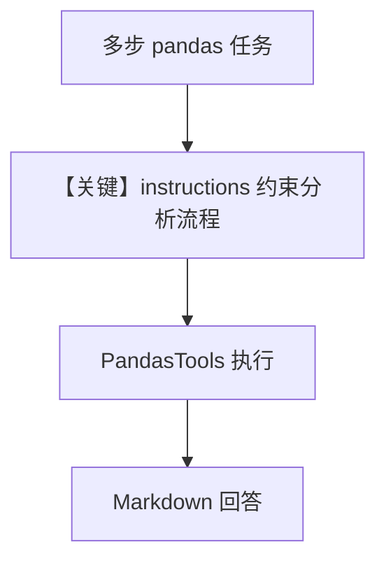

# pandas_tools.py — 实现原理分析

<!-- cookbook-py-source:start -->
## 完整源码

```python
"""
Pandas Tools - Data Analysis and DataFrame Operations

This example demonstrates how to use PandasTools for data manipulation and analysis.
Shows enable_ flag patterns for selective function access.
PandasTools is a small tool (<6 functions) so it uses enable_ flags.

Run: `uv pip install pandas` to install the dependencies
"""

from agno.agent import Agent
from agno.tools.pandas import PandasTools

# ---------------------------------------------------------------------------
# Create Agent
# ---------------------------------------------------------------------------


agent_full = Agent(
    tools=[PandasTools()],  # All functions enabled by default
    description="You are a data analyst with full pandas capabilities for comprehensive data analysis.",
    instructions=[
        "Help users with all aspects of pandas data manipulation",
        "Create, modify, analyze, and visualize DataFrames",
        "Provide detailed explanations of data operations",
        "Suggest best practices for data analysis workflows",
    ],
    markdown=True,
)

# ---------------------------------------------------------------------------
# Run Agent
# ---------------------------------------------------------------------------
if __name__ == "__main__":
    print("=== DataFrame Creation and Analysis Example ===")
    agent_full.print_response("""
    Please perform these tasks:
    1. Create a pandas dataframe named 'sales_data' using DataFrame() with this sample data:
       {'date': ['2023-01-01', '2023-01-02', '2023-01-03', '2023-01-04', '2023-01-05'],
        'product': ['Widget A', 'Widget B', 'Widget A', 'Widget C', 'Widget B'],
        'quantity': [10, 15, 8, 12, 20],
        'price': [9.99, 15.99, 9.99, 12.99, 15.99]}
    2. Show me the first 5 rows of the sales_data dataframe
    3. Calculate the total revenue (quantity * price) for each row
    """)
```

<!-- cookbook-py-source:end -->

> 源文件：`cookbook/91_tools/pandas_tools.py`

## 概述

本示例展示 Agno 的 **`PandasTools`**：在 Agent 上启用 pandas 数据分析能力，并通过 **`description` + 多行 `instructions`** 约束分析师角色与回答风格。

**核心配置一览：**

| 配置项 | 值 | 说明 |
|--------|------|------|
| `model` | `None`（默认 `OpenAIChat(id="gpt-4o")`） | Chat Completions |
| `tools` | `[PandasTools()]` | 全量函数默认开启 |
| `description` | `"You are a data analyst with full pandas capabilities..."` | 角色 |
| `instructions` | 见下（4 条字符串列表） | 任务边界 |
| `markdown` | `True` | Markdown 段 |

## 架构分层

```
pandas_tools.py           get_system_message
  agent_full ───────────► #3.3.1 description
                          #3.3.3 instructions
                          #3.2.1 markdown
                               ▼
                          OpenAIChat(gpt-4o)
```

## 核心组件解析

### PandasTools

小工具集，通过 enable 类开关筛选函数（本例使用默认全开启）。

### 运行机制与因果链

1. **路径**：用户多步任务字符串 → 模型调用 pandas 相关工具 → 返回表格/计算结果 → 自然语言解释。
2. **副作用**：可能在 `tmp` 或当前目录产生中间文件（取决于 `PandasTools` 实现）；无 Agent `db`。
3. **分支**：若改用 `include_tools`/`exclude_tools` 可缩小能力面（本文件未演示）。

## System Prompt 组装

### 还原后的完整 System 文本（字面量来自 .py）

```text
You are a data analyst with full pandas capabilities for comprehensive data analysis.

- Help users with all aspects of pandas data manipulation
- Create, modify, analyze, and visualize DataFrames
- Provide detailed explanations of data operations
- Suggest best practices for data analysis workflows

<additional_information>
- Use markdown to format your answers.
</additional_information>

（其后追加工具说明与模型补充，运行时生成。）
```

本 run 用户消息为 `agent_full.print_response(""" Please perform these tasks: ... """)` 中的多行任务描述。

### 段落释义

- **description**：固定分析师身份。
- **instructions**：覆盖操纵 DataFrame、解释与最佳实践。
- **markdown**：统一输出格式。

## 完整 API 请求

```python
client.chat.completions.create(
    model="gpt-4o",
    messages=[
        {"role": "system", "content": "<含上节字面量 + 工具说明>"},
        {"role": "user", "content": "<DataFrame 任务多行文本>"},
    ],
    tools=[...],
)
```

## Mermaid 流程图



## 关键源码文件索引

| 文件 | 位置 | 作用 |
|------|------|------|
| `agno/agent/_messages.py` | `# 3.3.1`–`# 3.3.3` | description / instructions |
| `agno/tools/pandas/` | `PandasTools` | 工具逻辑 |
