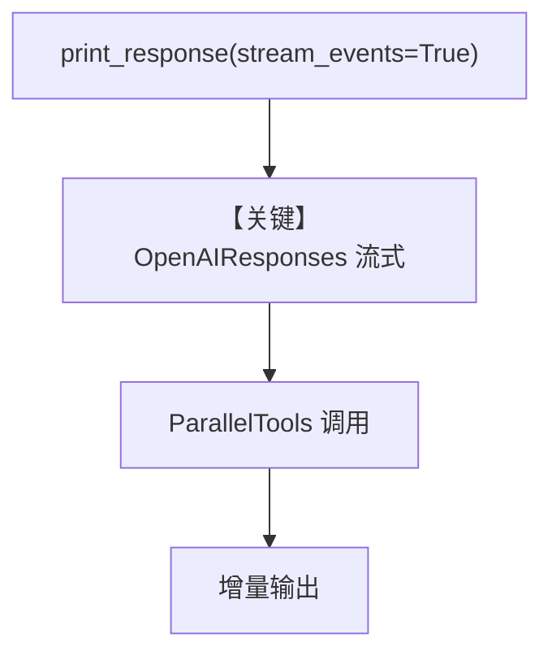

# parallel_tools.py — 实现原理分析

> 源文件：`cookbook/91_tools/parallel_tools.py`

## 概述

本示例展示 Agno 的 **`OpenAIResponses` 模型** 与 **`ParallelTools`** 组合：使用 OpenAI **Responses API**（非 Chat Completions），并开启流式与事件流。

**核心配置一览：**

| 配置项 | 值 | 说明 |
|--------|------|------|
| `model` | `OpenAIResponses(id="gpt-5.1")` | Responses API |
| `tools` | `[ParallelTools()]` | Parallel 搜索/研究类工具 |
| `instructions` | `"No need to tell me its based on your research."` | 单行 |
| `markdown` | `True` | 是 |

## 架构分层

```
parallel_tools.py     Agent._run
  OpenAIResponses ──► responses.create 形态（见模型 invoke）
  ParallelTools  ──► 工具 schema
```

## 核心组件解析

### OpenAIResponses

`role_map` 将 `system` 映射为 `developer`（`agno/models/openai/responses.py` L84-90），请求走 Responses 端点而非 `chat.completions`。

### ParallelTools

提供并行检索/研究能力（具体函数见 `agno/tools/parallel`）。

### 运行机制与因果链

1. **路径**：用户问题 → Responses 多轮 → 可能含工具调用 → 流式 `stream_events` 输出。
2. **副作用**：外部 Parallel API/网络；无本地 db。
3. **分支**：`stream=True, stream_events=True` 时走流式事件路径。

## System Prompt 组装

```text
No need to tell me its based on your research.

<additional_information>
- Use markdown to format your answers.
</additional_information>
（+ 工具说明 + get_system_message_for_model）
```

## 完整 API 请求

```python
# 与 OpenAIResponses 一致：client.responses.create（参数名可为 input 等，见 responses.py invoke 实现）
# 概念结构：
client.responses.create(
    model="gpt-5.1",
    input=[{"role": "developer", "content": "<system 拼装>"}, {"role": "user", "content": "Tell me about Agno's AgentOS?"}],
    tools=[...],
    stream=True,
)
```

> 精确字段名以 `OpenAIResponses.invoke` / `ainvoke` 实现为准（`libs/agno/agno/models/openai/responses.py`）。

## Mermaid 流程图



## 关键源码文件索引

| 文件 | 作用 |
|------|------|
| `agno/models/openai/responses.py` | Responses API、`role_map` |
| `agno/agent/_messages.py` | `get_system_message` |
