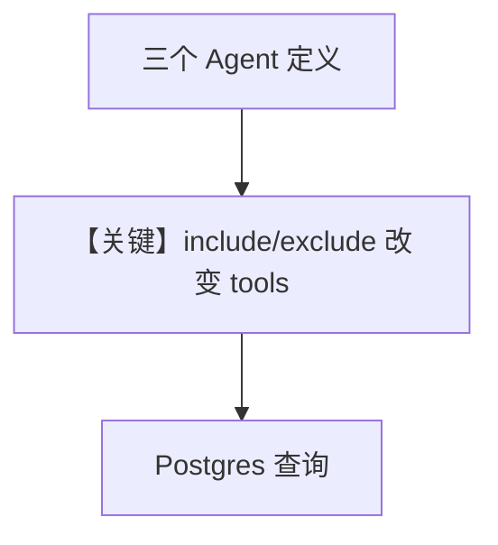

# postgres_tools.py — 实现原理分析

> 源文件：`cookbook/91_tools/postgres_tools.py`

## 概述

本示例展示 Agno 的 **`PostgresTools`**：同一脚本定义 **三个 Agent**（全量 / 只读 / 排除危险），演示 `include_tools` 与 `exclude_tools` 对暴露给模型的函数集合的控制。

**核心配置一览（`__main__` 使用的 `agent`）**

| 配置项 | 值 | 说明 |
|--------|------|------|
| `model` | 默认 `OpenAIChat(id="gpt-4o")` | 未显式传入 |
| `tools` | `[PostgresTools(host=..., port=5532, ...)]` | 连接本地示例库 |
| `markdown` | 仅在 `print_response(..., markdown=True)` | 调用时传入 |

`agent_readonly`、`agent_safe` 见源码，用于对比工具子集。

## 核心组件解析

### PostgresTools

将 SQL 相关操作封装为工具；`include_tools` 白名单；`exclude_tools` 黑名单。

### 运行机制与因果链

1. **路径**：自然语言 → 模型选工具 → psycopg/连接执行 → 结果回传。
2. **副作用**：**读写数据库**；`run_query` 被排除时仍可能有其它写路径需注意（取决于工具列表）。
3. **分支**：`agent` vs `agent_readonly` vs `agent_safe` 改变可用工具集合与风险面。

## System Prompt 组装

未设置 `instructions`、`description`，且三个 `Agent` 均未设 `Agent(markdown=True)`，故 `# 3.2.1` 的「Use markdown...」**不**进入默认 system（`agno/agent/_messages.py` 中 `agent.markdown` 为 False）。

### 还原后的完整 System 文本

```text
（无静态字面量 instructions/description；拼装结果主要由运行时工具说明 + Model.get_system_message_for_model 构成。若需全文，请在 get_system_message 返回前打印 Message.content。）
```

`print_response(..., markdown=True)` 仅影响终端输出样式，不自动把 `markdown=True` 写入 Agent 构造参数。

## 完整 API 请求

```python
client.chat.completions.create(
    model="gpt-4o",
    messages=[
        {"role": "system", "content": "<无 markdown 默认时较短的 system>"},
        {"role": "user", "content": "List the tables..."},
    ],
    tools=[...],
)
```

## Mermaid 流程图



## 关键源码文件索引

| 文件 | 作用 |
|------|------|
| `agno/tools/postgres/` | `PostgresTools` |
| `agno/agent/_messages.py` | system 拼装 |
