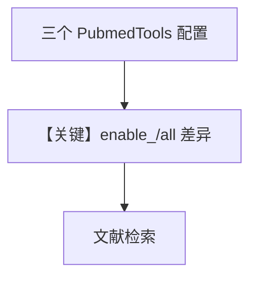

# pubmed_tools.py — 实现原理分析

<!-- cookbook-py-source:start -->
## 完整源码

```python
"""
Pubmed Tools
=============================

Demonstrates pubmed tools.
"""

from agno.agent import Agent
from agno.tools.pubmed import PubmedTools

# ---------------------------------------------------------------------------
# Create Agent
# ---------------------------------------------------------------------------


# Example 1: Enable all PubMed functions
agent_all = Agent(
    tools=[
        PubmedTools(
            all=True,  # Enable all PubMed search functions
        )
    ],
    markdown=True,
)

# Example 2: Enable specific PubMed functions only
agent_specific = Agent(
    tools=[
        PubmedTools(
            enable_search_pubmed=True,  # Only enable the main search function
        )
    ],
    markdown=True,
)

# Example 3: Default behavior with search enabled
agent = Agent(
    tools=[
        PubmedTools(
            enable_search_pubmed=True,
        )
    ],
    markdown=True,
)

# Example usage with all functions enabled

# ---------------------------------------------------------------------------
# Run Agent
# ---------------------------------------------------------------------------
if __name__ == "__main__":
    print("=== Example 1: Using all PubMed functions ===")
    agent_all.print_response(
        "Tell me about ulcerative colitis and find the latest research."
    )

    # Example usage with specific functions only
    print("\n=== Example 2: Using specific PubMed functions (search only) ===")
    agent_specific.print_response("Search for recent studies on diabetes treatment.")

    # Example usage with default configuration
    print("\n=== Example 3: Default PubMed agent usage ===")
    agent.print_response("Tell me about ulcerative colitis.")

    agent.print_response("Find research papers on machine learning in healthcare.")
```

<!-- cookbook-py-source:end -->

> 源文件：`cookbook/91_tools/pubmed_tools.py`

## 概述

本示例展示 **`PubmedTools`** 的 **`all=True`** 与 **`enable_*`** 开关，并定义三个 Agent 对比能力范围；运行入口依次演示三种配置。

**核心配置一览（`agent`，示例 3）**

| 配置项 | 值 | 说明 |
|--------|------|------|
| `model` | 默认 `OpenAIChat(id="gpt-4o")` | Chat Completions |
| `tools` | `[PubmedTools(enable_search_pubmed=True)]` | 主搜索开启 |
| `markdown` | `True` | 是 |

## 架构分层

用户脚本 → `Agent.print_response` → `get_system_message` → `OpenAIChat` → PubMed 工具 HTTP/API。

## 核心组件解析

### PubmedTools

通过 `all` 与布尔 `enable_*` 控制函数子集。

### 运行机制与因果链

1. **路径**：医学/文献问题 → 工具检索 PubMed → 模型总结引用。
2. **副作用**：外部 API 调用；无 Agent `db`。
3. **分支**：`agent_all` 功能最全；`agent_specific` 仅搜索。

## System Prompt 组装

```text
<additional_information>
- Use markdown to format your answers.
</additional_information>
（+ 工具说明 + 模型补充）
```

## 完整 API 请求

`chat.completions.create(model="gpt-4o", messages=[system,user], tools=[...])`。

## Mermaid 流程图



## 关键源码文件索引

| 文件 | 作用 |
|------|------|
| `agno/tools/pubmed/` | `PubmedTools` |
| `agno/agent/_messages.py` | `get_system_message` L106 |
