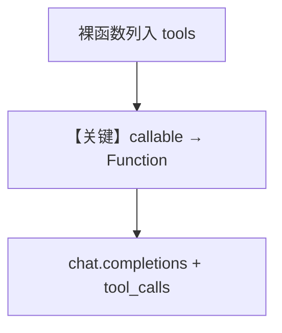

# python_function_as_tool.py — 实现原理分析

<!-- cookbook-py-source:start -->
## 完整源码

```python
"""
Python Function As Tool
=============================

Demonstrates python function as tool.
"""

import json

import httpx
from agno.agent import Agent

# ---------------------------------------------------------------------------
# Create Agent
# ---------------------------------------------------------------------------


def get_top_hackernews_stories(num_stories: int = 10) -> str:
    """Use this function to get top stories from Hacker News.

    Args:
        num_stories (int): Number of stories to return. Defaults to 10.

    Returns:
        str: JSON string of top stories.
    """

    # Fetch top story IDs
    response = httpx.get("https://hacker-news.firebaseio.com/v0/topstories.json")
    story_ids = response.json()

    # Fetch story details
    stories = []
    for story_id in story_ids[:num_stories]:
        story_response = httpx.get(
            f"https://hacker-news.firebaseio.com/v0/item/{story_id}.json"
        )
        story = story_response.json()
        if "text" in story:
            story.pop("text", None)
        stories.append(story)
    return json.dumps(stories)


agent = Agent(tools=[get_top_hackernews_stories], markdown=True)

# ---------------------------------------------------------------------------
# Run Agent
# ---------------------------------------------------------------------------
if __name__ == "__main__":
    agent.print_response("Summarize the top 5 stories on hackernews?", stream=True)
```

<!-- cookbook-py-source:end -->

> 源文件：`cookbook/91_tools/python_function_as_tool.py`

## 概述

本示例展示将 **普通 Python 函数** 直接传入 `Agent(tools=[...])`：框架把函数包装为 `Function`，无需 `@tool` 装饰器即可调用 Hacker News API。

**核心配置一览**

| 配置项 | 值 | 说明 |
|--------|------|------|
| `model` | 默认 `OpenAIChat(id="gpt-4o")` | 未显式传入 |
| `tools` | `[get_top_hackernews_stories]` | 裸函数 |
| `markdown` | `True` | 是 |

## 核心组件解析

### 函数即工具

`get_top_hackernews_stories` 的 docstring 成为工具描述来源（具体见 `agno/tools/function` 包装逻辑）。

### 运行机制与因果链

1. **路径**：用户提问 → 模型发起 `get_top_hackernews_stories` → httpx 请求 HN API → JSON 返回 → 摘要。
2. **副作用**：仅出站 HTTP；无持久化。

## System Prompt 组装

```text
<additional_information>
- Use markdown to format your answers.
</additional_information>
（工具：含 get_top_hackernews_stories 的 schema/说明）
```

## 完整 API 请求

Chat Completions + `tools` 数组含该函数名与参数 schema。

## Mermaid 流程图



## 关键源码文件索引

| 文件 | 作用 |
|------|------|
| `agno/tools/function.py` | 函数包装为可调用工具 |
| `agno/models/openai/chat.py` | `OpenAIChat.invoke` L385 |
