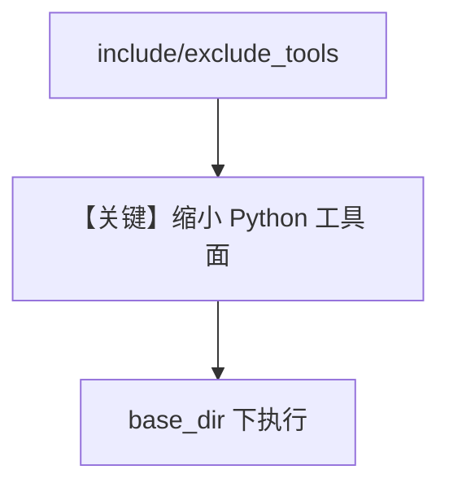

# python_tools.py — 实现原理分析

<!-- cookbook-py-source:start -->
## 完整源码

```python
"""
Python Tools
=============================

Demonstrates python tools.
"""

from pathlib import Path

from agno.agent import Agent
from agno.tools.python import PythonTools

# ---------------------------------------------------------------------------
# Create Agent
# ---------------------------------------------------------------------------


# Example 1: All functions available (default behavior)
agent_all = Agent(
    name="Python Agent - All Functions",
    tools=[PythonTools(base_dir=Path("tmp/python"))],
    instructions=["You have access to all Python execution capabilities."],
    markdown=True,
)

# Example 2: Include specific functions only
agent_specific = Agent(
    name="Python Agent - Specific Functions",
    tools=[
        PythonTools(
            base_dir=Path("tmp/python"),
            include_tools=["save_to_file_and_run", "run_python_code"],
        )
    ],
    instructions=["You can only save and run Python code, no package installation."],
    markdown=True,
)

# Example 3: Exclude dangerous functions
agent_safe = Agent(
    name="Python Agent - Safe Mode",
    tools=[
        PythonTools(
            base_dir=Path("tmp/python"),
            exclude_tools=["pip_install_package", "uv_pip_install_package"],
        )
    ],
    instructions=["You can run Python code but cannot install packages."],
    markdown=True,
)

# Use the default agent for examples
agent = agent_all

# ---------------------------------------------------------------------------
# Run Agent
# ---------------------------------------------------------------------------
if __name__ == "__main__":
    agent.print_response(
        "Write a python script for fibonacci series and display the result till the 10th number"
    )
```

<!-- cookbook-py-source:end -->

> 源文件：`cookbook/91_tools/python_tools.py`

## 概述

本示例展示 **`PythonTools`** 的 **`base_dir`**、**`include_tools`**、**`exclude_tools`** 三种约束方式，并用 `agent = agent_all` 指定默认演示 Agent。

**核心配置一览（`agent_all`）**

| 配置项 | 值 | 说明 |
|--------|------|------|
| `name` | `"Python Agent - All Functions"` | 未 `add_name_to_context` 则仅元数据 |
| `model` | 默认 `OpenAIChat` | 未显式传入 |
| `tools` | `[PythonTools(base_dir=Path("tmp/python"))]` | 沙箱目录 |
| `instructions` | `["You have access to all Python execution capabilities."]` | 列表 |
| `markdown` | `True` | 是 |

## 核心组件解析

### PythonTools

在受限目录执行/保存 Python 代码；`include_tools`/`exclude_tools` 缩小攻击面。

### 运行机制与因果链

1. **路径**：用户要脚本 → 模型调用执行类工具 → 本地 `tmp/python` 下文件与进程副作用。
2. **副作用**：**本地文件系统与进程执行**；需注意路径与权限。
3. **分支**：`agent_safe` 禁用 pip 安装类工具。

## System Prompt 组装

```text
- You have access to all Python execution capabilities.

<additional_information>
- Use markdown to format your answers.
</additional_information>
```

## 完整 API 请求

`gpt-4o` + tools 描述 Python 子命令。

## Mermaid 流程图



## 关键源码文件索引

| 文件 | 作用 |
|------|------|
| `agno/tools/python/` | `PythonTools` |
