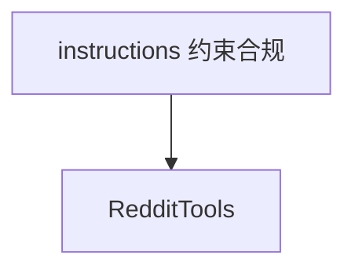

# reddit_tools.py — 实现原理分析

<!-- cookbook-py-source:start -->
## 完整源码

```python
"""
Steps to get Reddit credentials:

1. Create/Login to Reddit account
   - Go to https://www.reddit.com

2. Create a Reddit App
   - Go to https://www.reddit.com/prefs/apps
   - Click "Create App" or "Create Another App" button
   - Fill in required details:
     * Name: Your app name
     * App type: Select "script"
     * Description: Brief description
     * About url: Your website (can be http://localhost)
     * Redirect uri: http://localhost:8080
   - Click "Create app" button

3. Get credentials
   - client_id: Found under your app name (looks like a random string)
   - client_secret: Listed as "secret"
   - user_agent: Format as: "platform:app_id:version (by /u/username)"
   - username: Your Reddit username
   - password: Your Reddit account password

"""

from agno.agent import Agent
from agno.tools.reddit import RedditTools

# ---------------------------------------------------------------------------
# Create Agent
# ---------------------------------------------------------------------------


agent = Agent(
    instructions=[
        "Use your tools to answer questions about Reddit content and statistics",
        "Respect Reddit's content policies and NSFW restrictions",
        "When analyzing subreddits, provide relevant statistics and trends",
    ],
    tools=[RedditTools()],
)

# ---------------------------------------------------------------------------
# Run Agent
# ---------------------------------------------------------------------------
if __name__ == "__main__":
    agent.print_response("What are the top 5 posts on r/SAAS this week ?", stream=True)
```

<!-- cookbook-py-source:end -->

> 源文件：`cookbook/91_tools/reddit_tools.py`

## 概述

本示例展示 **`RedditTools`** 与 **多行 `instructions`**（政策、NSFW、子版块分析），需 Reddit API 凭证（见文件头文档）。

**核心配置一览**

| 配置项 | 值 | 说明 |
|--------|------|------|
| `instructions` | 3 条字符串 | Reddit 使用策略 |
| `tools` | `[RedditTools()]` |  |
| `model` | 默认 `OpenAIChat` | 未传入 |

## System Prompt 组装

```text
- Use your tools to answer questions about Reddit content and statistics
- Respect Reddit's content policies and NSFW restrictions
- When analyzing subreddits, provide relevant statistics and trends

（无 markdown Agent 标志则无 3.2.1 段；本文件未设 markdown=True）
```

若需确认是否含 markdown 行：本 Agent **未** 设 `markdown=True`，故无「Use markdown...」。

## 完整 API 请求

Chat Completions，`messages[0].content` 含上述三条指令 + 工具说明。

## Mermaid 流程图



## 关键源码文件索引

| 文件 | 作用 |
|------|------|
| `agno/tools/reddit/` | `RedditTools` |
