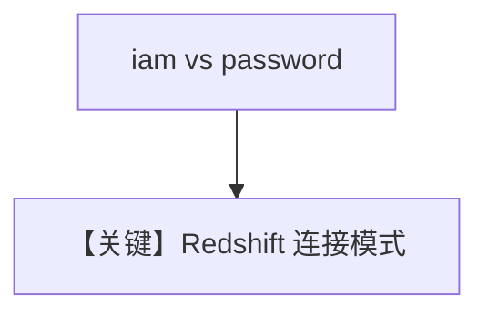

# redshift_tools.py — 实现原理分析

> 源文件：`cookbook/91_tools/redshift_tools.py`

## 概述

本示例展示 **`RedshiftTools`** 的两种认证：**用户名密码** 与 **`iam=True`**（配合 AWS 环境变量）。

**核心配置一览（`agent`）**

| 配置项 | 值 | 说明 |
|--------|------|------|
| `tools` | `[RedshiftTools(user=..., password=...)]` | 占位凭证 |
| `model` | 默认 | 未传入 |

`agent_iam` 使用 `RedshiftTools(iam=True)`。

## 运行机制与因果链

1. **路径**：自然语言 → SQL/元数据类工具 → Redshift。
2. **副作用**：**数据库访问**；凭证来自环境或构造函数。

## System Prompt 组装

无 `instructions`/`markdown` Agent 参数。还原为运行时工具段为主。

## 完整 API 请求

`chat.completions` + tools。

## Mermaid 流程图

## 关键源码文件索引

| 文件 | 作用 |
|------|------|
| `agno/tools/redshift/` | `RedshiftTools` |
