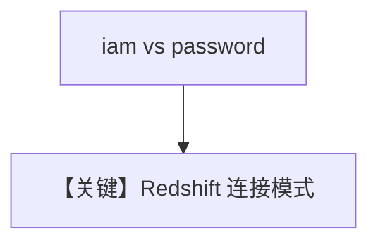

# redshift_tools.py — 实现原理分析

<!-- cookbook-py-source:start -->
## 完整源码

```python
"""
Amazon Redshift Tools Example

For IAM authentication with environment variables, set:
export AWS_ACCESS_KEY_ID="your-access-key"
export AWS_SECRET_ACCESS_KEY="your-secret-key"
export AWS_SESSION_TOKEN="your-session-token"
export REDSHIFT_HOST="your-workgroup.123456789.us-east-1.redshift-serverless.amazonaws.com"
export REDSHIFT_DATABASE="dev"
"""

from agno.agent import Agent
from agno.tools.redshift import RedshiftTools

# ---------------------------------------------------------------------------
# Create Agent
# ---------------------------------------------------------------------------


# Example 1: Standard username/password authentication
agent = Agent(
    tools=[
        RedshiftTools(
            user="your-username",
            password="your-password",
        )
    ]
)

# Example 2: IAM authentication with environment variables (Serverless)
agent_iam = Agent(
    tools=[
        RedshiftTools(
            iam=True,
        )
    ]
)

# ---------------------------------------------------------------------------
# Run Agent
# ---------------------------------------------------------------------------
if __name__ == "__main__":
    agent.print_response(
        "List the tables in the database and describe one of the tables", markdown=True
    )

    agent_iam.print_response("Run a query to select 1 + 1 as result", markdown=True)
```

<!-- cookbook-py-source:end -->

> 源文件：`cookbook/91_tools/redshift_tools.py`

## 概述

本示例展示 **`RedshiftTools`** 的两种认证：**用户名密码** 与 **`iam=True`**（配合 AWS 环境变量）。

**核心配置一览（`agent`）**

| 配置项 | 值 | 说明 |
|--------|------|------|
| `tools` | `[RedshiftTools(user=..., password=...)]` | 占位凭证 |
| `model` | 默认 | 未传入 |

`agent_iam` 使用 `RedshiftTools(iam=True)`。

## 运行机制与因果链

1. **路径**：自然语言 → SQL/元数据类工具 → Redshift。
2. **副作用**：**数据库访问**；凭证来自环境或构造函数。

## System Prompt 组装

无 `instructions`/`markdown` Agent 参数。还原为运行时工具段为主。

## 完整 API 请求

`chat.completions` + tools。

## Mermaid 流程图



## 关键源码文件索引

| 文件 | 作用 |
|------|------|
| `agno/tools/redshift/` | `RedshiftTools` |
