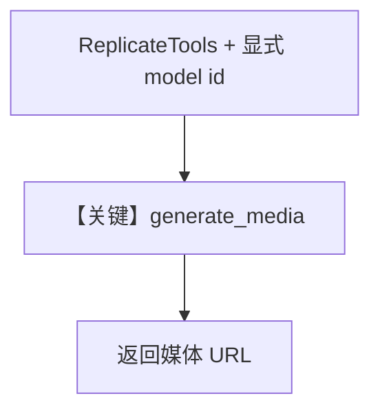

# replicate_tools.py — 实现原理分析

<!-- cookbook-py-source:start -->
## 完整源码

```python
"""
Replicate Tools
=============================

Demonstrates replicate tools.
"""

from agno.agent import Agent
from agno.models.openai import OpenAIChat
from agno.tools.replicate import ReplicateTools

# ---------------------------------------------------------------------------
# Create Agent
# ---------------------------------------------------------------------------


"""Create an agent specialized for Replicate AI content generation"""

# Example 1: Enable specific Replicate functions
image_agent = Agent(
    name="Image Generator Agent",
    model=OpenAIChat(id="gpt-4o"),
    tools=[ReplicateTools(model="luma/photon-flash", enable_generate_media=True)],
    description="You are an AI agent that can generate images using the Replicate API.",
    instructions=[
        "When the user asks you to create an image, use the `generate_media` tool to create the image.",
        "Return the URL as raw to the user.",
        "Don't convert image URL to markdown or anything else.",
    ],
    markdown=True,
)

# Example 2: Enable all Replicate functions
full_agent = Agent(
    name="Full Replicate Agent",
    model=OpenAIChat(id="gpt-4o"),
    tools=[ReplicateTools(model="minimax/video-01", all=True)],
    description="You are an AI agent that can generate various media using Replicate models.",
    instructions=[
        "Use the Replicate API to generate images or videos based on user requests.",
        "Return the generated media URL to the user.",
    ],
    markdown=True,
)

# ---------------------------------------------------------------------------
# Run Agent
# ---------------------------------------------------------------------------
if __name__ == "__main__":
    image_agent.print_response("Generate an image of a horse in the dessert.")
```

<!-- cookbook-py-source:end -->

> 源文件：`cookbook/91_tools/replicate_tools.py`

## 概述

本示例展示 **`ReplicateTools`** 与显式 **`OpenAIChat`**，两个 Agent 分别演示 **单能力开启**（`enable_generate_media` + 指定 `model`）与 **`all=True`**。

**核心配置一览（`image_agent`）**

| 配置项 | 值 | 说明 |
|--------|------|------|
| `name` | `"Image Generator Agent"` |  |
| `model` | `OpenAIChat(id="gpt-4o")` | Chat Completions |
| `tools` | `[ReplicateTools(model="luma/photon-flash", enable_generate_media=True)]` |  |
| `description` | `"You are an AI agent that can generate images using the Replicate API."` |  |
| `instructions` | 3 条：调用 generate_media、原样 URL、不要转 markdown |  |
| `markdown` | `True` |  |

## System Prompt 组装

### 还原后的完整 System 文本（字面量）

```text
You are an AI agent that can generate images using the Replicate API.

- When the user asks you to create an image, use the `generate_media` tool to create the image.
- Return the URL as raw to the user.
- Don't convert image URL to markdown or anything else.

<additional_information>
- Use markdown to format your answers.
</additional_information>
```

## 完整 API 请求

```python
client.chat.completions.create(
    model="gpt-4o",
    messages=[{"role": "system", "content": "..."}, {"role": "user", "content": "Generate an image of a horse in the dessert."}],
    tools=[...],
)
```

## Mermaid 流程图



## 关键源码文件索引

| 文件 | 作用 |
|------|------|
| `agno/tools/replicate/` | `ReplicateTools` |
