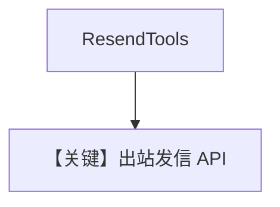

# resend_tools.py — 实现原理分析

> 源文件：`cookbook/91_tools/resend_tools.py`

## 概述

本示例展示 **`ResendTools(from_email=...)`** 发送邮件；`from_email`/`to_email` 为占位符，需替换为真实地址。

**核心配置一览**

| 配置项 | 值 | 说明 |
|--------|------|------|
| `tools` | `[ResendTools(from_email=from_email)]` |  |
| `model` | 默认 `OpenAIChat` | 未传入 |

## 运行机制与因果链

用户消息在 `__main__` 中用 **f-string** 注入 `to_email`：**用户内容随占位符变化**，非固定字面量。

## System Prompt 组装

无显式 `instructions`。运行时工具说明 + 可选 markdown（Agent 未设 `markdown=True`）。

## 完整 API 请求

Chat Completions；用户消息示例逻辑：`Send an email to {to_email} greeting them with hello world`。

## Mermaid 流程图

## 关键源码文件索引

| 文件 | 作用 |
|------|------|
| `agno/tools/resend/` | `ResendTools` |
