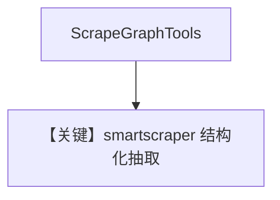

# scrapegraph_tools.py — 实现原理分析

> 源文件：`cookbook/91_tools/scrapegraph_tools.py`

## 概述

本示例展示 **`ScrapeGraphTools(enable_smartscraper=True)`** 与显式 **`OpenAIChat(id="gpt-4.1")`**，并设 **`stream=True`**。

**核心配置一览**

| 配置项 | 值 | 说明 |
|--------|------|------|
| `model` | `OpenAIChat(id="gpt-4.1")` | Chat Completions |
| `tools` | `[scrapegraph_smartscraper]` | smartscraper 单开 |
| `markdown` | `True` |  |
| `stream` | `True` | Agent 级流式 |

## 运行机制与因果链

脚本注释含 markdownify/crawl/scrape/all 等变体，默认仅跑 smartscraper 示例。

## System Prompt 组装

```text
<additional_information>
- Use markdown to format your answers.
</additional_information>
```

## 完整 API 请求

流式 `chat.completions.create(..., stream=True)`。

## Mermaid 流程图



## 关键源码文件索引

| 文件 | 作用 |
|------|------|
| `agno/tools/scrapegraph/` | `ScrapeGraphTools` |
