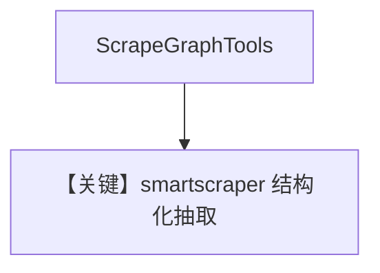

# scrapegraph_tools.py — 实现原理分析

<!-- cookbook-py-source:start -->
## 完整源码

```python
"""
ScrapeGraphTools

This script demonstrates the various capabilities of ScrapeGraphTools toolkit:

1. smartscraper: Extract structured data using natural language prompts
2. markdownify: Convert web pages to markdown format
3. searchscraper: Search the web and extract information
4. crawl: Crawl websites with structured data extraction
5. scrape: Get raw HTML content from websites (NEW!)

The scrape method is particularly useful when you need:
- Complete HTML source code
- Raw content for further processing
- HTML structure analysis
- Content that needs to be parsed differently

All methods support heavy JavaScript rendering when needed.
"""

from agno.agent import Agent
from agno.models.openai import OpenAIChat
from agno.tools.scrapegraph import ScrapeGraphTools

# ---------------------------------------------------------------------------
# Create Agent
# ---------------------------------------------------------------------------


agent_model = OpenAIChat(id="gpt-4.1")
scrapegraph_smartscraper = ScrapeGraphTools(enable_smartscraper=True)

agent = Agent(
    tools=[scrapegraph_smartscraper], model=agent_model, markdown=True, stream=True
)

# Example 1: Use smartscraper tool

# ---------------------------------------------------------------------------
# Run Agent
# ---------------------------------------------------------------------------
if __name__ == "__main__":
    agent.print_response("""
    Use smartscraper to extract the following from https://www.wired.com/category/science/:
    - News articles
    - Headlines
    - Images
    - Links
    - Author
    """)

    # Example 2: Only markdownify enabled (by setting smartscraper=False)
    # scrapegraph_md = ScrapeGraphTools(enable_smartscraper=False)

    # md_agent = Agent(tools=[scrapegraph_md], model=agent_model, markdown=True)

    # md_agent.print_response(
    #     "Fetch and convert https://www.wired.com/category/science/ to markdown format"
    # )

    # # Example 3: Enable crawl
    # scrapegraph_crawl = ScrapeGraphTools(enable_crawl=True)

    # crawl_agent = Agent(tools=[scrapegraph_crawl], model=agent_model, markdown=True)

    # crawl_agent.print_response(
    #     "Use crawl to extract what the company does and get text content from privacy and terms from https://scrapegraphai.com/ with a suitable schema."
    # )

    # # Example 4: Enable scrape method for raw HTML content
    # scrapegraph_scrape = ScrapeGraphTools(enable_scrape=True, enable_smartscraper=False)

    # scrape_agent = Agent(
    #     tools=[scrapegraph_scrape],
    #     model=agent_model,
    #     markdown=True,
    #     stream=True,
    # )

    # scrape_agent.print_response(
    #     "Use the scrape tool to get the complete raw HTML content from https://en.wikipedia.org/wiki/2025_FIFA_Club_World_Cup"
    # )

    # # Example 5: Enable all ScrapeGraph functions
    # scrapegraph_all = Agent(
    #     tools=[
    #         ScrapeGraphTools(all=True, render_heavy_js=True)
    #     ],  # render_heavy_js=True scrapes all JavaScript
    #     model=agent_model,
    #     markdown=True,
    #     stream=True,
    # )

    # scrapegraph_all.print_response("""
    # Use any appropriate scraping method to extract comprehensive information from https://www.wired.com/category/science/:
    # - News articles and headlines
    # - Convert to markdown if needed
    # - Search for specific information
    # """)
```

<!-- cookbook-py-source:end -->

> 源文件：`cookbook/91_tools/scrapegraph_tools.py`

## 概述

本示例展示 **`ScrapeGraphTools(enable_smartscraper=True)`** 与显式 **`OpenAIChat(id="gpt-4.1")`**，并设 **`stream=True`**。

**核心配置一览**

| 配置项 | 值 | 说明 |
|--------|------|------|
| `model` | `OpenAIChat(id="gpt-4.1")` | Chat Completions |
| `tools` | `[scrapegraph_smartscraper]` | smartscraper 单开 |
| `markdown` | `True` |  |
| `stream` | `True` | Agent 级流式 |

## 运行机制与因果链

脚本注释含 markdownify/crawl/scrape/all 等变体，默认仅跑 smartscraper 示例。

## System Prompt 组装

```text
<additional_information>
- Use markdown to format your answers.
</additional_information>
```

## 完整 API 请求

流式 `chat.completions.create(..., stream=True)`。

## Mermaid 流程图



## 关键源码文件索引

| 文件 | 作用 |
|------|------|
| `agno/tools/scrapegraph/` | `ScrapeGraphTools` |
