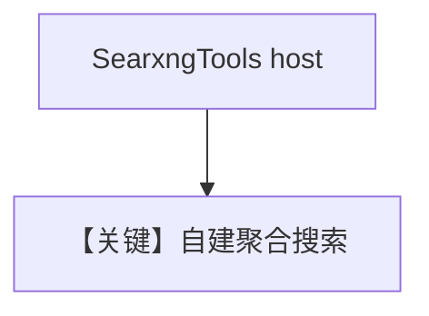

# searxng_tools.py — 实现原理分析

<!-- cookbook-py-source:start -->
## 完整源码

```python
"""
Searxng Tools
=============================

Demonstrates searxng tools.
"""

from agno.agent import Agent
from agno.tools.searxng import SearxngTools

# ---------------------------------------------------------------------------
# Create Agent
# ---------------------------------------------------------------------------


# Initialize Searxng with your Searxng instance URL
searxng = SearxngTools(
    host="http://localhost:53153",
    engines=[],
    fixed_max_results=5,
    news=True,
    science=True,
)

# Create an agent with Searxng
agent = Agent(tools=[searxng])

# Example: Ask the agent to search using Searxng

# ---------------------------------------------------------------------------
# Run Agent
# ---------------------------------------------------------------------------
if __name__ == "__main__":
    agent.print_response("""
    Please search for information about artificial intelligence 
    and summarize the key points from the top results
    """)
```

<!-- cookbook-py-source:end -->

> 源文件：`cookbook/91_tools/searxng_tools.py`

## 概述

本示例展示 **`SearxngTools`** 连接 **自托管 SearXNG**（`host`、引擎、固定结果数、news/science 开关），再挂到默认模型 Agent。

**核心配置一览**

| 配置项 | 值 | 说明 |
|--------|------|------|
| `tools` | `[searxng]` 见源码 `SearxngTools(host="http://localhost:53153", ...)]` |  |
| `model` | 默认 `OpenAIChat` | 未传入 |

## 运行机制与因果链

流量走向用户 SearXNG 实例；需本地服务可用。

## System Prompt 组装

无字面量 instructions；运行时工具 + 模型补充。

## 完整 API 请求

Chat Completions + tools。

## Mermaid 流程图



## 关键源码文件索引

| 文件 | 作用 |
|------|------|
| `agno/tools/searxng/` | `SearxngTools` |
