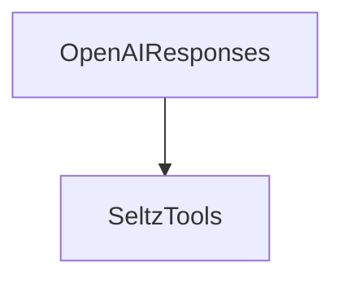

# seltz_tools.py — 实现原理分析

<!-- cookbook-py-source:start -->
## 完整源码

```python
"""Seltz Tools Example.

Run `pip install seltz agno openai python-dotenv` to install dependencies.
"""

from agno.agent import Agent
from agno.models.openai import OpenAIResponses
from agno.tools.seltz import SeltzTools
from dotenv import load_dotenv

# ---------------------------------------------------------------------------
# Create Agent
# ---------------------------------------------------------------------------


load_dotenv()

agent = Agent(
    model=OpenAIResponses(id="gpt-5.2"),
    tools=[SeltzTools(show_results=True)],
    markdown=True,
)

# ---------------------------------------------------------------------------
# Run Agent
# ---------------------------------------------------------------------------

if __name__ == "__main__":
    agent.print_response("Search for current AI safety reports", markdown=True)
```

<!-- cookbook-py-source:end -->

> 源文件：`cookbook/91_tools/seltz_tools.py`

## 概述

本示例展示 **`OpenAIResponses(id="gpt-5.2")`** 与 **`SeltzTools(show_results=True)`**，并 `load_dotenv()` 加载环境变量。

**核心配置一览**

| 配置项 | 值 | 说明 |
|--------|------|------|
| `model` | `OpenAIResponses(id="gpt-5.2")` | Responses API |
| `tools` | `[SeltzTools(show_results=True)]` |  |
| `markdown` | `True` |  |

## 完整 API 请求

见 `OpenAIResponses` 的 `responses.create` 形态（`agno/models/openai/responses.py`）。

## Mermaid 流程图



## 关键源码文件索引

| 文件 | 作用 |
|------|------|
| `agno/models/openai/responses.py` | Responses 调用 |
| `agno/tools/seltz/` | `SeltzTools` |
