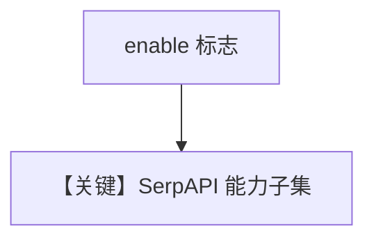

# serpapi_tools.py — 实现原理分析

<!-- cookbook-py-source:start -->
## 完整源码

```python
"""
Serpapi Tools
=============================

Demonstrates serpapi tools.
"""

from agno.agent import Agent
from agno.tools.serpapi import SerpApiTools

# ---------------------------------------------------------------------------
# Create Agent
# ---------------------------------------------------------------------------


# Example 1: Enable specific SerpAPI functions
agent = Agent(
    tools=[SerpApiTools(enable_search_google=True, enable_search_youtube=False)]
)

# Example 2: Enable all SerpAPI functions
agent_all = Agent(tools=[SerpApiTools(all=True)])

# Example 3: Enable only YouTube search
youtube_agent = Agent(
    tools=[SerpApiTools(enable_search_google=False, enable_search_youtube=True)]
)

# Test the agents

# ---------------------------------------------------------------------------
# Run Agent
# ---------------------------------------------------------------------------
if __name__ == "__main__":
    agent.print_response("What's happening in the USA?", markdown=True)
    youtube_agent.print_response("Search YouTube for 'python tutorial'", markdown=True)
```

<!-- cookbook-py-source:end -->

> 源文件：`cookbook/91_tools/serpapi_tools.py`

## 概述

本示例展示 **`SerpApiTools`** 的 **`enable_*`** 与 **`all=True`**，并演示 `youtube_agent` 仅开 YouTube 搜索。

**核心配置一览（`agent`）**

| 配置项 | 值 | 说明 |
|--------|------|------|
| `tools` | `[SerpApiTools(enable_search_google=True, enable_search_youtube=False)]` |  |
| `model` | 默认 |  |

## 运行机制与因果链

需 SerpAPI Key（环境或构造参数）。

## System Prompt 组装

无静态 instructions；`print_response(..., markdown=True)` 不改变 Agent 默认（未设 `markdown=True` 于构造函数）。

## Mermaid 流程图



## 关键源码文件索引

| 文件 | 作用 |
|------|------|
| `agno/tools/serpapi/` | `SerpApiTools` |
