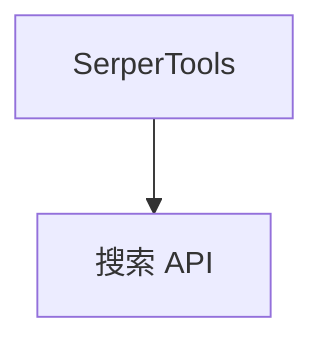

# serper_tools.py — 实现原理分析

> 源文件：`cookbook/91_tools/serper_tools.py`

## 概述

本示例展示 **`SerperTools()`** 默认配置，依赖 **`SERPER_API_KEY`** 环境变量或构造传入。

**核心配置一览**

| 配置项 | 值 | 说明 |
|--------|------|------|
| `tools` | `[SerperTools()]` |  |
| `model` | 默认 |  |

## System Prompt 组装

无字面量 instructions；运行时工具说明。

## 完整 API 请求

Chat Completions。

## Mermaid 流程图

## 关键源码文件索引

| 文件 | 作用 |
|------|------|
| `agno/tools/serper/` | `SerperTools` |
