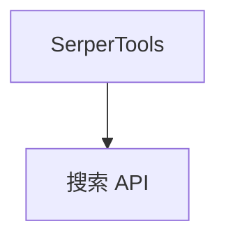

# serper_tools.py — 实现原理分析

<!-- cookbook-py-source:start -->
## 完整源码

```python
"""
This is a example of an agent using the Serper Toolkit.

You can obtain an API key from https://serper.dev/

 - Set your API key as an environment variable: export SERPER_API_KEY="your_api_key_here"
 - or pass api_key to the SerperTools class
"""

from agno.agent import Agent
from agno.tools.serper import SerperTools

# ---------------------------------------------------------------------------
# Create Agent
# ---------------------------------------------------------------------------


agent = Agent(
    tools=[SerperTools()],
)

# ---------------------------------------------------------------------------
# Run Agent
# ---------------------------------------------------------------------------
if __name__ == "__main__":
    agent.print_response(
        "Search for the latest news about artificial intelligence developments",
        markdown=True,
    )

    # Example 2: Google Scholar Search
    # agent.print_response(
    #     "Find 2 recent academic papers about large language model safety and alignment",
    #     markdown=True,
    # )

    # Example 3: Web Scraping
    # agent.print_response(
    #     "Scrape and summarize the main content from this OpenAI blog post: https://openai.com/index/gpt-4/",
    #     markdown=True
    # )
```

<!-- cookbook-py-source:end -->

> 源文件：`cookbook/91_tools/serper_tools.py`

## 概述

本示例展示 **`SerperTools()`** 默认配置，依赖 **`SERPER_API_KEY`** 环境变量或构造传入。

**核心配置一览**

| 配置项 | 值 | 说明 |
|--------|------|------|
| `tools` | `[SerperTools()]` |  |
| `model` | 默认 |  |

## System Prompt 组装

无字面量 instructions；运行时工具说明。

## 完整 API 请求

Chat Completions。

## Mermaid 流程图



## 关键源码文件索引

| 文件 | 作用 |
|------|------|
| `agno/tools/serper/` | `SerperTools` |
