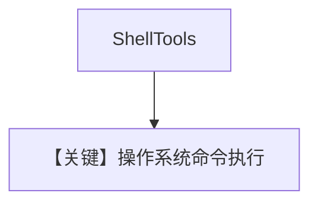

# shell_tools.py — 实现原理分析

<!-- cookbook-py-source:start -->
## 完整源码

```python
"""
Shell Tools
=============================

Demonstrates shell tools.
"""

from agno.agent import Agent
from agno.tools.shell import ShellTools

# ---------------------------------------------------------------------------
# Create Agent
# ---------------------------------------------------------------------------


agent = Agent(tools=[ShellTools()])

# ---------------------------------------------------------------------------
# Run Agent
# ---------------------------------------------------------------------------
if __name__ == "__main__":
    agent.print_response("Show me the contents of the current directory", markdown=True)
```

<!-- cookbook-py-source:end -->

> 源文件：`cookbook/91_tools/shell_tools.py`

## 概述

本示例展示 **`ShellTools()`**：授予 Agent 执行 shell 命令能力（高风险，仅用于受信环境）。

**核心配置一览**

| 配置项 | 值 | 说明 |
|--------|------|------|
| `tools` | `[ShellTools()]` |  |
| `model` | 默认 |  |

## 运行机制与因果链

**副作用**：本地 shell 执行；需严格环境隔离与权限控制。

## System Prompt 组装

无 instructions/markdown 构造函数参数。

## Mermaid 流程图



## 关键源码文件索引

| 文件 | 作用 |
|------|------|
| `agno/tools/shell/` | `ShellTools` |
