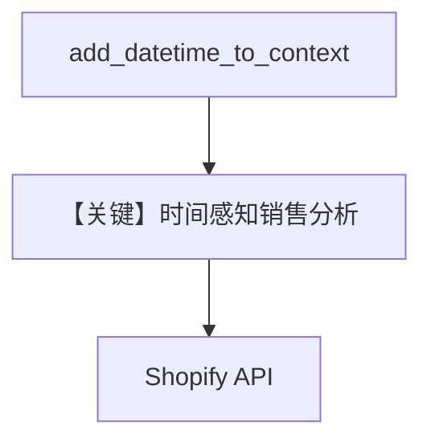

# shopify_tools.py — 实现原理分析

<!-- cookbook-py-source:start -->
## 完整源码

```python
"""
Example: Using ShopifyTools with an Agno Agent

This example shows how to create an agent that can:
- Analyze sales data and identify top-selling products
- Find products that are frequently bought together
- Track inventory levels and identify low-stock items
- Generate sales reports and trends

Prerequisites:
Set the following environment variables:
- SHOPIFY_SHOP_NAME -> Your Shopify shop name, e.g. "my-store" from my-store.myshopify.com
- SHOPIFY_ACCESS_TOKEN -> Your Shopify access token

You can get your Shopify access token from your Shopify Admin > Settings > Apps and sales channels > Develop apps

Required scopes:
- read_orders (for order and sales data)
- read_products (for product information)
- read_customers (for customer insights)
- read_analytics (for analytics data)
"""

from agno.agent import Agent
from agno.models.openai import OpenAIChat
from agno.tools.shopify import ShopifyTools

# ---------------------------------------------------------------------------
# Create Agent
# ---------------------------------------------------------------------------


sales_agent = Agent(
    name="Sales Analyst",
    model=OpenAIChat(id="gpt-4o"),
    tools=[ShopifyTools()],
    instructions=[
        "You are a sales analyst for an e-commerce store using Shopify.",
        "Help the user understand their sales performance, product trends, and customer behavior.",
        "When analyzing data:",
        "1. Start by getting the relevant data using the available tools",
        "2. Summarize key insights in a clear, actionable format",
        "3. Highlight notable patterns or concerns",
        "4. Suggest next steps when appropriate",
        "Always present numbers clearly and use comparisons to add context.",
        "If you need to get information about the store, like currency, call the `get_shop_info` tool.",
    ],
    add_datetime_to_context=True,
    markdown=True,
)

# Example usage
# ---------------------------------------------------------------------------
# Run Agent
# ---------------------------------------------------------------------------

if __name__ == "__main__":
    # Example 1: Get top selling products
    sales_agent.print_response(
        "What are my top 5 selling products in the last 30 days? "
        "Show me quantity sold and revenue for each.",
    )

    # Example 2: Products bought together
    sales_agent.print_response(
        "Which products are frequently bought together? "
        "I want to create product bundles for my store."
    )

    # Example 3: Sales trends
    sales_agent.print_response(
        "How are my sales trending compared over the last 3 months? "
        "Are we up or down in terms of revenue and order count?"
    )
```

<!-- cookbook-py-source:end -->

> 源文件：`cookbook/91_tools/shopify_tools.py`

## 概述

本示例展示 **`ShopifyTools()`** 与 **`OpenAIChat(id="gpt-4o")`**，并开启 **`add_datetime_to_context=True`** 与多行 **`instructions`**（销售分析流程）。

**核心配置一览（`sales_agent`）**

| 配置项 | 值 | 说明 |
|--------|------|------|
| `name` | `"Sales Analyst"` |  |
| `model` | `OpenAIChat(id="gpt-4o")` | Chat Completions |
| `tools` | `[ShopifyTools()]` |  |
| `instructions` | 多条：分析师角色、步骤、`get_shop_info` 等 |  |
| `add_datetime_to_context` | `True` | 注入当前时间 |
| `markdown` | `True` |  |

## System Prompt 组装

含 `# 3.2.2` 当前时间（若时区未配则为本地时间字符串）与 instructions 列表。

### 还原后的完整 System 文本（指令字面量）

```text
- You are a sales analyst for an e-commerce store using Shopify.
- Help the user understand their sales performance, product trends, and customer behavior.
- When analyzing data:
- 1. Start by getting the relevant data using the available tools
- 2. Summarize key insights in a clear, actionable format
- 3. Highlight notable patterns or concerns
- 4. Suggest next steps when appropriate
- Always present numbers clearly and use comparisons to add context.
- If you need to get information about the store, like currency, call the `get_shop_info` tool.

<additional_information>
- Use markdown to format your answers.
- The current time is <运行时>.
</additional_information>
```

## Mermaid 流程图



## 关键源码文件索引

| 文件 | 作用 |
|------|------|
| `agno/agent/_messages.py` | `# 3.2.2` datetime |
| `agno/tools/shopify/` | `ShopifyTools` |
