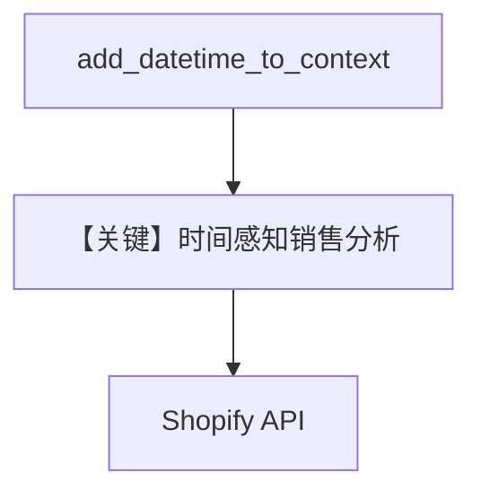

# shopify_tools.py — 实现原理分析

> 源文件：`cookbook/91_tools/shopify_tools.py`

## 概述

本示例展示 **`ShopifyTools()`** 与 **`OpenAIChat(id="gpt-4o")`**，并开启 **`add_datetime_to_context=True`** 与多行 **`instructions`**（销售分析流程）。

**核心配置一览（`sales_agent`）**

| 配置项 | 值 | 说明 |
|--------|------|------|
| `name` | `"Sales Analyst"` |  |
| `model` | `OpenAIChat(id="gpt-4o")` | Chat Completions |
| `tools` | `[ShopifyTools()]` |  |
| `instructions` | 多条：分析师角色、步骤、`get_shop_info` 等 |  |
| `add_datetime_to_context` | `True` | 注入当前时间 |
| `markdown` | `True` |  |

## System Prompt 组装

含 `# 3.2.2` 当前时间（若时区未配则为本地时间字符串）与 instructions 列表。

### 还原后的完整 System 文本（指令字面量）

```text
- You are a sales analyst for an e-commerce store using Shopify.
- Help the user understand their sales performance, product trends, and customer behavior.
- When analyzing data:
- 1. Start by getting the relevant data using the available tools
- 2. Summarize key insights in a clear, actionable format
- 3. Highlight notable patterns or concerns
- 4. Suggest next steps when appropriate
- Always present numbers clearly and use comparisons to add context.
- If you need to get information about the store, like currency, call the `get_shop_info` tool.

<additional_information>
- Use markdown to format your answers.
- The current time is <运行时>.
</additional_information>
```

## Mermaid 流程图



## 关键源码文件索引

| 文件 | 作用 |
|------|------|
| `agno/agent/_messages.py` | `# 3.2.2` datetime |
| `agno/tools/shopify/` | `ShopifyTools` |
