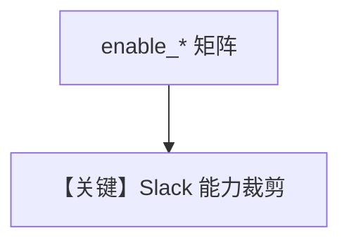

# slack_tools.py — 实现原理分析

> 源文件：`cookbook/91_tools/slack_tools.py`

## 概述

本示例展示 **`SlackTools`** 的 **`all=True`** 与细粒度 **`enable_*`**，以及只读型组合；`__main__` 对三个 Agent 调用 `print_response(..., stream=True)`。

**核心配置一览（`agent_all`）**

| 配置项 | 值 | 说明 |
|--------|------|------|
| `tools` | `[SlackTools(all=True)]` |  |
| `markdown` | `True` | Agent 级 |

## 运行机制与因果链

需 Slack SDK 与 token；工具涵盖发消息、列频道、历史等。

## System Prompt 组装

```text
<additional_information>
- Use markdown to format your answers.
</additional_information>
```

## Mermaid 流程图



## 关键源码文件索引

| 文件 | 作用 |
|------|------|
| `agno/tools/slack/` | `SlackTools` |
