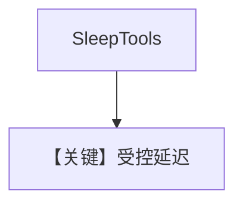

# sleep_tools.py — 实现原理分析

<!-- cookbook-py-source:start -->
## 完整源码

```python
"""
Sleep Tools
=============================

Demonstrates sleep tools.
"""

from agno.agent import Agent
from agno.tools.sleep import SleepTools

# ---------------------------------------------------------------------------
# Create Agent
# ---------------------------------------------------------------------------


# Example 1: Enable specific sleep functions
agent = Agent(tools=[SleepTools(enable_sleep=True)], name="Sleep Agent")

# Example 2: Enable all sleep functions
agent_all = Agent(tools=[SleepTools(all=True)], name="Full Sleep Agent")

# Test the agents

# ---------------------------------------------------------------------------
# Run Agent
# ---------------------------------------------------------------------------
if __name__ == "__main__":
    agent.print_response("Sleep for 2 seconds")
    agent_all.print_response("Sleep for 5 seconds")
```

<!-- cookbook-py-source:end -->

> 源文件：`cookbook/91_tools/sleep_tools.py`

## 概述

本示例展示 **`SleepTools`** 的 **`enable_sleep`** 与 **`all=True`**，用于演示阻塞/延迟类工具行为。

**核心配置一览**

| 配置项 | 值 | 说明 |
|--------|------|------|
| `name` | `"Sleep Agent"` / `"Full Sleep Agent"` |  |
| `tools` | `[SleepTools(enable_sleep=True)]` 等 |  |
| `model` | 默认 |  |

## Mermaid 流程图



## 关键源码文件索引

| 文件 | 作用 |
|------|------|
| `agno/tools/sleep/` | `SleepTools` |
